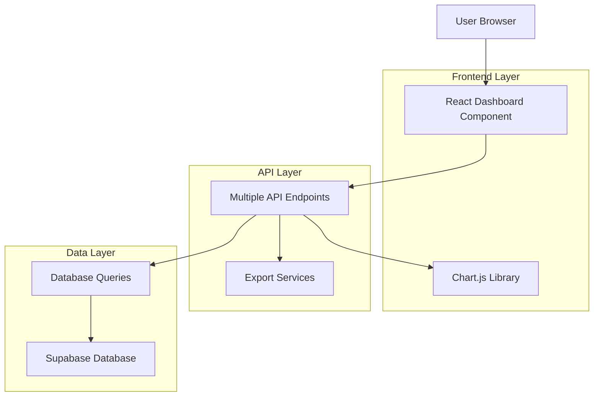
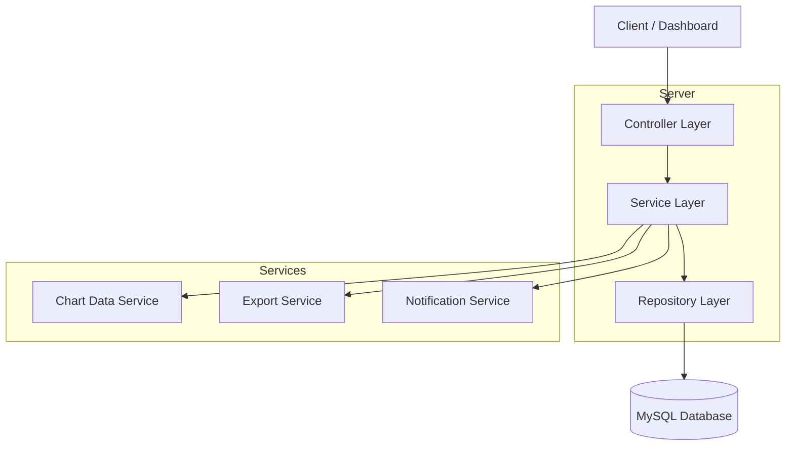
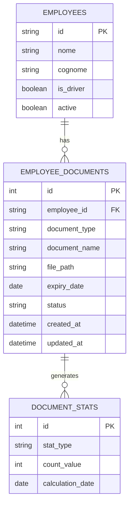

# Dashboard Autisti Documenti - Architettura Tecnica

## 1. Architecture design



## 2. Technology Description

- Frontend: React@18 + Bootstrap@5 + Chart.js@4 + React-Bootstrap
- Backend: Next.js API Routes + MySQL
- Database: MySQL (existing employee_documents table)
- Charts: Chart.js per visualizzazioni grafiche
- Export: ExcelJS per report Excel, jsPDF per report PDF

## 3. Route definitions

| Route | Purpose |
|-------|---------|
| /gestione/autisti/dashboard | Dashboard principale con tutti i widget documenti |
| /gestione/autisti/dashboard/scaduti | Vista dedicata documenti scaduti |
| /gestione/autisti/dashboard/report | Pagina generazione e download report |

## 4. API definitions

### 4.1 Core API

**Statistiche documenti complete**
```
GET /api/employees/documents/stats
```

Request:
| Param Name | Param Type | isRequired | Description |
|------------|------------|------------|-------------|
| include_expired | boolean | false | Include documenti scaduti nelle statistiche |
| include_valid | boolean | false | Include documenti validi nelle statistiche |

Response:
| Param Name | Param Type | Description |
|------------|------------|-------------|
| total | number | Totale documenti |
| valid | number | Documenti validi |
| expiring | number | Documenti in scadenza |
| expired | number | Documenti scaduti |
| no_expiry | number | Documenti senza scadenza |
| by_type | object | Conteggio per tipo documento |

Example Response:
```json
{
  "success": true,
  "data": {
    "total": 150,
    "valid": 120,
    "expiring": 15,
    "expired": 10,
    "no_expiry": 5,
    "by_type": {
      "patente": 45,
      "cqc": 30,
      "adr": 25,
      "contratto_lavoro": 50
    }
  }
}
```

**Documenti scaduti con priorità**
```
GET /api/employees/documents/expired
```

Request:
| Param Name | Param Type | isRequired | Description |
|------------|------------|------------|-------------|
| sort_by | string | false | Campo ordinamento (days_overdue, employee_name, document_type) |
| limit | number | false | Numero massimo risultati (default: 50) |

Response:
| Param Name | Param Type | Description |
|------------|------------|-------------|
| documents | array | Lista documenti scaduti |
| total_expired | number | Totale documenti scaduti |
| critical_count | number | Documenti scaduti da >30 giorni |

**Export report documenti**
```
POST /api/employees/documents/export
```

Request:
| Param Name | Param Type | isRequired | Description |
|------------|------------|------------|-------------|
| format | string | true | Formato export (excel, pdf) |
| include_expired | boolean | false | Include documenti scaduti |
| include_expiring | boolean | false | Include documenti in scadenza |
| days_filter | number | false | Giorni per filtro scadenza |

Response:
| Param Name | Param Type | Description |
|------------|------------|-------------|
| download_url | string | URL per download file |
| filename | string | Nome file generato |
| expires_at | string | Scadenza URL download |

## 5. Server architecture diagram



## 6. Data model

### 6.1 Data model definition



### 6.2 Data Definition Language

**Nuove viste per statistiche ottimizzate**
```sql
-- Vista per statistiche documenti per stato
CREATE VIEW document_stats_by_status AS
SELECT 
    status,
    COUNT(*) as count,
    COUNT(CASE WHEN expiry_date IS NULL THEN 1 END) as no_expiry_count
FROM employee_documents 
WHERE employee_id IN (SELECT id FROM employees WHERE active = 1)
GROUP BY status;

-- Vista per statistiche documenti per tipo
CREATE VIEW document_stats_by_type AS
SELECT 
    document_type,
    COUNT(*) as total_count,
    COUNT(CASE WHEN status = 'scaduto' THEN 1 END) as expired_count,
    COUNT(CASE WHEN status = 'in_scadenza' THEN 1 END) as expiring_count,
    COUNT(CASE WHEN status = 'valido' THEN 1 END) as valid_count
FROM employee_documents ed
JOIN employees e ON ed.employee_id = e.id
WHERE e.active = 1
GROUP BY document_type;

-- Vista per documenti scaduti con priorità
CREATE VIEW expired_documents_priority AS
SELECT 
    ed.*,
    CONCAT(e.nome, ' ', e.cognome) as employee_name,
    DATEDIFF(CURDATE(), ed.expiry_date) as days_overdue,
    CASE 
        WHEN DATEDIFF(CURDATE(), ed.expiry_date) > 90 THEN 'critico'
        WHEN DATEDIFF(CURDATE(), ed.expiry_date) > 30 THEN 'alto'
        ELSE 'medio'
    END as priority_level
FROM employee_documents ed
JOIN employees e ON ed.employee_id = e.id
WHERE ed.status = 'scaduto' 
    AND e.active = 1
    AND ed.expiry_date IS NOT NULL
ORDER BY days_overdue DESC;

-- Indici per performance
CREATE INDEX idx_employee_documents_status_expiry ON employee_documents(status, expiry_date);
CREATE INDEX idx_employee_documents_type_status ON employee_documents(document_type, status);
CREATE INDEX idx_employees_active_driver ON employees(active, is_driver);

-- Stored procedure per aggiornamento statistiche
DELIMITER //
CREATE PROCEDURE UpdateDocumentStatistics()
BEGIN
    -- Aggiorna automaticamente gli stati dei documenti
    UPDATE employee_documents 
    SET status = CASE 
        WHEN expiry_date IS NULL THEN 'valido'
        WHEN expiry_date < CURDATE() THEN 'scaduto'
        WHEN expiry_date <= DATE_ADD(CURDATE(), INTERVAL 30 DAY) THEN 'in_scadenza'
        ELSE 'valido'
    END
    WHERE employee_id IN (SELECT id FROM employees WHERE active = 1);
    
    -- Log aggiornamento
    INSERT INTO system_logs (action, description, created_at) 
    VALUES ('document_stats_update', 'Aggiornamento automatico stati documenti', NOW());
END //
DELIMITER ;
```