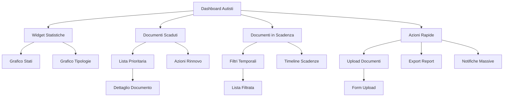

# Dashboard Autisti - Gestione Documenti Completa

## 1. Product Overview

Miglioramento della dashboard autisti per fornire una visione completa e operativa di tutti gli stati dei documenti dipendenti, superando l'attuale limitazione che mostra solo documenti in scadenza nei prossimi 30 giorni.

La dashboard migliorata permetterà ai responsabili HR di monitorare proattivamente tutti i documenti (validi, scaduti, in scadenza, senza scadenza) con strumenti di analisi e azioni rapide per garantire compliance normativa e operativa.

## 2. Core Features

### 2.1 User Roles

| Ruolo | Metodo Accesso | Permessi Principali |
|-------|----------------|---------------------|
| Responsabile HR | Login esistente | Visualizzazione completa, azioni di rinnovo, export report |
| Manager Operativo | Login esistente | Visualizzazione dashboard, notifiche urgenze |
| Amministratore | Login esistente | Accesso completo, configurazione alert, gestione utenti |

### 2.2 Feature Module

La dashboard documenti migliorata consiste delle seguenti sezioni principali:

1. **Dashboard Principale**: panoramica statistiche, widget stati documenti, grafici analitici
2. **Sezione Documenti Scaduti**: lista prioritaria documenti scaduti con azioni immediate
3. **Sezione Documenti in Scadenza**: widget migliorato con filtri temporali e raggruppamenti
4. **Centro Azioni Rapide**: operazioni immediate per rinnovi e caricamenti
5. **Report e Analytics**: visualizzazioni grafiche e export dati

### 2.3 Page Details

| Page Name | Module Name | Feature description |
|-----------|-------------|---------------------|
| Dashboard Principale | Widget Statistiche Documenti | Visualizza contatori totali, validi, scaduti, in scadenza, senza scadenza con icone colorate e percentuali |
| Dashboard Principale | Grafico Stati Documenti | Mostra grafico a torta interattivo con distribuzione stati documenti e drill-down per dettagli |
| Dashboard Principale | Grafico Tipologie | Visualizza grafico a barre orizzontali per numero documenti per tipo (patente, CQC, ADR, etc.) |
| Sezione Documenti Scaduti | Lista Prioritaria Scaduti | Elenca documenti scaduti con alert rosso, giorni di ritardo, dipendente e azioni rapide |
| Sezione Documenti Scaduti | Azioni Rinnovo Rapido | Fornisce pulsanti per caricamento nuovo documento, promemoria dipendente, segnalazione urgente |
| Sezione Documenti in Scadenza | Filtri Temporali | Permette selezione periodo (7, 15, 30, 60 giorni) con aggiornamento dinamico lista |
| Sezione Documenti in Scadenza | Raggruppamento Urgenza | Organizza documenti per livello urgenza (critico ≤7gg, importante ≤15gg, normale ≤30gg) |
| Sezione Documenti in Scadenza | Timeline Scadenze | Mostra timeline visuale con documenti posizionati per data scadenza |
| Centro Azioni Rapide | Caricamento Documenti | Accesso diretto a form upload documenti per dipendente selezionato |
| Centro Azioni Rapide | Export Report Scadenze | Genera e scarica report Excel/PDF con documenti scaduti e in scadenza |
| Centro Azioni Rapide | Invio Notifiche Massive | Invia email automatiche a dipendenti con documenti scaduti/in scadenza |

## 3. Core Process

### Flusso Principale Responsabile HR

1. **Accesso Dashboard**: Login e navigazione a `/gestione/autisti/dashboard`
2. **Panoramica Stati**: Visualizzazione widget statistiche per identificare criticità immediate
3. **Gestione Urgenze**: Click su documenti scaduti per accesso lista prioritaria
4. **Azioni Correttive**: Utilizzo azioni rapide per rinnovo o notifica dipendenti
5. **Monitoraggio Scadenze**: Controllo documenti in scadenza con filtri temporali
6. **Analisi Trend**: Consultazione grafici per identificare pattern e pianificare azioni
7. **Export Report**: Generazione report per management o enti di controllo

### Flusso Operativo Quotidiano

1. **Check Mattutino**: Verifica documenti scaduti overnight
2. **Prioritizzazione**: Identificazione documenti critici per operatività
3. **Comunicazione**: Invio notifiche a dipendenti interessati
4. **Tracking**: Monitoraggio avanzamento rinnovi in corso
5. **Reporting**: Aggiornamento status per management

## 4. User Interface Design

### 4.1 Design Style

- **Colori Primari**: 
  - Blu principale: #007bff (informazioni)
  - Verde: #28a745 (documenti validi)
  - Giallo: #ffc107 (documenti in scadenza)
  - Rosso: #dc3545 (documenti scaduti)
  - Grigio: #6c757d (documenti senza scadenza)

- **Stile Pulsanti**: Rounded corners (border-radius: 6px), effetti hover con transizioni smooth
- **Font**: Bootstrap default (system fonts), dimensioni 14px base, 16px titoli, 12px labels
- **Layout**: Grid Bootstrap responsive, card-based design con shadow subtle
- **Icone**: Font Awesome 6, stile solid per azioni, regular per informazioni

### 4.2 Page Design Overview

| Page Name | Module Name | UI Elements |
|-----------|-------------|-------------|
| Dashboard Principale | Widget Statistiche | Cards con background gradient, icone grandi centrali, numeri bold 24px, percentuali small 12px |
| Dashboard Principale | Grafico Stati | Card con Chart.js, colori coordinati stati, tooltip interattivi, legend posizionata bottom |
| Dashboard Principale | Grafico Tipologie | Card con Chart.js horizontal bar, colori alternati, labels abbreviati, valori su barre |
| Sezione Documenti Scaduti | Lista Prioritaria | Table responsive con badge rossi, icone warning, background row alternato, sticky header |
| Sezione Documenti Scaduti | Azioni Rinnovo | Button group con icone, colori semantici, tooltip esplicativi, modal confirmation |
| Sezione Documenti in Scadenza | Filtri Temporali | Button group toggle, active state evidenziato, contatori badge, smooth transitions |
| Sezione Documenti in Scadenza | Timeline Scadenze | Timeline orizzontale con punti colorati, tooltip hover, zoom interattivo |
| Centro Azioni Rapide | Caricamento Documenti | Large buttons con icone 2x, descrizioni sotto, hover effects, modal forms |
| Centro Azioni Rapide | Export Report | Dropdown con opzioni formato, progress bar download, success notifications |

### 4.3 Responsiveness

- **Desktop-first**: Layout ottimizzato per schermi ≥1200px con sidebar e multi-column
- **Tablet adaptive**: Riorganizzazione automatica per schermi 768-1199px con stack verticale
- **Mobile responsive**: Layout single-column per schermi <768px con navigation collapsible
- **Touch optimization**: Pulsanti min 44px, spacing aumentato, swipe gestures per timeline