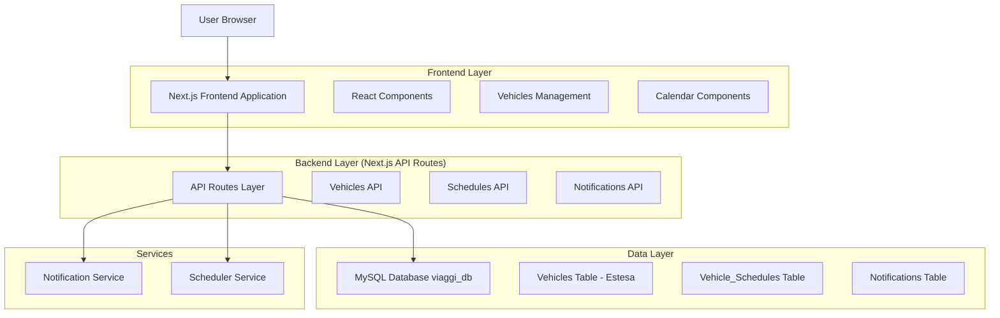
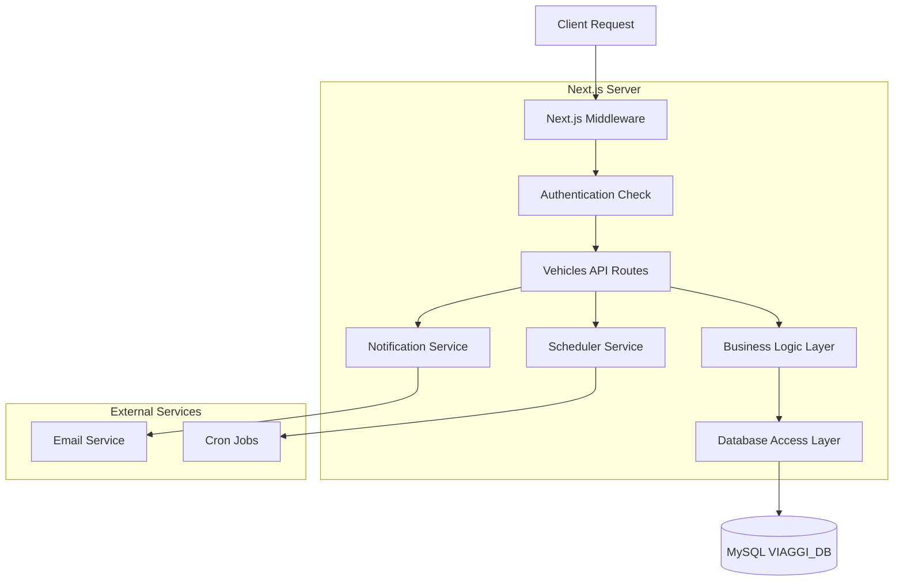
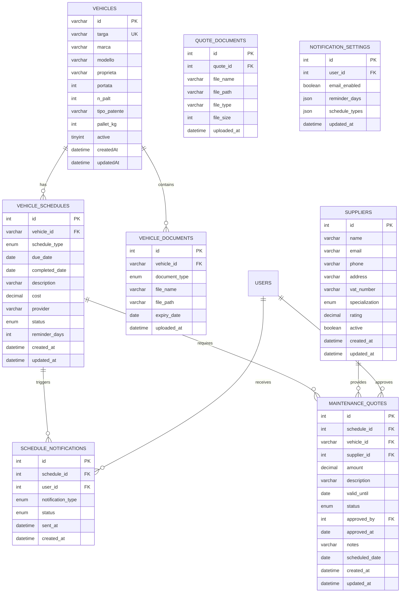

# Estensione Vehicles - Architettura Tecnica per Gestione Scadenze

## 1. Architettura di Sistema



## 2. Implementazioni Recenti Completate

### 2.1 Estensione Tabella Vehicles
- **Nuovi campi aggiunti**:
  - `km_ultimo_tagliando` (INT) - Chilometraggio ultimo tagliando
  - `data_ultimo_tagliando` (DATE) - Data ultimo tagliando effettuato
  - `data_ultima_revisione` (DATE) - Data ultima revisione effettuata
  - `attivo` (BOOLEAN DEFAULT 1) - Flag per disattivazione logica

### 2.2 API Vehicles Aggiornate
- **GET /api/vehicles**: Restituisce nuovi campi con formattazione date italiana
- **Filtri intelligenti**: Endpoint per valori unici di marca, modello, proprietà, tipo_patente
- **Soft delete**: Gestione veicoli attivi/disattivati tramite campo `attivo`
- **Export CSV**: Include tutti i nuovi campi con gestione valori null

### 2.3 Frontend Enhancements
- **Filtri dropdown**: Sostituzione input text con select popolati dinamicamente
- **Gestione stato**: Toggle per visualizzazione veicoli attivi/disattivati
- **Interfaccia TypeScript**: Aggiornata con nuovi campi Vehicle
- **Esportazione avanzata**: CSV con tutti i campi e formattazione italiana

## 3. Descrizione Tecnologie

- **Frontend**: React@18 + Next.js@15.5.3 + Bootstrap@5.3.2 + TypeScript@5
- **Backend**: Next.js API Routes + Node.js@24.4.1
- **Database**: MySQL@8.0+ (via XAMPP) - estensione database viaggi_db esistente
- **File Upload**: Multer per gestione upload preventivi (PDF, immagini)
- **File Storage**: Sistema locale con organizzazione per veicolo/preventivo
- **Scheduling**: node-cron per controlli automatici scadenze e scadenza preventivi
- **Notifiche**: Nodemailer per email + sistema notifiche in-app
- **Calendar**: React Big Calendar per visualizzazione calendario
- **Charts**: Chart.js per analytics e reports
- **PDF Viewer**: React-PDF per anteprima preventivi caricati

## 4. Definizioni delle Route

| Route | Scopo |
|-------|-------|
| /vehicles/list | **IMPLEMENTATA** - Lista veicoli con nuovi campi manutenzione, filtri dropdown, disattivazione logica, export CSV |
| /vehicles/[id] | Dettaglio veicolo con tutte le scadenze |
| /vehicles/schedules | Calendario scadenze generale |
| /vehicles/quotes | Gestione preventivi manutenzione |
| /vehicles/quotes/[id] | Dettaglio e confronto preventivi |
| /vehicles/dashboard | Dashboard dedicata alle scadenze veicoli |
| /vehicles/notifications | Configurazione notifiche e alert |
| /vehicles/reports | Reports e analytics scadenze |

## 5. Definizioni API

### 5.1 API Implementate

**Gestione Veicoli (IMPLEMENTATA)**

```
GET /api/vehicles
```

Response:
| Nome Parametro | Tipo Parametro | Descrizione |
|----------------|----------------|-------------|
| vehicles | array | Lista veicoli con nuovi campi: km_ultimo_tagliando, data_ultimo_tagliando, data_ultima_revisione |
| total | number | Totale veicoli nel database |
| active | number | Veicoli attivi (attivo = 1) |

### 5.2 API Pianificate

**Gestione Scadenze Veicoli**

```
GET /api/vehicles/schedules
```

Response:
| Nome Parametro | Tipo Parametro | Descrizione |
|----------------|----------------|--------------|
| schedules | array | Lista scadenze con dettagli veicolo |
| upcoming | array | Scadenze prossime (entro 30 giorni) |
| overdue | array | Scadenze scadute |

```
POST /api/vehicles/schedules
```

Request:
| Nome Parametro | Tipo Parametro | Richiesto | Descrizione |
|----------------|----------------|-----------|-------------|
| vehicleId | string | true | ID del veicolo |
| scheduleType | enum | true | Tipo scadenza: 'revisione', 'tagliando', 'assicurazione', 'bollo', 'altro' |
| dueDate | date | true | Data scadenza |
| description | string | false | Descrizione aggiuntiva |
| reminderDays | number | false | Giorni di preavviso (default: 30) |

**Notifiche Scadenze**

```
GET /api/vehicles/notifications
```

```
POST /api/vehicles/notifications/settings
```

Request:
| Nome Parametro | Tipo Parametro | Richiesto | Descrizione |
|----------------|----------------|-----------|-------------|
| emailEnabled | boolean | true | Abilita notifiche email |
| reminderDays | array | true | Giorni di preavviso [7, 15, 30] |
| scheduleTypes | array | true | Tipi di scadenza da monitorare |

**Gestione Preventivi Manutenzione**

```
GET /api/vehicles/quotes
```

Response:
| Nome Parametro | Tipo Parametro | Descrizione |
|----------------|----------------|-------------|
| quotes | array | Lista preventivi con dettagli |
| pending | array | Preventivi in attesa di approvazione |
| approved | array | Preventivi approvati |

```
POST /api/vehicles/quotes
```

Request:
| Nome Parametro | Tipo Parametro | Richiesto | Descrizione |
|----------------|----------------|-----------|-------------|
| vehicleId | string | true | ID del veicolo |
| scheduleId | number | true | ID della scadenza collegata |
| supplierId | string | true | ID del fornitore |
| amount | decimal | true | Importo preventivo |
| validUntil | date | true | Data scadenza preventivo |
| description | string | true | Descrizione lavori |
| files | array | false | File allegati (PDF, immagini) |

```
PUT /api/vehicles/quotes/{id}/approve
```

Request:
| Nome Parametro | Tipo Parametro | Richiesto | Descrizione |
|----------------|----------------|-----------|-------------|
| approvedBy | number | true | ID utente che approva |
| notes | string | false | Note approvazione |
| scheduledDate | date | false | Data programmata lavori |

```
GET /api/vehicles/quotes/compare/{scheduleId}
```

Response:
| Nome Parametro | Tipo Parametro | Descrizione |
|----------------|----------------|-------------|
| quotes | array | Preventivi per la stessa manutenzione |
| bestOffer | object | Preventivo con miglior rapporto qualità/prezzo |
| savings | decimal | Risparmio rispetto al preventivo più costoso |

**Analytics e Reports**

```
GET /api/vehicles/analytics
```

Response:
| Nome Parametro | Tipo Parametro | Descrizione |
|----------------|----------------|-------------|
| totalVehicles | number | Totale veicoli attivi |
| upcomingSchedules | number | Scadenze prossime |
| monthlyCosts | object | Costi manutenzione per mese |
| schedulesByType | object | Distribuzione scadenze per tipo |
| quotesStats | object | Statistiche preventivi (totali, approvati, risparmi) |

Esempio Response:
```json
{
  "totalVehicles": 25,
  "upcomingSchedules": 8,
  "monthlyCosts": {
    "2024-01": 15000,
    "2024-02": 12000
  },
  "schedulesByType": {
    "revisione": 5,
    "tagliando": 3,
    "assicurazione": 2
  },
  "quotesStats": {
    "totalQuotes": 45,
    "approvedQuotes": 32,
    "totalSavings": 8500,
    "avgApprovalTime": 3.2
  }
}
```

## 6. Architettura Server



## 7. Modello Dati

### 7.1 Implementazioni Database Completate

**Tabella Vehicles - Campi Aggiunti**
```sql
ALTER TABLE vehicles ADD COLUMN km_ultimo_tagliando INT NULL;
ALTER TABLE vehicles ADD COLUMN data_ultimo_tagliando DATE NULL;
ALTER TABLE vehicles ADD COLUMN data_ultima_revisione DATE NULL;
ALTER TABLE vehicles ADD COLUMN attivo BOOLEAN DEFAULT 1;
```

### 7.2 Definizione Modello Dati



### 7.3 Data Definition Language

**Estensione Tabella Vehicle_Schedules**

```sql
-- Tabella per gestione scadenze veicoli
CREATE TABLE vehicle_schedules (
    id INT AUTO_INCREMENT PRIMARY KEY,
    vehicle_id VARCHAR(191) NOT NULL,
    schedule_type ENUM('revisione', 'tagliando', 'assicurazione', 'bollo', 'patente_conducente', 'altro') NOT NULL,
    due_date DATE NOT NULL,
    completed_date DATE NULL,
    description TEXT,
    cost DECIMAL(10,2) NULL,
    provider VARCHAR(255) NULL,
    status ENUM('pending', 'completed', 'overdue', 'cancelled') DEFAULT 'pending',
    reminder_days INT DEFAULT 30,
    notes TEXT,
    created_at TIMESTAMP DEFAULT CURRENT_TIMESTAMP,
    updated_at TIMESTAMP DEFAULT CURRENT_TIMESTAMP ON UPDATE CURRENT_TIMESTAMP,
    FOREIGN KEY (vehicle_id) REFERENCES vehicles(id) ON DELETE CASCADE
);

-- Indici per performance
CREATE INDEX idx_vehicle_schedules_vehicle_id ON vehicle_schedules(vehicle_id);
CREATE INDEX idx_vehicle_schedules_due_date ON vehicle_schedules(due_date);
CREATE INDEX idx_vehicle_schedules_status ON vehicle_schedules(status);
CREATE INDEX idx_vehicle_schedules_type ON vehicle_schedules(schedule_type);
```

**Tabella Documenti Veicoli**

```sql
-- Tabella per documenti allegati ai veicoli
CREATE TABLE vehicle_documents (
    id INT AUTO_INCREMENT PRIMARY KEY,
    vehicle_id VARCHAR(191) NOT NULL,
    document_type ENUM('libretto', 'assicurazione', 'bollo', 'revisione', 'altro') NOT NULL,
    file_name VARCHAR(255) NOT NULL,
    file_path VARCHAR(500) NOT NULL,
    file_size INT,
    expiry_date DATE NULL,
    uploaded_at TIMESTAMP DEFAULT CURRENT_TIMESTAMP,
    FOREIGN KEY (vehicle_id) REFERENCES vehicles(id) ON DELETE CASCADE
);

CREATE INDEX idx_vehicle_documents_vehicle_id ON vehicle_documents(vehicle_id);
CREATE INDEX idx_vehicle_documents_expiry ON vehicle_documents(expiry_date);
```

**Tabella Notifiche Scadenze**

```sql
-- Tabella per tracking notifiche inviate
CREATE TABLE schedule_notifications (
    id INT AUTO_INCREMENT PRIMARY KEY,
    schedule_id INT NOT NULL,
    user_id INT NULL,
    notification_type ENUM('email', 'dashboard', 'sms') NOT NULL,
    status ENUM('pending', 'sent', 'failed') DEFAULT 'pending',
    sent_at TIMESTAMP NULL,
    error_message TEXT NULL,
    created_at TIMESTAMP DEFAULT CURRENT_TIMESTAMP,
    FOREIGN KEY (schedule_id) REFERENCES vehicle_schedules(id) ON DELETE CASCADE,
    FOREIGN KEY (user_id) REFERENCES users(id) ON DELETE SET NULL
);

CREATE INDEX idx_schedule_notifications_schedule_id ON schedule_notifications(schedule_id);
CREATE INDEX idx_schedule_notifications_status ON schedule_notifications(status);
```

**Tabella Impostazioni Notifiche**

```sql
-- Tabella per impostazioni notifiche utente
CREATE TABLE notification_settings (
    id INT AUTO_INCREMENT PRIMARY KEY,
    user_id INT NOT NULL,
    email_enabled BOOLEAN DEFAULT TRUE,
    reminder_days JSON DEFAULT '[7, 15, 30]',
    schedule_types JSON DEFAULT '["revisione", "tagliando", "assicurazione", "bollo"]',
    updated_at TIMESTAMP DEFAULT CURRENT_TIMESTAMP ON UPDATE CURRENT_TIMESTAMP,
    FOREIGN KEY (user_id) REFERENCES users(id) ON DELETE CASCADE,
    UNIQUE KEY unique_user_settings (user_id)
);
```

**Tabella Fornitori**

```sql
-- Tabella per gestione fornitori manutenzione
CREATE TABLE suppliers (
    id INT AUTO_INCREMENT PRIMARY KEY,
    name VARCHAR(255) NOT NULL,
    email VARCHAR(255),
    phone VARCHAR(50),
    address TEXT,
    vat_number VARCHAR(50),
    specialization ENUM('meccanica', 'elettrica', 'carrozzeria', 'pneumatici', 'generale') DEFAULT 'generale',
    rating DECIMAL(3,2) DEFAULT 0.00,
    active BOOLEAN DEFAULT TRUE,
    created_at TIMESTAMP DEFAULT CURRENT_TIMESTAMP,
    updated_at TIMESTAMP DEFAULT CURRENT_TIMESTAMP ON UPDATE CURRENT_TIMESTAMP
);

CREATE INDEX idx_suppliers_active ON suppliers(active);
CREATE INDEX idx_suppliers_specialization ON suppliers(specialization);
```

**Tabella Preventivi Manutenzione**

```sql
-- Tabella per gestione preventivi manutenzione
CREATE TABLE maintenance_quotes (
    id INT AUTO_INCREMENT PRIMARY KEY,
    schedule_id INT NOT NULL,
    vehicle_id VARCHAR(191) NOT NULL,
    supplier_id INT NOT NULL,
    amount DECIMAL(10,2) NOT NULL,
    description TEXT NOT NULL,
    valid_until DATE NOT NULL,
    status ENUM('pending', 'approved', 'rejected', 'expired', 'converted') DEFAULT 'pending',
    approved_by INT NULL,
    approved_at TIMESTAMP NULL,
    notes TEXT,
    scheduled_date DATE NULL,
    created_at TIMESTAMP DEFAULT CURRENT_TIMESTAMP,
    updated_at TIMESTAMP DEFAULT CURRENT_TIMESTAMP ON UPDATE CURRENT_TIMESTAMP,
    FOREIGN KEY (schedule_id) REFERENCES vehicle_schedules(id) ON DELETE CASCADE,
    FOREIGN KEY (vehicle_id) REFERENCES vehicles(id) ON DELETE CASCADE,
    FOREIGN KEY (supplier_id) REFERENCES suppliers(id) ON DELETE RESTRICT,
    FOREIGN KEY (approved_by) REFERENCES users(id) ON DELETE SET NULL
);

-- Indici per performance
CREATE INDEX idx_maintenance_quotes_schedule_id ON maintenance_quotes(schedule_id);
CREATE INDEX idx_maintenance_quotes_vehicle_id ON maintenance_quotes(vehicle_id);
CREATE INDEX idx_maintenance_quotes_supplier_id ON maintenance_quotes(supplier_id);
CREATE INDEX idx_maintenance_quotes_status ON maintenance_quotes(status);
CREATE INDEX idx_maintenance_quotes_valid_until ON maintenance_quotes(valid_until);
```

**Tabella Documenti Preventivi**

```sql
-- Tabella per documenti allegati ai preventivi
CREATE TABLE quote_documents (
    id INT AUTO_INCREMENT PRIMARY KEY,
    quote_id INT NOT NULL,
    file_name VARCHAR(255) NOT NULL,
    file_path VARCHAR(500) NOT NULL,
    file_type VARCHAR(50) NOT NULL,
    file_size INT NOT NULL,
    uploaded_at TIMESTAMP DEFAULT CURRENT_TIMESTAMP,
    FOREIGN KEY (quote_id) REFERENCES maintenance_quotes(id) ON DELETE CASCADE
);

CREATE INDEX idx_quote_documents_quote_id ON quote_documents(quote_id);
```

**Dati Iniziali**

```sql
-- Inserimento impostazioni notifiche default per utenti esistenti
INSERT INTO notification_settings (user_id, email_enabled, reminder_days, schedule_types)
SELECT id, TRUE, '[7, 15, 30]', '["revisione", "tagliando", "assicurazione", "bollo"]'
FROM users
WHERE id NOT IN (SELECT user_id FROM notification_settings);

-- Inserimento fornitori di esempio
INSERT INTO suppliers (name, email, phone, specialization, rating) VALUES
('Officina Rossi', 'info@officinarossi.it', '0123456789', 'meccanica', 4.5),
('Elettrauto Bianchi', 'elettrauto@bianchi.it', '0987654321', 'elettrica', 4.2),
('Carrozzeria Verdi', 'carrozzeria@verdi.it', '0555123456', 'carrozzeria', 4.8),
('Pneumatici Express', 'info@pneumaticiexpress.it', '0333987654', 'pneumatici', 4.0);

-- Esempi di scadenze per testing
INSERT INTO vehicle_schedules (vehicle_id, schedule_type, due_date, description, reminder_days)
VALUES 
('vehicle_id_1', 'revisione', '2024-03-15', 'Revisione annuale obbligatoria', 30),
('vehicle_id_1', 'assicurazione', '2024-06-30', 'Rinnovo polizza assicurativa', 15),
('vehicle_id_2', 'tagliando', '2024-02-20', 'Tagliando 20.000 km', 7);

-- Esempi di preventivi per testing
INSERT INTO maintenance_quotes (schedule_id, vehicle_id, supplier_id, amount, description, valid_until, status)
VALUES 
(1, 'vehicle_id_1', 1, 350.00, 'Revisione completa con eventuali riparazioni minori', '2024-03-01', 'pending'),
(1, 'vehicle_id_1', 2, 320.00, 'Revisione standard', '2024-02-28', 'pending'),
(3, 'vehicle_id_2', 1, 180.00, 'Tagliando 20.000 km con cambio olio e filtri', '2024-02-15', 'approved');
```

## 7. Servizi di Background

### 7.1 Scheduler per Controllo Scadenze

```javascript
// Cron job per controllo giornaliero scadenze
// Esecuzione ogni giorno alle 08:00
cron.schedule('0 8 * * *', async () => {
  await checkUpcomingSchedules();
  await sendNotifications();
  await updateOverdueSchedules();
});
```

### 7.2 Sistema Notifiche

- **Email**: Invio automatico email di promemoria
- **Dashboard**: Notifiche in-app con badge e contatori
- **Reports**: Generazione automatica report settimanali/mensili

### 7.3 Backup e Manutenzione

- Backup automatico tabelle scadenze incluso nel sistema esistente
- Pulizia automatica notifiche vecchie (> 6 mesi)
- Archiviazione scadenze completate (> 2 anni)