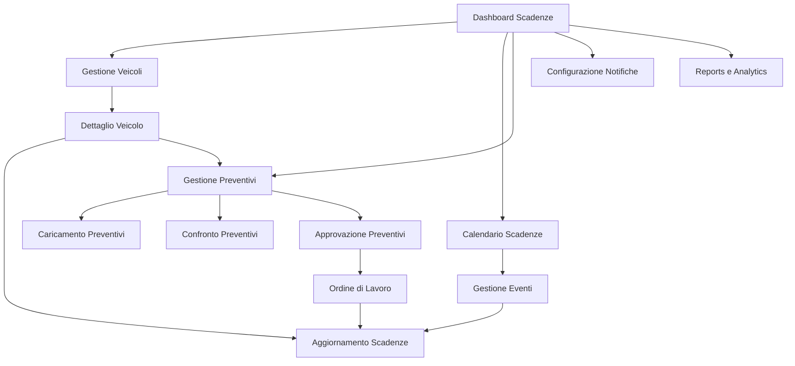

# Estensione Tabella Vehicles - Gestione Scadenze

## 1. Panoramica del Progetto

Estensione del sistema di gestione veicoli per includere il monitoraggio automatico delle scadenze di revisioni, tagliandi e documenti amministrativi. Il sistema fornirà notifiche proattive per evitare sanzioni e garantire la conformità normativa.

- Obiettivo: Automatizzare il controllo delle scadenze dei veicoli per prevenire problemi legali e operativi
- Utenti target: Gestori della flotta, amministratori, operatori logistici
- Valore: Riduzione dei rischi legali, ottimizzazione dei costi di manutenzione, miglioramento dell'efficienza operativa

## 2. Funzionalità Principali

### 2.1 Ruoli Utente

| Ruolo | Metodo di Registrazione | Permessi Principali |
|-------|------------------------|---------------------|
| Amministratore | Accesso diretto al sistema | Gestione completa scadenze, configurazione notifiche, reports |
| Gestore Flotta | Assegnazione da amministratore | Visualizzazione e gestione scadenze veicoli assegnati |
| Operatore | Accesso limitato | Solo visualizzazione scadenze in scadenza |

### 2.2 Moduli Funzionali

Il sistema di gestione scadenze veicoli comprende le seguenti pagine principali:

1. **Dashboard Scadenze**: panoramica generale, alert critici, statistiche scadenze
2. **Gestione Veicoli**: elenco veicoli con stato scadenze, filtri avanzati
3. **Calendario Scadenze**: vista calendario con tutte le scadenze programmate
4. **Gestione Preventivi**: caricamento, confronto e approvazione preventivi manutenzione
5. **Configurazione Notifiche**: impostazione alert e promemoria automatici
6. **Reports e Analytics**: analisi costi manutenzione, trend scadenze

### 2.3 Dettagli delle Pagine

| Nome Pagina | Nome Modulo | Descrizione Funzionalità |
|-------------|-------------|-------------------------|
| Dashboard Scadenze | Panoramica Alert | Visualizza scadenze critiche (entro 30 giorni), contatori per tipo scadenza, grafici trend |
| Dashboard Scadenze | Widget Statistiche | Mostra totale veicoli, scadenze del mese, costi previsti manutenzione |
| Gestione Veicoli | Lista Veicoli Estesa | Visualizza veicoli con colonne aggiuntive per stato scadenze, filtri per tipo scadenza e urgenza |
| Gestione Veicoli | Dettaglio Veicolo | Scheda completa con tutte le scadenze del veicolo, storico manutenzioni, documenti allegati |
| Gestione Preventivi | Caricamento Preventivi | Upload file PDF/immagini, inserimento dati preventivo (fornitore, importo, validità) |
| Gestione Preventivi | Confronto Preventivi | Tabella comparativa preventivi per stessa manutenzione, evidenziazione migliore offerta |
| Gestione Preventivi | Approvazione Preventivi | Workflow approvazione con stati (in attesa, approvato, rifiutato, scaduto), conversione in ordine lavoro |
| Calendario Scadenze | Vista Calendario | Calendario mensile/annuale con scadenze evidenziate per colore (critico, attenzione, normale) |
| Calendario Scadenze | Gestione Eventi | Aggiunta/modifica scadenze, impostazione promemoria, note operative |
| Configurazione Notifiche | Impostazioni Alert | Configurazione soglie di preavviso (7, 15, 30 giorni), canali notifica (email, dashboard) |
| Configurazione Notifiche | Template Messaggi | Personalizzazione messaggi notifica per tipo scadenza |
| Reports e Analytics | Report Scadenze | Generazione report PDF/Excel con scadenze per periodo, veicolo, tipo |
| Reports e Analytics | Analisi Costi | Grafici costi manutenzione, previsioni budget, confronti storici |
| Reports e Analytics | Report Preventivi | Analisi preventivi per fornitore, tempi approvazione, risparmi ottenuti |

## 3. Processo Principale

### Flusso Operativo Amministratore
1. Accesso alla Dashboard Scadenze per panoramica generale
2. Configurazione notifiche e soglie di preavviso
3. Gestione calendario scadenze con pianificazione interventi
4. Gestione preventivi: approvazione, confronto offerte, conversione in ordini
5. Monitoraggio reports per analisi costi e trend
6. Aggiornamento dati post-manutenzione

### Flusso Operativo Gestore Flotta
1. Visualizzazione veicoli assegnati con stato scadenze
2. Pianificazione interventi di manutenzione
3. Richiesta e caricamento preventivi da fornitori
4. Confronto preventivi e proposta di approvazione
5. Aggiornamento date scadenze post-intervento
6. Gestione documenti e certificazioni

### Flusso Gestione Preventivi
1. Identificazione necessità manutenzione da scadenza
2. Richiesta preventivi a fornitori multipli
3. Caricamento e catalogazione preventivi ricevuti
4. Confronto automatico prezzi e condizioni
5. Approvazione preventivo selezionato
6. Conversione in ordine di lavoro e pianificazione
7. Tracking stato lavorazione e completamento

## 4. Design dell'Interfaccia Utente

### 4.1 Stile di Design

- **Colori primari**: #007bff (blu principale), #28a745 (verde successo), #dc3545 (rosso critico)
- **Colori secondari**: #ffc107 (giallo attenzione), #6c757d (grigio neutro)
- **Stile pulsanti**: Arrotondati con ombre sottili, stati hover evidenti
- **Font**: Inter o system fonts, dimensioni 14px (corpo), 16px (titoli), 12px (etichette)
- **Layout**: Card-based con griglia responsive, navigazione top-bar
- **Icone**: Lucide React per coerenza, stile outline

### 4.2 Panoramica Design delle Pagine

| Nome Pagina | Nome Modulo | Elementi UI |
|-------------|-------------|-------------|
| Dashboard Scadenze | Panoramica Alert | Cards con bordi colorati per urgenza, icone veicoli, contatori animati |
| Dashboard Scadenze | Widget Statistiche | Grafici a ciambella per distribuzione scadenze, progress bar per budget |
| Gestione Veicoli | Lista Veicoli Estesa | Tabella con badge colorati per stato scadenze, filtri dropdown, paginazione |
| Gestione Veicoli | Dettaglio Veicolo | Layout a schede (Info, Scadenze, Storico, Preventivi), timeline verticale per eventi |
| Gestione Preventivi | Caricamento Preventivi | Drag&drop area per file, form dati preventivo, preview documenti caricati |
| Gestione Preventivi | Confronto Preventivi | Tabella comparativa responsive, highlighting migliore offerta, filtri per criteri |
| Gestione Preventivi | Approvazione Preventivi | Cards preventivi con stati colorati, workflow stepper, pulsanti azione |
| Calendario Scadenze | Vista Calendario | Calendario full-screen con eventi colorati, modal per dettagli, drag&drop |
| Configurazione Notifiche | Impostazioni Alert | Form con toggle switches, slider per giorni preavviso, preview notifiche |
| Reports e Analytics | Report Scadenze | Filtri avanzati, tabelle esportabili, grafici Chart.js responsive |
| Reports e Analytics | Report Preventivi | Dashboard analytics preventivi, grafici risparmi, KPI fornitori |

### 4.3 Responsività

Design mobile-first con breakpoints Bootstrap 5:
- Mobile (< 768px): Stack verticale, menu hamburger, cards full-width
- Tablet (768px - 1024px): Layout a 2 colonne, sidebar collassabile
- Desktop (> 1024px): Layout completo a 3 colonne, sidebar fissa

Ottimizzazione touch per dispositivi mobili con pulsanti di dimensione minima 44px.