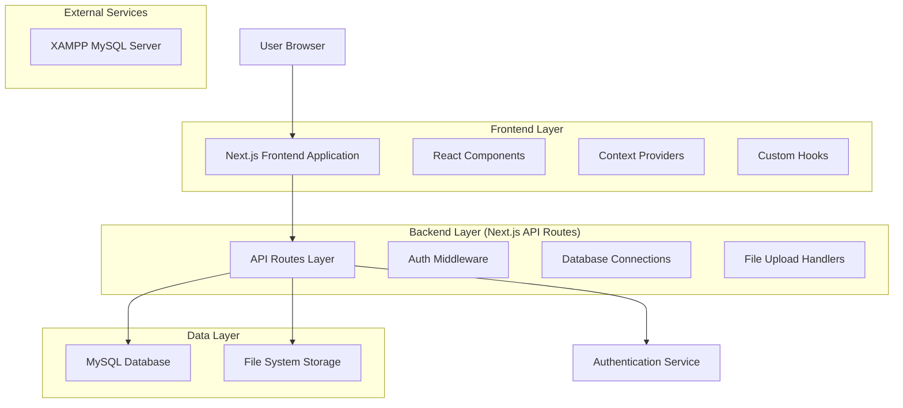
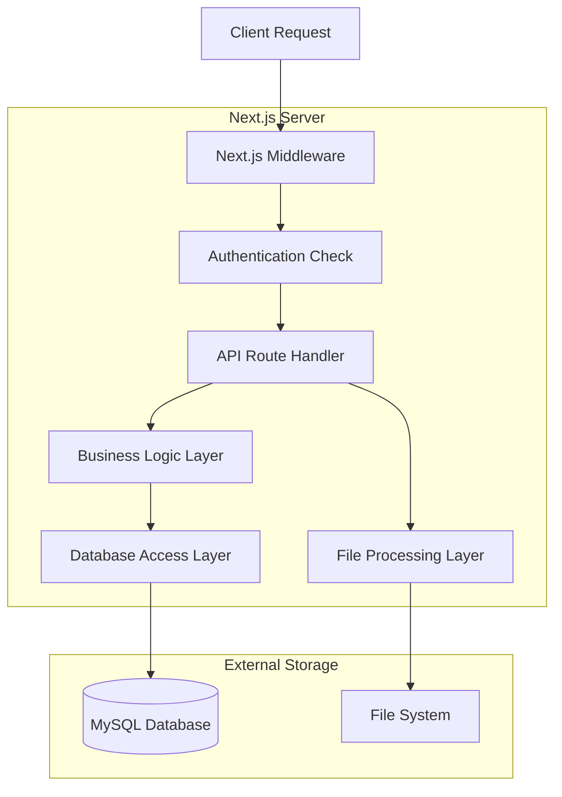
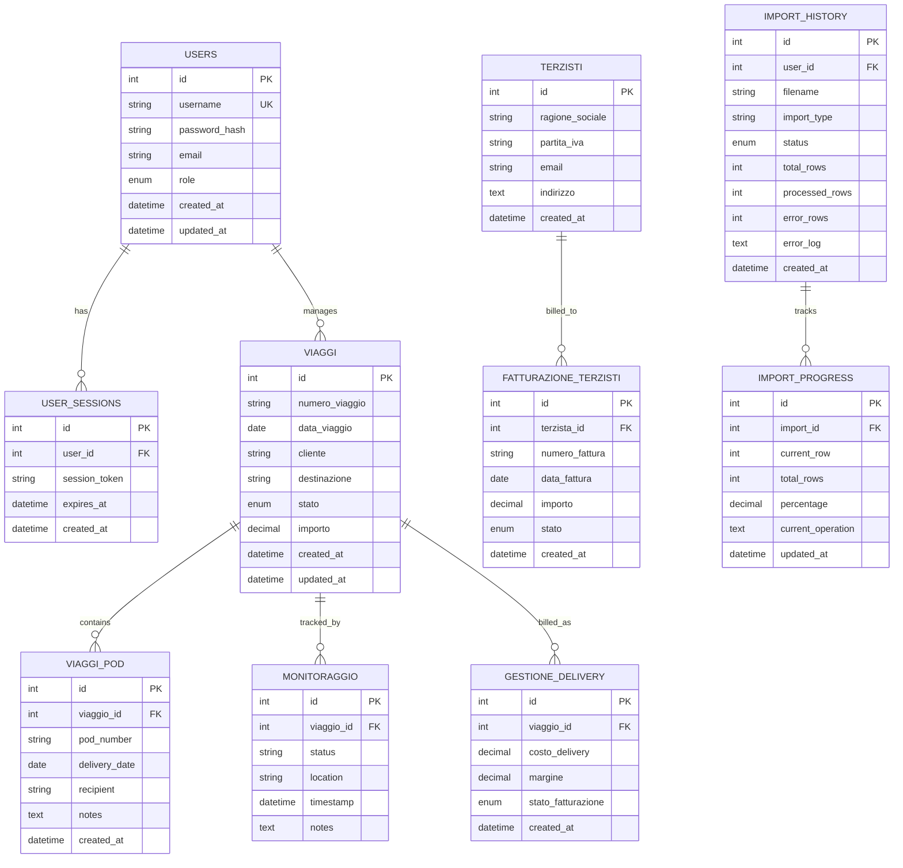

# Gestione Partesa - Documento Architettura Tecnica

## 1. Architecture Design



## 2. Technology Description

* **Frontend**: React\@18 + Next.js\@15.5.3 + Bootstrap\@5.3.2 + TypeScript\@5

* **Backend**: Next.js API Routes + Node.js\@24.4.1

* **Database**: MySQL\@8.0+ (via XAMPP) + Dual Database Architecture

* **Database Tunneling**: ngrok TCP tunnel a pagamento (porta 3306) - sostituisce bore tunnel dismesso

* **Authentication**: JWT + bcryptjs

* **File Processing**: multer + xlsx + react-dropzone

* **State Management**: Zustand\@5.0.2 + React Context

* **UI Components**: Lucide React icons + Custom Bootstrap components

* **Backup System**: Windows Batch Scripts + MySQL Dump + Automated Scheduling

* **Database Exposure**: ngrok TCP tunnel a pagamento per accesso remoto MySQL (porta 3306)

* **Development**: ESLint + TypeScript + Turbopack (Hot Reload)

## 3. Route Definitions

| Route                  | Purpose                                             |
| ---------------------- | --------------------------------------------------- |
| /                      | Home page - redirects automatically to /dashboard   |
| /dashboard             | Main dashboard with statistics and navigation cards |
| /login                 | User authentication page                            |
| /viaggi                | Travel management with advanced filtering           |
| /monitoraggio          | Real-time travel monitoring and tracking            |
| /viaggi-pod            | Proof of Delivery management                        |
| /fatturazione-terzisti | Third-party billing management                      |
| /gestione              | Delivery billing and management                     |
| /import\_viaggi\_PoD   | POD data import with Excel file processing          |
| /import-delivery       | Delivery data import and mapping                    |
| /sistema               | System administration and user management           |
| /backup-dashboard      | Database backup management and monitoring           |
| /funzionalita          | Features and help documentation                     |
| /vehicles              | Vehicle management dashboard with statistics        |
| /vehicles/list         | Complete vehicle list with advanced filtering      |
| /vehicles/quotes       | All maintenance quotes with filters and actions    |
| /vehicles/quotes/new   | Create new maintenance quote form                   |
| /vehicles/quotes/[id]  | Quote detail page with documents and actions       |
| /vehicles/quotes/[id]/edit | Edit existing quote with document management   |
| /vehicles/[plate]      | Vehicle detail page with associated quotes         |
| /vehicles/schedules    | Vehicle maintenance schedules management            |

## 4. API Definitions

### 4.1 Authentication APIs

**User Login**

```
POST /api/auth/login
```

Request:

| Param Name | Param Type | isRequired | Description                |
| ---------- | ---------- | ---------- | -------------------------- |
| username   | string     | true       | User login name            |
| password   | string     | true       | User password (plain text) |

Response:

| Param Name | Param Type | Description                           |
| ---------- | ---------- | ------------------------------------- |
| success    | boolean    | Login success status                  |
| token      | string     | JWT authentication token              |
| user       | object     | User information (id, username, role) |

**Token Verification**

```
POST /api/auth/verify
```

### 4.2 Dashboard APIs

**Dashboard Statistics**

```
GET /api/dashboard/stats
```

Response:

| Param Name   | Param Type | Description                                           |
| ------------ | ---------- | ----------------------------------------------------- |
| viaggi       | object     | Travel statistics (active, completed, pending, total) |
| anagrafiche  | object     | Registry statistics (clients, suppliers, users)       |
| fatturazione | object     | Billing statistics (monthly, pending, completed)      |
| import       | object     | Import statistics (files, pending, errors)            |
| sistema      | object     | System statistics (configs, logs, users)              |

### 4.3 Travel Management APIs

**Get Travels**

```
GET /api/viaggi
```

**Get Travel Details**

```
GET /api/viaggi/[id]
```

**Update Travel**

```
PUT /api/viaggi/[id]
```

### 4.4 Import APIs

**Upload POD File**

```
POST /api/import_viaggi_PoD/upload
```

**Execute POD Import**

```
POST /api/import_viaggi_PoD/execute
```

**Get Import Progress**

```
GET /api/import_viaggi_PoD/progress
```

### 4.5 Export APIs

**Export Travels**

```
GET /api/gestione/export
```

**Export Third-party Billing**

```
GET /api/terzisti/export
```

### 4.6 Backup Management APIs

**Get Backup Summary**

```
GET /api/backup/summary
```

Response:

| Param Name | Param Type | Description |
| ---------- | ---------- | ----------- |
| totalJobs | number | Total backup jobs executed |
| successfulJobs | number | Successfully completed jobs |
| failedJobs | number | Failed backup jobs |
| lastBackup | string | Last backup execution timestamp |
| nextScheduled | string | Next scheduled backup time |

**Get Backup Jobs**
```
GET /api/backup/jobs
```

### 4.7 Vehicle Management APIs

**Get All Vehicles**
```
GET /api/vehicles
```

**Get Vehicle Details**
```
GET /api/vehicles/[plate]
```

**Get All Maintenance Quotes**
```
GET /api/vehicles/quotes
```

Query Parameters:
| Param Name | Param Type | isRequired | Description |
|------------|------------|------------|-------------|
| vehicleId | number | false | Filter by vehicle ID |
| status | string | false | Filter by status (pending/approved/rejected) |
| supplierId | number | false | Filter by supplier ID |

Response:
| Param Name | Param Type | Description |
|------------|------------|-------------|
| success | boolean | Operation status |
| quotes | array | List of quotes with vehicle and supplier data |
| total | number | Total number of quotes |

**Create Maintenance Quote**
```
POST /api/vehicles/quotes
```

Request:
| Param Name | Param Type | isRequired | Description |
|------------|------------|------------|-------------|
| vehicle_id | number | true | Vehicle ID |
| supplier_id | number | true | Supplier ID |
| description | string | true | Service description |
| amount | number | true | Quote amount |
| valid_until | string | true | Expiry date (YYYY-MM-DD) |
| schedule_id | number | false | Associated schedule ID |
| notes | string | false | Additional notes |

**Update Quote Status**
```
PUT /api/vehicles/quotes
```

Request:
| Param Name | Param Type | isRequired | Description |
|------------|------------|------------|-------------|
| id | number | true | Quote ID |
| status | string | true | New status (approved/rejected) |
| notes | string | false | Decision notes |

**Get Quote Details**
```
GET /api/vehicles/quotes/[id]
```

**Update Quote**
```
PUT /api/vehicles/quotes/[id]
```

**Delete Quote**
```
DELETE /api/vehicles/quotes/[id]
```

**Upload Quote Documents**
```
POST /api/vehicles/quotes/[id]/documents
```

**Get Quote Documents**
```
GET /api/vehicles/quotes/[id]/documents
```

**Delete Quote Document**
```
DELETE /api/vehicles/quotes/[id]/documents?documentId=[docId]
```

**Get Backup Jobs**
```
GET /api/backup/jobs
```

**Get Backup Schedules**

```
GET /api/backup/schedules
```

**Get Backup Alerts**

```
GET /api/backup/alerts
```

**Execute Manual Backup**

```
POST /api/backup/execute
```

Request:

| Param Name | Param Type | isRequired | Description |
| ---------- | ---------- | ---------- | ----------- |
| type | string | true | Backup type: 'full', 'incremental', 'differential' |
| databases | array | true | List of databases to backup |

## 5. Server Architecture Diagram



## 6. Data Model

### 6.1 Data Model Definition



### 6.2 Data Definition Language

**Users Table**

```sql
CREATE TABLE users (
    id INT AUTO_INCREMENT PRIMARY KEY,
    username VARCHAR(50) UNIQUE NOT NULL,
    password_hash VARCHAR(255) NOT NULL,
    email VARCHAR(100),
    role ENUM('admin', 'user', 'guest') DEFAULT 'user',
    created_at TIMESTAMP DEFAULT CURRENT_TIMESTAMP,
    updated_at TIMESTAMP DEFAULT CURRENT_TIMESTAMP ON UPDATE CURRENT_TIMESTAMP
);

CREATE INDEX idx_users_username ON users(username);
CREATE INDEX idx_users_role ON users(role);
```

**User Sessions Table**

```sql
CREATE TABLE user_sessions (
    id INT AUTO_INCREMENT PRIMARY KEY,
    user_id INT NOT NULL,
    session_token VARCHAR(255) UNIQUE NOT NULL,
    expires_at TIMESTAMP NOT NULL,
    created_at TIMESTAMP DEFAULT CURRENT_TIMESTAMP,
    FOREIGN KEY (user_id) REFERENCES users(id) ON DELETE CASCADE
);

CREATE INDEX idx_sessions_token ON user_sessions(session_token);
CREATE INDEX idx_sessions_user_id ON user_sessions(user_id);
```

**Viaggi Table**

```sql
CREATE TABLE viaggi (
    id INT AUTO_INCREMENT PRIMARY KEY,
    numero_viaggio VARCHAR(50) UNIQUE NOT NULL,
    data_viaggio DATE NOT NULL,
    cliente VARCHAR(100),
    destinazione VARCHAR(200),
    stato ENUM('pianificato', 'in_corso', 'completato', 'annullato') DEFAULT 'pianificato',
    importo DECIMAL(10,2),
    created_at TIMESTAMP DEFAULT CURRENT_TIMESTAMP,
    updated_at TIMESTAMP DEFAULT CURRENT_TIMESTAMP ON UPDATE CURRENT_TIMESTAMP
);

CREATE INDEX idx_viaggi_data ON viaggi(data_viaggio);
CREATE INDEX idx_viaggi_stato ON viaggi(stato);
CREATE INDEX idx_viaggi_cliente ON viaggi(cliente);
```

**Import History Table**

```sql
CREATE TABLE import_history (
    id INT AUTO_INCREMENT PRIMARY KEY,
    user_id INT NOT NULL,
    filename VARCHAR(255) NOT NULL,
    import_type ENUM('viaggi_pod', 'delivery', 'terzisti') NOT NULL,
    status ENUM('pending', 'processing', 'completed', 'failed') DEFAULT 'pending',
    total_rows INT DEFAULT 0,
    processed_rows INT DEFAULT 0,
    error_rows INT DEFAULT 0,
    error_log TEXT,
    created_at TIMESTAMP DEFAULT CURRENT_TIMESTAMP,
    FOREIGN KEY (user_id) REFERENCES users(id)
);

CREATE INDEX idx_import_history_user_id ON import_history(user_id);
CREATE INDEX idx_import_history_status ON import_history(status);
CREATE INDEX idx_import_history_type ON import_history(import_type);
```

**Initial Data**

```sql
-- Create default admin user
INSERT INTO users (username, password_hash, email, role) VALUES 
('admin', '$2b$10$hash_here', 'admin@gestione-partesa.com', 'admin');

-- Create sample travel data
INSERT INTO viaggi (numero_viaggio, data_viaggio, cliente, destinazione, stato, importo) VALUES 
('V001', '2024-01-15', 'Cliente A', 'Milano', 'completato', 1500.00),
('V002', '2024-01-16', 'Cliente B', 'Roma', 'in_corso', 2000.00);
```

## 7. Security Architecture

### 7.1 Authentication Flow

1. User submits credentials to `/api/auth/login`
2. Server validates against database using bcryptjs
3. JWT token generated with user info and expiration
4. Token stored in localStorage on client
5. Middleware validates token on protected routes
6. Automatic token refresh on expiration

### 7.2 Authorization Levels

* **Public Routes**: Login page, static assets

* **Authenticated Routes**: Dashboard, data views

* **Admin Routes**: User management, system configuration

* **API Protection**: JWT middleware on all API routes

### 7.3 Data Protection

* Input validation on all forms

* SQL injection prevention with parameterized queries

* XSS protection with input sanitization

* File upload validation and size limits

* HTTPS enforcement in production

