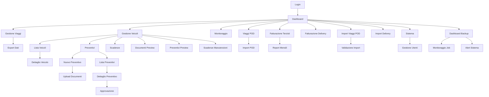

# Gestione Partesa - Documento dei Requisiti di Prodotto

## 1. Product Overview

Gestione Partesa è un sistema web completo per la gestione logistica e amministrativa di viaggi, fatturazione e monitoraggio operativo. L'applicazione centralizza la gestione di delivery, viaggi POD, fatturazione terzisti e fornisce strumenti avanzati di import/export dati con dashboard di monitoraggio in tempo reale.

Il sistema risolve la complessità della gestione manuale di operazioni logistiche, automatizzando processi di import dati, generazione report e monitoraggio KPI per aziende del settore trasporti e logistica.

## 2. Core Features

### 2.1 User Roles

| Role  | Registration Method          | Core Permissions                                                                  |
| ----- | ---------------------------- | --------------------------------------------------------------------------------- |
| Admin | Creazione diretta da sistema | Accesso completo a tutte le funzionalità, gestione utenti, configurazioni sistema |
| User  | Creazione da Admin           | Accesso a dashboard, visualizzazione dati, operazioni base                        |
| Guest | Login temporaneo             | Solo visualizzazione limitata                                                     |

### 2.2 Feature Module

Il sistema Gestione Partesa è composto dalle seguenti pagine principali:

1. **Dashboard**: panoramica generale, statistiche in tempo reale, navigazione rapida
2. **Gestione Viaggi**: gestione completa viaggi, filtri avanzati, export dati
3. **Gestione Veicoli**: gestione completa parco veicoli, manutenzioni, preventivi, anagrafica veicoli, documenti, scadenze
4. **Monitoraggio**: tracking viaggi in corso, stato operativo, alert
5. **Viaggi POD**: gestione Proof of Delivery, import automatico, validazione
6. **Fatturazione Terzisti**: gestione fatturazione fornitori, export report
7. **Fatturazione Delivery**: gestione fatturazione delivery, calcoli automatici
8. **Import Viaggi POD**: caricamento file Excel, mapping colonne, validazione dati
9. **Import Delivery**: import dati delivery, configurazione mapping
10. **Sistema**: configurazioni, gestione utenti, log sistema, backup
11. **Dashboard Backup**: monitoraggio backup automatici, gestione job, alert sistema
12. **Login**: autenticazione utenti, gestione sessioni

### 2.3 Page Details

| Page Name             | Module Name           | Feature description                                                                                          |
| --------------------- | --------------------- | ------------------------------------------------------------------------------------------------------------ |
| Dashboard             | Panoramica Generale   | Visualizza statistiche real-time di viaggi, fatturazione, import. Navigazione rapida alle sezioni principali |
| Dashboard             | Sezioni Operative     | Cards interattive per Viaggi, Fatturazione, Anagrafiche, Import, Sistema, Supporto                           |
| Dashboard             | Data/Ora Live         | Aggiornamento automatico data e ora corrente                                                                 |
| Gestione Viaggi       | Lista Viaggi          | Visualizza, filtra, ordina viaggi con paginazione avanzata                                                   |
| Gestione Viaggi       | Filtri Avanzati       | Filtra per data, stato, cliente, fornitore con reset e applicazione                                          |
| Gestione Viaggi       | Export Dati           | Esporta viaggi filtrati in formato Excel/CSV                                                                 |
| Gestione Veicoli      | Dashboard Veicoli     | Panoramica parco veicoli, statistiche manutenzioni, preventivi attivi                                        |
| Gestione Veicoli      | Lista Veicoli         | Visualizza tutti i veicoli con filtri per marca, modello, stato                                              |
| Gestione Veicoli      | Dettaglio Veicolo     | Informazioni complete veicolo, scadenze, preventivi associati                                                |
| Gestione Veicoli      | Gestione Preventivi   | Crea, modifica, approva preventivi manutenzione con allegati                                                 |
| Gestione Veicoli      | Lista Preventivi      | Visualizza tutti i preventivi con filtri per stato e fornitore                                               |
| Gestione Veicoli      | Scadenze Manutenzione | Gestisce scadenze revisioni, tagliandi, assicurazioni                                                        |
| Gestione Veicoli      | Upload Documenti      | Caricamento allegati preventivi con drag\&drop e validazione                                                 |
| Monitoraggio          | Tracking Real-time    | Monitora stato viaggi in corso, alert automatici                                                             |
| Monitoraggio          | Statistiche Operative | KPI viaggi completati, in corso, ritardi                                                                     |
| Viaggi POD            | Gestione POD          | Visualizza, modifica, valida Proof of Delivery                                                               |
| Viaggi POD            | Import Automatico     | Carica file Excel POD con mapping automatico colonne                                                         |
| Fatturazione Terzisti | Gestione Fatture      | Crea, modifica, elimina fatture fornitori                                                                    |
| Fatturazione Terzisti | Report Mensili        | Genera report fatturazione per periodo                                                                       |
| Fatturazione Delivery | Calcoli Automatici    | Calcola automaticamente costi delivery basati su parametri                                                   |
| Import Viaggi POD     | Upload File           | Carica file Excel/CSV con validazione formato                                                                |
| Import Viaggi POD     | Mapping Colonne       | Configura corrispondenza colonne file-database                                                               |
| Import Viaggi POD     | Validazione Dati      | Verifica integrità dati prima import definitivo                                                              |
| Import Delivery       | Configurazione Import | Setup parametri import delivery personalizzati                                                               |
| Sistema               | Gestione Utenti       | Crea, modifica, elimina utenti sistema                                                                       |
| Sistema               | Configurazioni        | Gestisce parametri sistema, backup, log                                                                      |
| Dashboard Backup      | Monitoraggio Job      | Visualizza stato backup in tempo reale, progress tracking                                                    |
| Dashboard Backup      | Gestione Schedule     | Configura backup automatici full/incrementali/differenziali                                                  |
| Dashboard Backup      | Alert Sistema         | Notifiche backup falliti, spazio disco, errori critici                                                       |
| Dashboard Backup      | Statistiche Backup    | Report dimensioni, tempi esecuzione, successo/fallimento                                                     |
| Gestione Veicoli      | Anagrafica Veicoli    | Gestione completa dati veicolo, marca, modello, targa, proprietà                                             |
| Gestione Veicoli      | Documenti Veicolo     | Upload, visualizzazione, gestione scadenze documenti con preview diretta                                     |
| Gestione Veicoli      | Preventivi            | Gestione preventivi con apertura diretta PDF o navigazione dettaglio                                         |
| Gestione Veicoli      | Scadenze Manutenzioni | Monitoraggio km e date per tagliandi, revisioni, assicurazioni                                               |
| Gestione Veicoli      | Filtri Avanzati       | Ricerca per marca, modello, proprietà, tipo patente, stato                                                   |
| Login                 | Autenticazione        | Login sicuro con JWT, gestione sessioni                                                                      |

## 3. Core Process

### Flusso Utente Principale

1. L'utente accede tramite login con credenziali
2. Viene reindirizzato automaticamente alla Dashboard
3. Dalla Dashboard naviga alle sezioni operative
4. Utilizza filtri avanzati per visualizzare dati specifici
5. Esporta report o importa nuovi dati
6. Monitora operazioni in tempo reale

### Flusso Admin

1. Accesso con privilegi amministrativi
2. Gestione utenti e configurazioni sistema
3. Monitoraggio log e backup automatici
4. Configurazione parametri operativi

## 4. User Interface Design

### 4.1 Design Style

* **Colori Primari**: Blu (#3B82F6), Verde (#10B981), Grigio (#6B7280)

* **Colori Secondari**: Rosso (#EF4444) per alert, Giallo (#F59E0B) per warning

* **Stile Pulsanti**: Rounded corners, effetti hover, gradient per azioni primarie

* **Font**: System fonts (Segoe UI, Arial), dimensioni 14px-18px per testo, 24px+ per titoli

* **Layout**: Card-based design, sidebar navigation, responsive grid

* **Icone**: Lucide React icons, dimensioni 16px-24px

* **Animazioni**: Smooth transitions, loading spinners, hover effects

### 4.2 Page Design Overview

| Page Name       | Module Name   | UI Elements                                                             |
| --------------- | ------------- | ----------------------------------------------------------------------- |
| Dashboard       | Header        | Titolo "Dashboard Moderna", badge data/ora live, info utente            |
| Dashboard       | Cards Sezioni | Grid responsive 2-3 colonne, gradient backgrounds, hover effects        |
| Dashboard       | Statistiche   | Numeri grandi, icone colorate, skeleton loading                         |
| Gestione Viaggi | Filtri        | Collapsible panel, form controls Bootstrap, pulsanti allineati a destra |
| Gestione Viaggi | Tabella       | Sortable headers, paginazione, row hover, responsive                    |
| Import Pages    | Upload Zone   | Drag & drop area, progress bar, file validation feedback                |
| Login           | Form          | Centered layout, input validation, loading states                       |

### 4.3 Responsiveness

L'applicazione è desktop-first con adattamento mobile. Utilizza Bootstrap 5.3.2 per responsive design, con breakpoints standard e ottimizzazione touch per dispositivi mobili. Navigation collapsible su schermi piccoli.

## 5. Technical Requirements

### 5.1 Performance

* Caricamento pagina < 2 secondi

* Import file fino a 10MB

* Supporto 100+ utenti concorrenti

* Cache intelligente per query frequenti

### 5.2 Security

* Autenticazione JWT con refresh token

* Validazione input lato client e server

* Protezione CSRF e XSS

* Backup automatici database

### 5.3 Compatibility

* Browser moderni (Chrome 90+, Firefox 88+, Safari 14+)

* Node.js 18+ per sviluppo

* MySQL 8.0+ per database

* Windows/Linux server support

