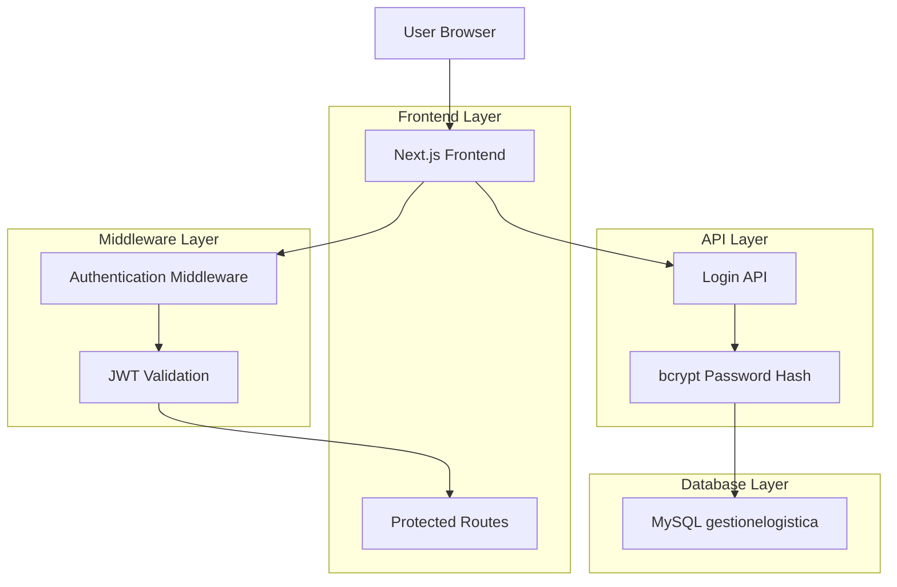
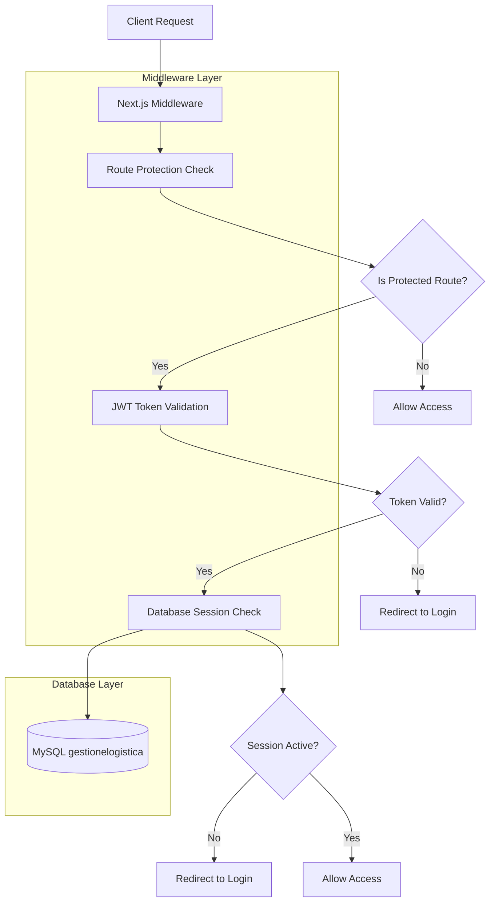
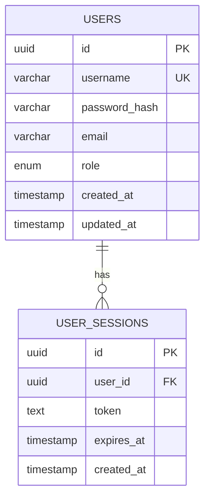

# Architettura Tecnica - Sistema di Autenticazione

## 1. Architecture design



## 2. Technology Description

* Frontend: React\@18 + Next.js\@14 + TypeScript + Tailwind CSS

* Authentication: JWT + bcrypt + Next.js middleware

* Database: MySQL (database gestionelogistica esistente)

* Session Management: Database-based con token JWT

## 3. Route definitions

| Route                  | Purpose                                                    |
| ---------------------- | ---------------------------------------------------------- |
| /login                 | Pagina di autenticazione utente                            |
| /api/auth/login        | API endpoint per validazione credenziali                   |
| /api/auth/logout       | API endpoint per logout e invalidazione sessione           |
| /api/auth/verify       | API endpoint per verifica validità token                   |
| /                      | Homepage protetta (reindirizza a /gestione se autenticato) |
| /gestione              | Dashboard principale protetta                              |
| /viaggi                | Pagina viaggi protetta                                     |
| /monitoraggio          | Pagina monitoraggio protetta                               |
| /fatturazione-terzisti | Pagina fatturazione protetta                               |

## 4. API definitions

### 4.1 Core API

**Autenticazione utente**

```
POST /api/auth/login
```

Request:

| Param Name | Param Type | isRequired | Description               |
| ---------- | ---------- | ---------- | ------------------------- |
| username   | string     | true       | Nome utente per l'accesso |
| password   | string     | true       | Password in chiaro        |

Response:

| Param Name | Param Type | Description                              |
| ---------- | ---------- | ---------------------------------------- |
| success    | boolean    | Stato dell'autenticazione                |
| token      | string     | JWT token se successo                    |
| user       | object     | Informazioni utente (id, username, role) |
| message    | string     | Messaggio di errore se fallimento        |

Example:

```json
{
  "username": "admin",
  "password": "password123"
}
```

**Logout utente**

```
POST /api/auth/logout
```

Request:

| Param Name | Param Type | isRequired | Description             |
| ---------- | ---------- | ---------- | ----------------------- |
| token      | string     | true       | JWT token da invalidare |

Response:

| Param Name | Param Type | Description           |
| ---------- | ---------- | --------------------- |
| success    | boolean    | Stato del logout      |
| message    | string     | Messaggio di conferma |

**Verifica token**

```
GET /api/auth/verify
```

Headers:

| Header Name   | Header Type | isRequired | Description      |
| ------------- | ----------- | ---------- | ---------------- |
| Authorization | string      | true       | Bearer JWT token |

Response:

| Param Name | Param Type | Description                   |
| ---------- | ---------- | ----------------------------- |
| valid      | boolean    | Validità del token            |
| user       | object     | Informazioni utente se valido |
| expires    | string     | Data scadenza token           |

## 5. Server architecture diagram



## 6. Data model

### 6.1 Data model definition



### 6.2 Data Definition Language

**Tabella Users**

```sql
-- Creazione tabella users
CREATE TABLE users (
    id VARCHAR(36) PRIMARY KEY DEFAULT (UUID()),
    username VARCHAR(50) UNIQUE NOT NULL,
    password_hash VARCHAR(255) NOT NULL,
    email VARCHAR(100),
    role ENUM('admin', 'user') DEFAULT 'user',
    created_at TIMESTAMP DEFAULT CURRENT_TIMESTAMP,
    updated_at TIMESTAMP DEFAULT CURRENT_TIMESTAMP ON UPDATE CURRENT_TIMESTAMP
);

-- Indici per performance
CREATE INDEX idx_users_username ON users(username);
CREATE INDEX idx_users_email ON users(email);
CREATE INDEX idx_users_role ON users(role);

-- Dati iniziali admin
INSERT INTO users (username, password_hash, email, role) VALUES 
('admin', '$2b$12$example_hash_here', 'admin@gestione-partesa.com', 'admin');
```

**Tabella User Sessions**

```sql
-- Creazione tabella user_sessions
CREATE TABLE user_sessions (
    id VARCHAR(36) PRIMARY KEY DEFAULT (UUID()),
    user_id VARCHAR(36) NOT NULL,
    token TEXT NOT NULL,
    expires_at TIMESTAMP NOT NULL,
    created_at TIMESTAMP DEFAULT CURRENT_TIMESTAMP,
    FOREIGN KEY (user_id) REFERENCES users(id) ON DELETE CASCADE
);

-- Indici per performance
CREATE INDEX idx_sessions_user_id ON user_sessions(user_id);
CREATE INDEX idx_sessions_token ON user_sessions(token(255));
CREATE INDEX idx_sessions_expires ON user_sessions(expires_at);

-- Pulizia automatica sessioni scadute (evento schedulato)
CREATE EVENT IF NOT EXISTS cleanup_expired_sessions
ON SCHEDULE EVERY 1 HOUR
DO
  DELETE FROM user_sessions WHERE expires_at < NOW();
```

**Configurazione Database**

```sql
-- Abilitazione eventi per pulizia automatica
SET GLOBAL event_scheduler = ON;

-- Verifica configurazione
SHOW VARIABLES LIKE 'event_scheduler';
```

