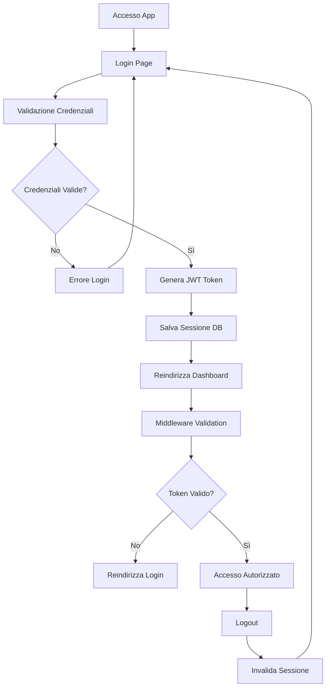

# Sistema di Autenticazione - Gestione Partesa

## 1. Product Overview
Implementazione di un sistema di autenticazione sicuro per l'applicazione Gestione Partesa che richiede login obbligatorio per accedere a tutte le funzionalità.
- Il sistema protegge l'accesso all'intera applicazione tramite autenticazione JWT e gestione sessioni sicura.
- Target: garantire sicurezza e controllo accessi per gli utenti del sistema di gestione logistica.

## 2. Core Features

### 2.1 User Roles
| Role | Registration Method | Core Permissions |
|------|---------------------|------------------|
| Admin | Creazione diretta nel database | Accesso completo a tutte le funzionalità |
| User | Registrazione tramite admin | Accesso alle funzionalità base di gestione |

### 2.2 Feature Module
Il sistema di autenticazione comprende le seguenti pagine principali:
1. **Login page**: form di autenticazione, validazione credenziali, gestione errori.
2. **Dashboard protetto**: reindirizzamento post-login, visualizzazione contenuti autorizzati.
3. **Gestione sessioni**: logout, scadenza automatica, rinnovo token.

### 2.3 Page Details
| Page Name | Module Name | Feature description |
|-----------|-------------|---------------------|
| Login page | Authentication Form | Validare username/password, gestire errori di login, reindirizzare dopo successo |
| Login page | Session Management | Creare JWT token, salvare sessione nel database, impostare cookie sicuri |
| Dashboard | Route Protection | Verificare autenticazione, controllare validità token, reindirizzare se non autorizzato |
| Dashboard | User Interface | Mostrare informazioni utente, pulsante logout, navigazione protetta |
| All Pages | Middleware Protection | Intercettare richieste, validare token JWT, gestire scadenza sessioni |

## 3. Core Process
**Flusso di Autenticazione Utente:**
1. L'utente accede all'applicazione e viene reindirizzato alla pagina di login
2. Inserisce username e password nel form di login
3. Il sistema valida le credenziali contro il database gestionelogistica
4. Se valide, genera un JWT token e crea una sessione nel database
5. L'utente viene reindirizzato alla dashboard principale
6. Ogni richiesta successiva viene validata dal middleware JWT
7. Al logout, la sessione viene invalidata e l'utente reindirizzato al login

## 4. User Interface Design
### 4.1 Design Style
- **Colori primari**: #2563eb (blu), #1f2937 (grigio scuro)
- **Colori secondari**: #f3f4f6 (grigio chiaro), #ef4444 (rosso errori)
- **Stile pulsanti**: Arrotondati con ombra leggera, hover effects
- **Font**: Inter, dimensioni 14px-16px per testo, 24px per titoli
- **Layout**: Centrato, card-based per il form di login
- **Icone**: Lucide React per consistenza con il progetto esistente

### 4.2 Page Design Overview
| Page Name | Module Name | UI Elements |
|-----------|-------------|-------------|
| Login page | Authentication Form | Card centrata, campi input con label, pulsante login blu, link password dimenticata |
| Login page | Error Display | Alert rosso per errori, validazione real-time campi, loading spinner |
| Dashboard | Header Navigation | Barra superiore con logo, nome utente, pulsante logout |
| Dashboard | Protected Content | Layout esistente con aggiunta controlli di autenticazione |

### 4.3 Responsiveness
Design mobile-first con adattamento desktop, ottimizzazione touch per dispositivi mobili, form di login responsive.