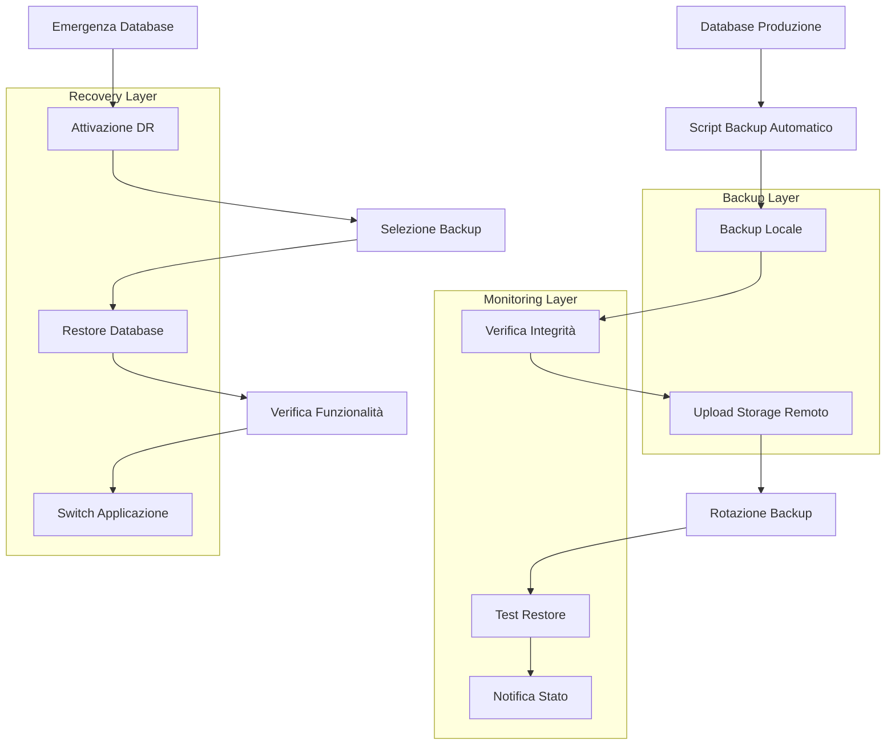

# Sistema di Backup Database MySQL - Gestione Partesa

## 1. Product Overview
Sistema completo di backup e disaster recovery per il database MySQL `gestionelogistica` del progetto Gestione Partesa, progettato per garantire la massima protezione dei dati critici di produzione.
- Il sistema implementa strategie di backup multiple con automazione completa per prevenire qualsiasi perdita di dati.
- Target: garantire continuità operativa e recupero rapido in caso di emergenze per un sistema logistico mission-critical.

## 2. Core Features

### 2.1 User Roles
| Role | Responsabilità | Accesso Backup |
|------|----------------|----------------|
| Database Administrator | Gestione completa sistema backup | Accesso completo a tutti i backup e procedure |
| System Administrator | Monitoraggio e manutenzione | Accesso ai log e script di automazione |
| Developer | Backup di sviluppo | Accesso ai backup di test e staging |

### 2.2 Feature Module
Il sistema di backup comprende i seguenti moduli principali:
1. **Backup Automatizzato**: script schedulati, backup multipli, rotazione automatica.
2. **Monitoraggio e Alerting**: controllo integrità, notifiche errori, dashboard stato.
3. **Disaster Recovery**: procedure restore, test recovery, documentazione emergenze.
4. **Sicurezza e Crittografia**: backup crittografati, accesso controllato, audit trail.

### 2.3 Page Details
| Modulo | Componente | Descrizione Funzionalità |
|--------|------------|-------------------------|
| Backup Automatizzato | Script Backup Completo | Eseguire mysqldump completo database, compressione gzip, timestamp, validazione integrità |
| Backup Automatizzato | Script Backup Incrementale | Utilizzare binary logs MySQL, backup solo modifiche, sincronizzazione master-slave |
| Backup Automatizzato | Rotazione Backup | Mantenere 7 giorni backup giornalieri, 4 settimane backup settimanali, 12 mesi backup mensili |
| Monitoraggio | Controllo Integrità | Verificare checksum backup, testare restore automatico, validazione struttura database |
| Monitoraggio | Sistema Alerting | Inviare notifiche email/SMS per errori, dashboard web stato backup, log centralizzato |
| Disaster Recovery | Procedure Restore | Documentare step-by-step restore, script automatici recovery, test periodici |
| Sicurezza | Crittografia Backup | Crittografare backup con AES-256, gestione chiavi sicura, accesso autenticato |

## 3. Core Process
**Flusso di Backup Automatizzato:**
1. Cron job esegue script backup alle 02:00 ogni notte
2. Script verifica spazio disco e connessione database
3. Esegue backup completo con mysqldump e compressione
4. Calcola checksum per verifica integrità
5. Carica backup su storage remoto (AWS S3/Google Drive)
6. Aggiorna log e invia notifica successo/errore
7. Esegue rotazione backup secondo policy di retention
8. Test automatico restore su database di test

**Flusso di Disaster Recovery:**
1. Rilevamento problema database principale
2. Attivazione procedura emergenza
3. Identificazione ultimo backup valido
4. Restore database su server di backup
5. Reindirizzamento applicazione a database restored
6. Verifica integrità dati e funzionalità
7. Comunicazione stakeholder e documentazione incident



## 4. User Interface Design
### 4.1 Design Style
- **Colori primari**: #dc3545 (rosso emergenza), #28a745 (verde successo)
- **Colori secondari**: #ffc107 (giallo warning), #17a2b8 (blu info)
- **Stile dashboard**: Minimalista con focus su stato e metriche critiche
- **Font**: Monospace per log e script, Sans-serif per interfaccia
- **Layout**: Dashboard centralizzata con widget stato backup
- **Icone**: Font Awesome per stati (✓ successo, ✗ errore, ⚠ warning)

### 4.2 Page Design Overview
| Componente | Modulo | Elementi UI |
|------------|--------|-------------|
| Dashboard Backup | Stato Sistema | Widget tempo ultimo backup, spazio utilizzato, stato servizi, grafico trend |
| Dashboard Backup | Log Attività | Tabella cronologica backup, filtri data/tipo, export CSV, dettagli errori |
| Pannello Recovery | Gestione Restore | Lista backup disponibili, preview contenuto, wizard restore guidato |
| Configurazione | Impostazioni | Form parametri backup, test connessioni, gestione schedule cron |

### 4.3 Responsiveness
Dashboard responsive per monitoraggio da mobile, interfaccia touch-friendly per operazioni emergenza, notifiche push per alerting critico.

## 5. Strategie di Backup

### 5.1 Backup Completo (Full Backup)
**Frequenza**: Giornaliera alle 02:00
**Metodo**: mysqldump con opzioni ottimizzate
**Retention**: 7 giorni locali + 30 giorni remoti

```bash
#!/bin/bash
# Script: full_backup.sh
DB_NAME="gestionelogistica"
BACKUP_DIR="/var/backups/mysql"
DATE=$(date +%Y%m%d_%H%M%S)
BACKUP_FILE="${DB_NAME}_full_${DATE}.sql.gz"

mysqldump --single-transaction --routines --triggers \
  --all-databases --master-data=2 \
  | gzip > "${BACKUP_DIR}/${BACKUP_FILE}"
```

### 5.2 Backup Incrementale
**Frequenza**: Ogni 4 ore
**Metodo**: Binary logs MySQL
**Retention**: 24 ore locali

```bash
#!/bin/bash
# Script: incremental_backup.sh
BINLOG_DIR="/var/lib/mysql"
BACKUP_DIR="/var/backups/mysql/incremental"
DATE=$(date +%Y%m%d_%H%M%S)

mysql -e "FLUSH LOGS;"
cp ${BINLOG_DIR}/mysql-bin.* ${BACKUP_DIR}/
```

### 5.3 Backup Differenziale
**Frequenza**: Ogni 12 ore
**Metodo**: Confronto con ultimo backup completo
**Retention**: 3 giorni

## 6. Automazione e Scheduling

### 6.1 Configurazione Cron Jobs
```bash
# /etc/crontab - Backup scheduling
# Backup completo giornaliero
0 2 * * * root /opt/backup/scripts/full_backup.sh

# Backup incrementale ogni 4 ore
0 */4 * * * root /opt/backup/scripts/incremental_backup.sh

# Backup differenziale ogni 12 ore
0 */12 * * * root /opt/backup/scripts/differential_backup.sh

# Pulizia backup vecchi
0 3 * * * root /opt/backup/scripts/cleanup_old_backups.sh

# Test restore settimanale
0 4 * * 0 root /opt/backup/scripts/test_restore.sh
```

### 6.2 Script di Monitoraggio
```bash
#!/bin/bash
# Script: monitor_backups.sh
LOG_FILE="/var/log/backup_monitor.log"
ALERT_EMAIL="admin@gestione-partesa.com"

# Verifica ultimo backup
LAST_BACKUP=$(find /var/backups/mysql -name "*.sql.gz" -mtime -1 | wc -l)
if [ $LAST_BACKUP -eq 0 ]; then
    echo "ALERT: Nessun backup nelle ultime 24 ore" | mail -s "Backup Alert" $ALERT_EMAIL
fi

# Verifica spazio disco
DISK_USAGE=$(df /var/backups | tail -1 | awk '{print $5}' | sed 's/%//')
if [ $DISK_USAGE -gt 85 ]; then
    echo "ALERT: Spazio disco backup al ${DISK_USAGE}%" | mail -s "Disk Space Alert" $ALERT_EMAIL
fi
```

## 7. Storage e Sicurezza

### 7.1 Storage Locale
- **Percorso**: `/var/backups/mysql/`
- **Permessi**: 700 (solo root)
- **Filesystem**: XFS con snapshot support
- **Capacità**: Minimo 500GB dedicati

### 7.2 Storage Remoto
- **AWS S3**: Bucket dedicato con versioning
- **Google Drive**: Account business con crittografia
- **FTP Sicuro**: Server backup secondario
- **Sync**: rsync con SSH keys

### 7.3 Crittografia
```bash
#!/bin/bash
# Crittografia backup con GPG
GPG_RECIPIENT="backup@gestione-partesa.com"
BACKUP_FILE="backup.sql.gz"
ENCRYPTED_FILE="backup.sql.gz.gpg"

gpg --trust-model always --encrypt \
    --recipient $GPG_RECIPIENT \
    --output $ENCRYPTED_FILE $BACKUP_FILE
```

## 8. Procedure di Restore

### 8.1 Restore Completo
```bash
#!/bin/bash
# Script: restore_full.sh
BACKUP_FILE="$1"
DB_NAME="gestionelogistica"

# Verifica backup
if [ ! -f "$BACKUP_FILE" ]; then
    echo "Errore: File backup non trovato"
    exit 1
fi

# Stop applicazione
systemctl stop gestione-partesa

# Backup database corrente
mysqldump $DB_NAME > "/tmp/pre_restore_backup_$(date +%Y%m%d_%H%M%S).sql"

# Restore database
zcat "$BACKUP_FILE" | mysql

# Verifica integrità
mysql -e "CHECK TABLE users, viaggi, delivery, user_sessions;" $DB_NAME

# Restart applicazione
systemctl start gestione-partesa
```

### 8.2 Restore Point-in-Time
```bash
#!/bin/bash
# Script: restore_point_in_time.sh
TARGET_TIME="$1"  # Format: YYYY-MM-DD HH:MM:SS
BASE_BACKUP="$2"
BINLOG_DIR="/var/backups/mysql/incremental"

# Restore base backup
zcat "$BASE_BACKUP" | mysql

# Apply binary logs fino al target time
mysqlbinlog --stop-datetime="$TARGET_TIME" \
    ${BINLOG_DIR}/mysql-bin.* | mysql
```

## 9. Test e Validazione

### 9.1 Test Automatici
```bash
#!/bin/bash
# Script: test_restore.sh
TEST_DB="gestionelogistica_test"
LATEST_BACKUP=$(ls -t /var/backups/mysql/*.sql.gz | head -1)

# Crea database di test
mysql -e "DROP DATABASE IF EXISTS $TEST_DB; CREATE DATABASE $TEST_DB;"

# Restore su database test
zcat "$LATEST_BACKUP" | sed "s/gestionelogistica/$TEST_DB/g" | mysql

# Verifica tabelle critiche
TABLE_COUNT=$(mysql -sN -e "SELECT COUNT(*) FROM information_schema.tables WHERE table_schema='$TEST_DB'")
USER_COUNT=$(mysql -sN -e "SELECT COUNT(*) FROM $TEST_DB.users")

echo "Test Restore: $TABLE_COUNT tabelle, $USER_COUNT utenti"

# Cleanup
mysql -e "DROP DATABASE $TEST_DB;"
```

### 9.2 Checklist Validazione
- [ ] Backup completato senza errori
- [ ] File backup presente e non corrotto
- [ ] Checksum MD5 corretto
- [ ] Test restore su database temporaneo
- [ ] Verifica integrità tabelle critiche
- [ ] Upload storage remoto completato
- [ ] Log backup aggiornato
- [ ] Notifica successo inviata

## 10. Monitoraggio e Alerting

### 10.1 Metriche Chiave
- **RTO (Recovery Time Objective)**: < 30 minuti
- **RPO (Recovery Point Objective)**: < 4 ore
- **Disponibilità target**: 99.9%
- **Tempo backup completo**: < 2 ore
- **Spazio storage utilizzato**: < 80%

### 10.2 Sistema di Alert
```bash
#!/bin/bash
# Script: send_alert.sh
ALERT_TYPE="$1"
MESSAGE="$2"
EMAIL="admin@gestione-partesa.com"
SLACK_WEBHOOK="https://hooks.slack.com/services/..."

# Email alert
echo "$MESSAGE" | mail -s "Backup Alert: $ALERT_TYPE" $EMAIL

# Slack notification
curl -X POST -H 'Content-type: application/json' \
    --data "{\"text\":\"🚨 Backup Alert: $ALERT_TYPE\\n$MESSAGE\"}" \
    $SLACK_WEBHOOK

# SMS via Twilio (opzionale)
# curl -X POST https://api.twilio.com/2010-04-01/Accounts/.../Messages.json
```

## 11. Disaster Recovery Plan

### 11.1 Scenari di Emergenza

**Scenario 1: Corruzione Database**
1. Identificazione problema (5 min)
2. Stop applicazione (2 min)
3. Restore ultimo backup valido (20 min)
4. Verifica integrità (5 min)
5. Restart applicazione (3 min)
**Totale: 35 minuti**

**Scenario 2: Perdita Server Database**
1. Attivazione server backup (10 min)
2. Restore backup su nuovo server (30 min)
3. Configurazione rete e DNS (10 min)
4. Test funzionalità (10 min)
5. Switch applicazione (5 min)
**Totale: 65 minuti**

**Scenario 3: Perdita Datacenter**
1. Attivazione sito DR remoto (30 min)
2. Download backup da cloud storage (45 min)
3. Setup completo ambiente (60 min)
4. Restore e test (30 min)
5. Reindirizzamento traffico (15 min)
**Totale: 180 minuti**

### 11.2 Contatti di Emergenza
- **DBA Principal**: +39 XXX XXX XXXX
- **System Admin**: +39 XXX XXX XXXX
- **Cloud Provider Support**: 24/7 ticket system
- **Management**: emergency@gestione-partesa.com

### 11.3 Documentazione Emergenza
- Runbook procedure step-by-step
- Credenziali di accesso sistemi critici
- Configurazioni server e network
- Contatti fornitori e partner
- Checklist post-recovery

## 12. Best Practices e Raccomandazioni

### 12.1 Sicurezza
- Crittografare tutti i backup con chiavi robuste
- Limitare accesso ai backup solo al personale autorizzato
- Implementare audit trail per accessi ai backup
- Testare regolarmente le procedure di restore
- Mantenere backup offline (air-gapped) per ransomware protection

### 12.2 Performance
- Schedulare backup durante ore di basso traffico
- Utilizzare compressione per ridurre spazio storage
- Implementare backup incrementali per ridurre tempo
- Monitorare impatto performance durante backup
- Ottimizzare configurazione MySQL per backup

### 12.3 Compliance
- Documentare tutte le procedure di backup
- Mantenere log dettagliati delle operazioni
- Implementare retention policy conforme normative
- Testare periodicamente disaster recovery
- Formare il team sulle procedure di emergenza

### 12.4 Manutenzione
- Aggiornare regolarmente script di backup
- Verificare spazio storage disponibile
- Testare restore almeno settimanalmente
- Aggiornare documentazione procedure
- Rivedere e aggiornare contatti emergenza

## 13. Implementazione Graduale

### 13.1 Fase 1: Setup Base (Settimana 1)
- [ ] Installazione script backup base
- [ ] Configurazione storage locale
- [ ] Setup cron jobs fondamentali
- [ ] Test backup manuale

### 13.2 Fase 2: Automazione (Settimana 2)
- [ ] Implementazione backup incrementali
- [ ] Setup storage remoto
- [ ] Configurazione monitoraggio base
- [ ] Test restore automatico

### 13.3 Fase 3: Sicurezza (Settimana 3)
- [ ] Implementazione crittografia
- [ ] Setup sistema alerting
- [ ] Configurazione accessi sicuri
- [ ] Audit e logging avanzato

### 13.4 Fase 4: Disaster Recovery (Settimana 4)
- [ ] Setup ambiente DR
- [ ] Test scenari emergenza
- [ ] Documentazione procedure
- [ ] Training team operativo

## 14. Costi e Risorse

### 14.1 Risorse Hardware
- **Storage locale**: 1TB SSD dedicato (~€200)
- **Server backup**: VM 4vCPU/8GB RAM (~€50/mese)
- **Bandwidth**: 100GB/mese upload (~€20/mese)

### 14.2 Servizi Cloud
- **AWS S3**: 500GB storage (~€12/mese)
- **Google Drive Business**: 2TB (~€10/mese)
- **Monitoring service**: (~€25/mese)

### 14.3 Risorse Umane
- **Setup iniziale**: 40 ore DBA
- **Manutenzione**: 4 ore/mese
- **Training team**: 8 ore una tantum

**Costo totale mensile stimato: €117/mese**
**ROI**: Prevenzione perdita dati del valore di migliaia di euro