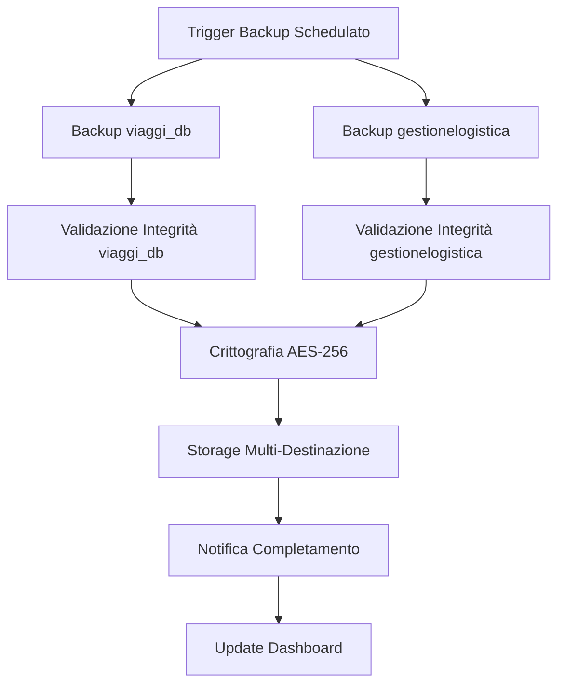
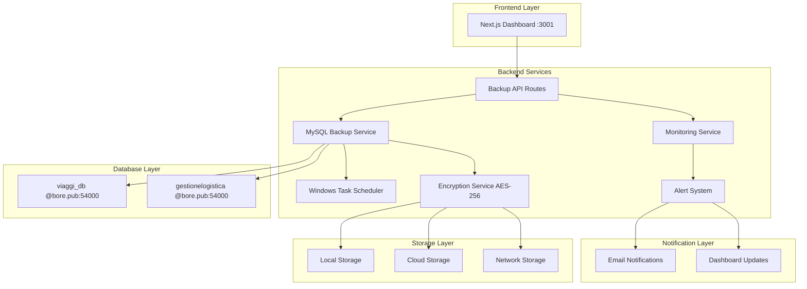
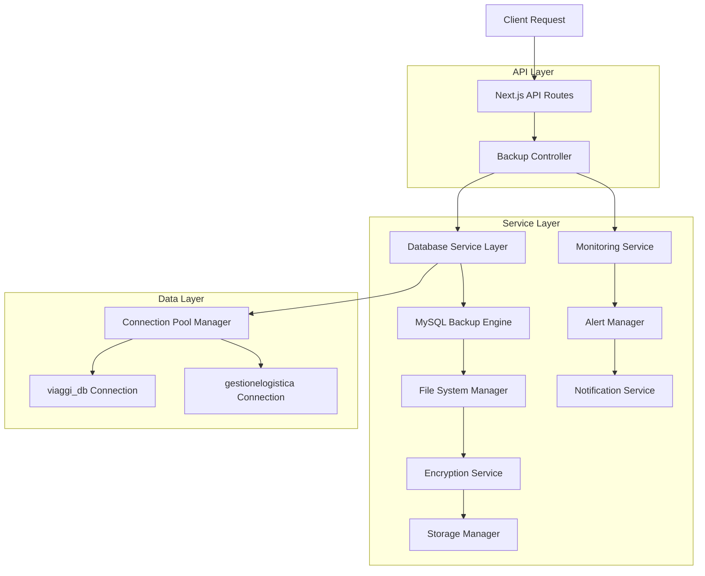
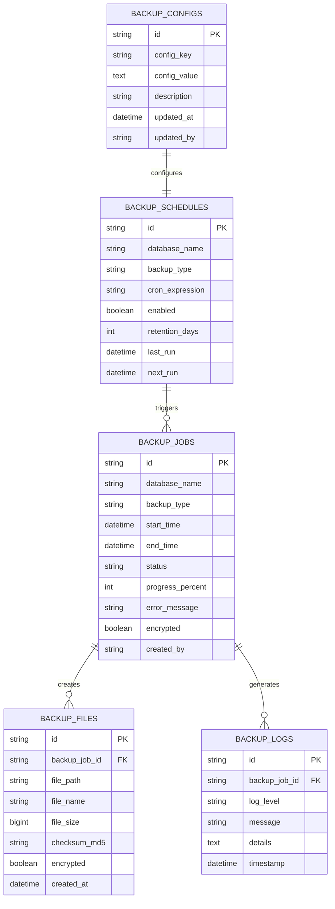

# Sistema di Backup MySQL Dual-Database - Gestione Partesa

## 1. Panoramica del Progetto

Il sistema "Gestione Partesa" è una piattaforma logistica critica costruita con Next.js 15, TypeScript e MySQL che gestisce operazioni di trasporto, fatturazione e monitoraggio viaggi. Il sistema utilizza un'architettura dual-database con due database MySQL critici che richiedono protezione completa contro la perdita di dati.

**Database Critici da Proteggere:**
- **viaggi_db**: Gestione viaggi, rifornimenti, km percorsi
- **gestionelogistica**: Fatturazione delivery, terzisti, consegne

## 2. Core Features

### 2.1 User Roles

| Ruolo | Metodo di Registrazione | Permessi Core |
|-------|------------------------|---------------|
| Amministratore Sistema | Accesso diretto server | Gestione completa backup, restore, monitoraggio |
| Operatore Backup | Credenziali dedicate | Esecuzione backup manuali, visualizzazione dashboard |
| Utente Monitoraggio | Dashboard web | Solo visualizzazione stato backup e alert |

### 2.2 Moduli Funzionali

Il sistema di backup per "Gestione Partesa" comprende le seguenti pagine principali:

1. **Dashboard Backup**: monitoraggio real-time, stato backup, metriche performance
2. **Configurazione Backup**: impostazioni strategie, scheduling, destinazioni storage
3. **Gestione Restore**: interfaccia point-in-time recovery, test restore
4. **Monitoraggio Alert**: sistema notifiche, log eventi, troubleshooting
5. **Sicurezza e Audit**: crittografia, controllo accessi, compliance

### 2.3 Dettagli Pagine

| Nome Pagina | Nome Modulo | Descrizione Funzionalità |
|-------------|-------------|-------------------------|
| Dashboard Backup | Monitoraggio Real-time | Visualizza stato backup dual-database, metriche performance, spazio storage utilizzato, ultimo backup completato |
| Dashboard Backup | Alert e Notifiche | Sistema alerting per backup falliti, spazio storage insufficiente, problemi connettività database |
| Configurazione Backup | Strategie Backup | Configura backup completi giornalieri, incrementali ogni 4 ore, differenziali ogni 12 ore per entrambi i database |
| Configurazione Backup | Scheduling Automatico | Gestisce cron jobs Windows, orari backup, rotazione file, cleanup automatico |
| Gestione Restore | Point-in-Time Recovery | Interfaccia per restore selettivo per data/ora, test restore automatici, validazione integrità |
| Gestione Restore | Disaster Recovery | Procedure automatizzate per ripristino completo sistema, failover database, sincronizzazione |
| Monitoraggio Alert | Sistema Logging | Log dettagliati operazioni backup, errori, performance, audit trail completo |
| Monitoraggio Alert | Troubleshooting | Diagnostica automatica problemi backup, suggerimenti risoluzione, escalation automatica |
| Sicurezza e Audit | Crittografia Dati | Crittografia AES-256 backup files, gestione chiavi sicure, compliance GDPR |
| Sicurezza e Audit | Controllo Accessi | Autenticazione multi-fattore, role-based access, audit log accessi |

## 3. Core Process

### Flusso Operativo Amministratore
1. **Accesso Dashboard** → Verifica stato backup dual-database
2. **Configurazione Strategie** → Imposta scheduling per viaggi_db e gestionelogistica
3. **Monitoraggio Esecuzione** → Supervisiona backup automatici
4. **Gestione Alert** → Risponde a notifiche e problemi
5. **Test Restore** → Verifica periodica integrità backup

### Flusso Operativo Automatico
1. **Trigger Schedulato** → Avvia backup secondo configurazione
2. **Backup Dual-Database** → Esegue backup parallelo di entrambi i database
3. **Validazione Integrità** → Verifica consistenza e completezza
4. **Crittografia e Storage** → Cripta e archivia in multiple destinazioni
5. **Notifica Completamento** → Invia alert di successo/fallimento



## 4. User Interface Design

### 4.1 Design Style
- **Colori Primari**: #0066cc (blu database), #28a745 (verde successo), #dc3545 (rosso errore)
- **Colori Secondari**: #6c757d (grigio info), #ffc107 (giallo warning)
- **Stile Pulsanti**: Rounded corners (8px), gradient backgrounds, hover effects
- **Font**: Inter, 14px base, 16px headers, 12px labels
- **Layout**: Card-based design, sidebar navigation, responsive grid
- **Icone**: Lucide React icons, database, shield, clock, alert themes

### 4.2 Panoramica Design Pagine

| Nome Pagina | Nome Modulo | Elementi UI |
|-------------|-------------|-------------|
| Dashboard Backup | Status Cards | 4 card principali: Stato viaggi_db (verde/rosso), Stato gestionelogistica (verde/rosso), Ultimo Backup (timestamp), Spazio Storage (progress bar) |
| Dashboard Backup | Grafici Performance | Line chart backup times, bar chart storage usage, pie chart success rate |
| Configurazione Backup | Form Strategie | Toggle switches per backup types, time pickers per scheduling, dropdown destinazioni storage |
| Gestione Restore | Timeline Recovery | Interactive timeline per point-in-time selection, dual-database restore options |
| Monitoraggio Alert | Log Table | Sortable table con filtri per database, tipo evento, severità, timestamp |
| Sicurezza e Audit | Security Dashboard | Encryption status indicators, access control matrix, compliance checklist |

### 4.3 Responsiveness
Design mobile-first con breakpoints Bootstrap 5, ottimizzato per tablet e desktop. Touch-friendly per operazioni critiche, swipe gestures per navigazione log.

## 5. Architettura Tecnica

### 5.1 Design Architetturale



### 5.2 Descrizione Tecnologie
- **Frontend**: Next.js 15 + TypeScript + Tailwind CSS + Chart.js
- **Backend**: Node.js API Routes + MySQL2 + node-cron + nodemailer
- **Database**: MySQL 8.0+ (viaggi_db + gestionelogistica)
- **Storage**: Windows File System + AWS S3 + Network Attached Storage
- **Scheduling**: Windows Task Scheduler + node-cron
- **Security**: AES-256 encryption + bcrypt + JWT authentication
- **Monitoring**: Custom logging + Winston + real-time WebSocket updates

### 5.3 Definizioni Route

| Route | Scopo |
|-------|-------|
| /backup-dashboard | Dashboard principale monitoraggio backup dual-database |
| /backup-config | Configurazione strategie e scheduling backup |
| /backup-restore | Interfaccia point-in-time recovery e disaster recovery |
| /backup-monitoring | Monitoraggio log, alert e troubleshooting |
| /backup-security | Gestione sicurezza, crittografia e audit |

### 5.4 Definizioni API

#### 5.4.1 API Core Backup

**Avvio Backup Manuale**
```
POST /api/backup/manual
```

Request:
| Nome Parametro | Tipo Parametro | Richiesto | Descrizione |
|----------------|----------------|-----------|-------------|
| databases | string[] | true | Array database da backuppare ['viaggi_db', 'gestionelogistica'] |
| backupType | string | true | Tipo backup: 'full', 'incremental', 'differential' |
| encryption | boolean | false | Abilita crittografia AES-256 (default: true) |

Response:
| Nome Parametro | Tipo Parametro | Descrizione |
|----------------|----------------|-------------|
| success | boolean | Stato operazione backup |
| backupId | string | ID univoco backup per tracking |
| estimatedTime | number | Tempo stimato completamento (minuti) |

Esempio Request:
```json
{
  "databases": ["viaggi_db", "gestionelogistica"],
  "backupType": "full",
  "encryption": true
}
```

**Stato Backup Real-time**
```
GET /api/backup/status/:backupId
```

Response:
| Nome Parametro | Tipo Parametro | Descrizione |
|----------------|----------------|-------------|
| status | string | 'running', 'completed', 'failed', 'queued' |
| progress | number | Percentuale completamento (0-100) |
| currentDatabase | string | Database attualmente in backup |
| filesCreated | string[] | Lista file backup creati |
| errors | string[] | Lista errori eventuali |

**Configurazione Scheduling**
```
POST /api/backup/schedule
```

Request:
| Nome Parametro | Tipo Parametro | Richiesto | Descrizione |
|----------------|----------------|-----------|-------------|
| fullBackup | object | true | Configurazione backup completo |
| incrementalBackup | object | true | Configurazione backup incrementale |
| differentialBackup | object | true | Configurazione backup differenziale |

Esempio Request:
```json
{
  "fullBackup": {
    "schedule": "0 2 * * *",
    "retention": 30,
    "enabled": true
  },
  "incrementalBackup": {
    "schedule": "0 */4 * * *",
    "retention": 7,
    "enabled": true
  },
  "differentialBackup": {
    "schedule": "0 */12 * * *",
    "retention": 14,
    "enabled": true
  }
}
```

#### 5.4.2 API Restore e Recovery

**Point-in-Time Restore**
```
POST /api/restore/point-in-time
```

Request:
| Nome Parametro | Tipo Parametro | Richiesto | Descrizione |
|----------------|----------------|-----------|-------------|
| database | string | true | Database da ripristinare |
| targetDateTime | string | true | Data/ora target restore (ISO 8601) |
| restoreLocation | string | false | Percorso ripristino (default: database originale) |
| testRestore | boolean | false | Esegui test restore senza sovrascrivere |

**Lista Backup Disponibili**
```
GET /api/restore/available
```

Response:
| Nome Parametro | Tipo Parametro | Descrizione |
|----------------|----------------|-------------|
| backups | object[] | Lista backup disponibili per database |
| database | string | Nome database |
| backupType | string | Tipo backup |
| timestamp | string | Data/ora backup |
| fileSize | number | Dimensione file backup (bytes) |
| encrypted | boolean | Stato crittografia |

### 5.5 Architettura Server



## 6. Modello Dati

### 6.1 Definizione Modello Dati



### 6.2 Data Definition Language

**Tabella Backup Jobs**
```sql
-- Tabella principale per tracking job backup
CREATE TABLE backup_jobs (
    id VARCHAR(36) PRIMARY KEY DEFAULT (UUID()),
    database_name VARCHAR(100) NOT NULL,
    backup_type ENUM('full', 'incremental', 'differential') NOT NULL,
    start_time TIMESTAMP DEFAULT CURRENT_TIMESTAMP,
    end_time TIMESTAMP NULL,
    status ENUM('queued', 'running', 'completed', 'failed', 'cancelled') DEFAULT 'queued',
    progress_percent INT DEFAULT 0 CHECK (progress_percent >= 0 AND progress_percent <= 100),
    error_message TEXT NULL,
    encrypted BOOLEAN DEFAULT TRUE,
    created_by VARCHAR(100) DEFAULT 'system',
    created_at TIMESTAMP DEFAULT CURRENT_TIMESTAMP,
    updated_at TIMESTAMP DEFAULT CURRENT_TIMESTAMP ON UPDATE CURRENT_TIMESTAMP
);

-- Indici per performance
CREATE INDEX idx_backup_jobs_database ON backup_jobs(database_name);
CREATE INDEX idx_backup_jobs_status ON backup_jobs(status);
CREATE INDEX idx_backup_jobs_start_time ON backup_jobs(start_time DESC);
CREATE INDEX idx_backup_jobs_type_status ON backup_jobs(backup_type, status);

-- Tabella file backup generati
CREATE TABLE backup_files (
    id VARCHAR(36) PRIMARY KEY DEFAULT (UUID()),
    backup_job_id VARCHAR(36) NOT NULL,
    file_path VARCHAR(500) NOT NULL,
    file_name VARCHAR(255) NOT NULL,
    file_size BIGINT NOT NULL,
    checksum_md5 VARCHAR(32) NOT NULL,
    encrypted BOOLEAN DEFAULT TRUE,
    storage_location ENUM('local', 'cloud', 'network') DEFAULT 'local',
    created_at TIMESTAMP DEFAULT CURRENT_TIMESTAMP,
    FOREIGN KEY (backup_job_id) REFERENCES backup_jobs(id) ON DELETE CASCADE
);

-- Indici per backup_files
CREATE INDEX idx_backup_files_job_id ON backup_files(backup_job_id);
CREATE INDEX idx_backup_files_created_at ON backup_files(created_at DESC);
CREATE INDEX idx_backup_files_storage ON backup_files(storage_location);

-- Tabella log dettagliati
CREATE TABLE backup_logs (
    id VARCHAR(36) PRIMARY KEY DEFAULT (UUID()),
    backup_job_id VARCHAR(36) NOT NULL,
    log_level ENUM('DEBUG', 'INFO', 'WARN', 'ERROR', 'FATAL') DEFAULT 'INFO',
    message VARCHAR(500) NOT NULL,
    details TEXT NULL,
    timestamp TIMESTAMP DEFAULT CURRENT_TIMESTAMP,
    FOREIGN KEY (backup_job_id) REFERENCES backup_jobs(id) ON DELETE CASCADE
);

-- Indici per backup_logs
CREATE INDEX idx_backup_logs_job_id ON backup_logs(backup_job_id);
CREATE INDEX idx_backup_logs_level ON backup_logs(log_level);
CREATE INDEX idx_backup_logs_timestamp ON backup_logs(timestamp DESC);

-- Tabella scheduling backup
CREATE TABLE backup_schedules (
    id VARCHAR(36) PRIMARY KEY DEFAULT (UUID()),
    database_name VARCHAR(100) NOT NULL,
    backup_type ENUM('full', 'incremental', 'differential') NOT NULL,
    cron_expression VARCHAR(100) NOT NULL,
    enabled BOOLEAN DEFAULT TRUE,
    retention_days INT DEFAULT 30 CHECK (retention_days > 0),
    last_run TIMESTAMP NULL,
    next_run TIMESTAMP NULL,
    created_at TIMESTAMP DEFAULT CURRENT_TIMESTAMP,
    updated_at TIMESTAMP DEFAULT CURRENT_TIMESTAMP ON UPDATE CURRENT_TIMESTAMP,
    UNIQUE KEY unique_schedule (database_name, backup_type)
);

-- Indici per backup_schedules
CREATE INDEX idx_backup_schedules_enabled ON backup_schedules(enabled);
CREATE INDEX idx_backup_schedules_next_run ON backup_schedules(next_run);
CREATE INDEX idx_backup_schedules_database ON backup_schedules(database_name);

-- Tabella configurazioni sistema
CREATE TABLE backup_configs (
    id VARCHAR(36) PRIMARY KEY DEFAULT (UUID()),
    config_key VARCHAR(100) UNIQUE NOT NULL,
    config_value TEXT NOT NULL,
    description VARCHAR(255) NULL,
    config_type ENUM('string', 'number', 'boolean', 'json') DEFAULT 'string',
    updated_at TIMESTAMP DEFAULT CURRENT_TIMESTAMP ON UPDATE CURRENT_TIMESTAMP,
    updated_by VARCHAR(100) DEFAULT 'system'
);

-- Indice per backup_configs
CREATE INDEX idx_backup_configs_key ON backup_configs(config_key);

-- Dati iniziali configurazione
INSERT INTO backup_configs (config_key, config_value, description, config_type) VALUES
('backup_storage_path', 'C:\\BackupGestionePartesa', 'Percorso principale storage backup', 'string'),
('encryption_enabled', 'true', 'Abilita crittografia AES-256 per tutti i backup', 'boolean'),
('max_parallel_backups', '2', 'Numero massimo backup paralleli', 'number'),
('backup_compression', 'true', 'Abilita compressione backup per ridurre spazio', 'boolean'),
('alert_email_recipients', '["admin@gestione-partesa.it"]', 'Lista email per alert backup', 'json'),
('backup_retention_full', '30', 'Giorni retention backup completi', 'number'),
('backup_retention_incremental', '7', 'Giorni retention backup incrementali', 'number'),
('backup_retention_differential', '14', 'Giorni retention backup differenziali', 'number'),
('cloud_storage_enabled', 'false', 'Abilita backup su cloud storage', 'boolean'),
('network_storage_path', '', 'Percorso network storage per backup ridondanti', 'string');

-- Scheduling iniziale per entrambi i database
INSERT INTO backup_schedules (database_name, backup_type, cron_expression, enabled, retention_days) VALUES
('viaggi_db', 'full', '0 2 * * *', TRUE, 30),
('viaggi_db', 'incremental', '0 */4 * * *', TRUE, 7),
('viaggi_db', 'differential', '0 */12 * * *', TRUE, 14),
('gestionelogistica', 'full', '0 3 * * *', TRUE, 30),
('gestionelogistica', 'incremental', '0 1,5,9,13,17,21 * * *', TRUE, 7),
('gestionelogistica', 'differential', '0 7,19 * * *', TRUE, 14);

-- Trigger per aggiornamento automatico next_run
DELIMITER //
CREATE TRIGGER update_next_run_after_backup
AFTER UPDATE ON backup_schedules
FOR EACH ROW
BEGIN
    IF NEW.last_run != OLD.last_run THEN
        UPDATE backup_schedules 
        SET next_run = CASE 
            WHEN cron_expression = '0 2 * * *' THEN DATE_ADD(NEW.last_run, INTERVAL 1 DAY)
            WHEN cron_expression LIKE '0 */4 * * *' THEN DATE_ADD(NEW.last_run, INTERVAL 4 HOUR)
            WHEN cron_expression LIKE '0 */12 * * *' THEN DATE_ADD(NEW.last_run, INTERVAL 12 HOUR)
            ELSE DATE_ADD(NEW.last_run, INTERVAL 1 DAY)
        END
        WHERE id = NEW.id;
    END IF;
END//
DELIMITER ;

-- Event per cleanup automatico backup vecchi
CREATE EVENT cleanup_old_backup_jobs
ON SCHEDULE EVERY 1 DAY
STARTS CURRENT_TIMESTAMP
DO
BEGIN
    -- Rimuovi job backup più vecchi di 90 giorni
    DELETE FROM backup_jobs 
    WHERE created_at < DATE_SUB(NOW(), INTERVAL 90 DAY);
    
    -- Rimuovi log più vecchi di 30 giorni
    DELETE FROM backup_logs 
    WHERE timestamp < DATE_SUB(NOW(), INTERVAL 30 DAY);
END;

-- Abilita event scheduler
SET GLOBAL event_scheduler = ON;
```

**Configurazione Database Backup**
```sql
-- Crea database dedicato per sistema backup
CREATE DATABASE IF NOT EXISTS backup_management 
CHARACTER SET utf8mb4 
COLLATE utf8mb4_unicode_ci;

USE backup_management;

-- Crea utente dedicato per backup con privilegi limitati
CREATE USER IF NOT EXISTS 'backup_user'@'%' IDENTIFIED BY 'SecureBackupPass2024!';
GRANT SELECT, LOCK TABLES, SHOW VIEW, EVENT, TRIGGER ON viaggi_db.* TO 'backup_user'@'%';
GRANT SELECT, LOCK TABLES, SHOW VIEW, EVENT, TRIGGER ON gestionelogistica.* TO 'backup_user'@'%';
GRANT ALL PRIVILEGES ON backup_management.* TO 'backup_user'@'%';
FLUSH PRIVILEGES;
```