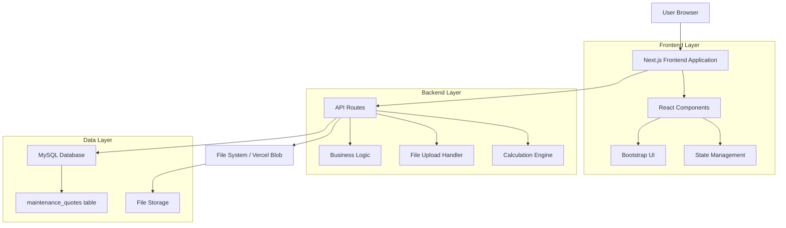
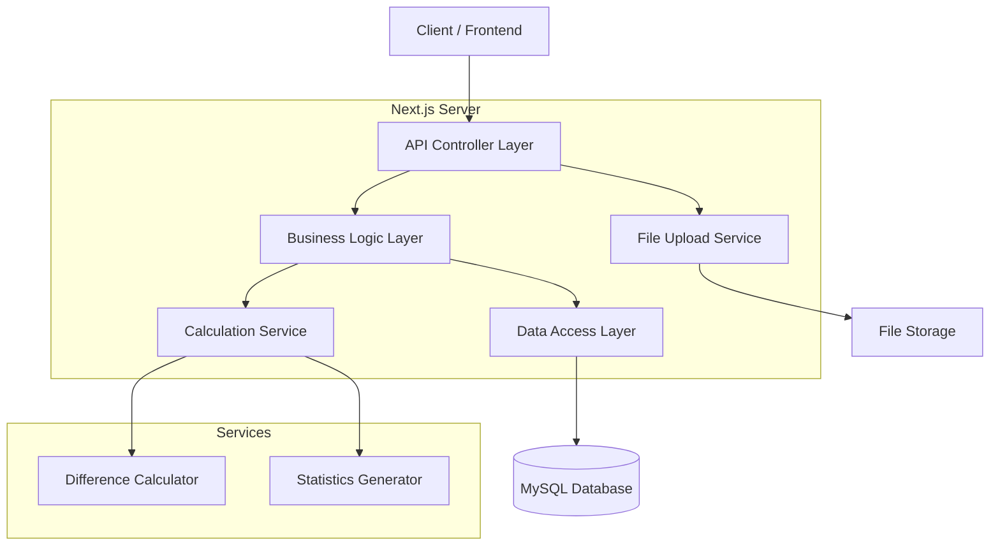
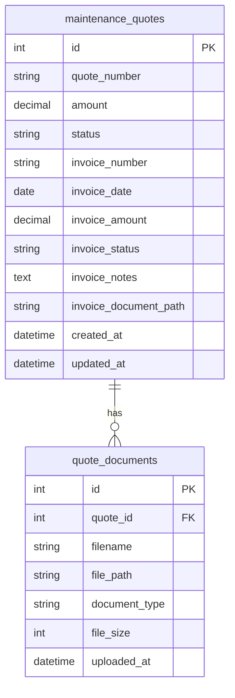

# Sistema Gestione Fatturazione Preventivi - Architettura Tecnica

## 1. Architecture Design



## 2. Technology Description

* Frontend: React\@18 + Next.js\@14 + Bootstrap\@5 + TypeScript

* Backend: Next.js API Routes + Node.js

* Database: MySQL (via XAMPP)

* File Storage: Vercel Blob / Local File System

* Styling: Bootstrap 5 + Custom CSS

## 3. Route Definitions

| Route                                  | Purpose                                                  |
| -------------------------------------- | -------------------------------------------------------- |
| /vehicles/quotes                       | Dashboard preventivi con gestione fatturazione integrata |
| /vehicles/quotes/\[id]/edit            | Dettaglio e modifica preventivo con sezione fatturazione |
| /vehicles/quotes/reports/discrepancies | Report analisi discrepanze fatturazione                  |
| /api/vehicles/quotes                   | CRUD preventivi con dati fatturazione                    |
| /api/vehicles/quotes/\[id]/invoice     | Gestione specifica dati fatturazione                     |
| /api/vehicles/quotes/\[id]/documents   | Upload e gestione documenti fattura                      |

## 4. API Definitions

### 4.1 Core API

**Aggiornamento dati fatturazione**

```
PUT /api/vehicles/quotes/[id]/invoice
```

Request:

| Param Name      | Param Type | isRequired | Description                                   |
| --------------- | ---------- | ---------- | --------------------------------------------- |
| invoice\_number | string     | false      | Numero fattura fornitore                      |
| invoice\_date   | string     | false      | Data fattura (YYYY-MM-DD)                     |
| invoice\_amount | number     | false      | Importo fatturato                             |
| invoice\_status | string     | true       | Stato: 'not\_invoiced', 'invoiced', 'partial' |
| invoice\_notes  | string     | false      | Note sulla fatturazione                       |

Response:

| Param Name             | Param Type | Description                |
| ---------------------- | ---------- | -------------------------- |
| success                | boolean    | Stato operazione           |
| data                   | object     | Dati preventivo aggiornati |
| difference             | number     | Differenza calcolata       |
| difference\_percentage | number     | Percentuale differenza     |

**Upload documento fattura**

```
POST /api/vehicles/quotes/[id]/documents
```

Request:

| Param Name     | Param Type | isRequired | Description           |
| -------------- | ---------- | ---------- | --------------------- |
| file           | File       | true       | Documento PDF fattura |
| document\_type | string     | true       | Tipo: 'invoice'       |

Response:

| Param Name | Param Type | Description           |
| ---------- | ---------- | --------------------- |
| success    | boolean    | Stato upload          |
| file\_path | string     | Percorso file salvato |
| file\_size | number     | Dimensione file       |

**Recupero statistiche fatturazione**

```
GET /api/vehicles/quotes/stats
```

Response:

| Param Name           | Param Type | Description              |
| -------------------- | ---------- | ------------------------ |
| not\_invoiced        | number     | Preventivi non fatturati |
| invoiced             | number     | Preventivi fatturati     |
| partial              | number     | Fatturazione parziale    |
| total\_discrepancies | number     | Totale discrepanze       |
| avg\_discrepancy     | number     | Discrepanza media        |

Example Request:

```json
{
  "invoice_number": "FATT-2024-001",
  "invoice_date": "2024-01-15",
  "invoice_amount": 1250.00,
  "invoice_status": "invoiced",
  "invoice_notes": "Fattura ricevuta con leggero aumento per materiali aggiuntivi"
}
```

## 5. Server Architecture Diagram



## 6. Data Model

### 6.1 Data Model Definition



### 6.2 Data Definition Language

**Aggiornamento tabella maintenance\_quotes**

```sql
-- Aggiunta colonne fatturazione
ALTER TABLE maintenance_quotes 
ADD COLUMN invoice_number VARCHAR(100) NULL COMMENT 'Numero fattura fornitore',
ADD COLUMN invoice_date DATE NULL COMMENT 'Data fattura',
ADD COLUMN invoice_amount DECIMAL(10,2) NULL COMMENT 'Importo fatturato',
ADD COLUMN invoice_status ENUM('not_invoiced', 'invoiced', 'partial') DEFAULT 'not_invoiced' COMMENT 'Stato fatturazione',
ADD COLUMN invoice_notes TEXT NULL COMMENT 'Note sulla fatturazione',
ADD COLUMN invoice_document_path VARCHAR(500) NULL COMMENT 'Percorso documento fattura';

-- Indici per performance
CREATE INDEX idx_maintenance_quotes_invoice_status ON maintenance_quotes(invoice_status);
CREATE INDEX idx_maintenance_quotes_invoice_date ON maintenance_quotes(invoice_date);
CREATE INDEX idx_maintenance_quotes_invoice_amount ON maintenance_quotes(invoice_amount);

-- Vista per calcoli automatici
CREATE VIEW v_quotes_with_discrepancies AS
SELECT 
    mq.*,
    CASE 
        WHEN mq.invoice_amount IS NOT NULL AND mq.amount IS NOT NULL 
        THEN (mq.invoice_amount - mq.amount) 
        ELSE NULL 
    END as difference_amount,
    CASE 
        WHEN mq.invoice_amount IS NOT NULL AND mq.amount IS NOT NULL AND mq.amount > 0
        THEN ROUND(((mq.invoice_amount - mq.amount) / mq.amount) * 100, 2)
        ELSE NULL 
    END as difference_percentage,
    CASE 
        WHEN mq.invoice_amount IS NOT NULL AND mq.amount IS NOT NULL AND mq.amount > 0
        THEN 
            CASE 
                WHEN ABS(((mq.invoice_amount - mq.amount) / mq.amount) * 100) = 0 THEN 'exact'
                WHEN ABS(((mq.invoice_amount - mq.amount) / mq.amount) * 100) <= 10 THEN 'minor'
                ELSE 'major'
            END
        ELSE 'none'
    END as discrepancy_level
FROM maintenance_quotes mq;

-- Trigger per aggiornamento automatico timestamp
DELIMITER //
CREATE TRIGGER tr_maintenance_quotes_invoice_update 
    BEFORE UPDATE ON maintenance_quotes
    FOR EACH ROW
BEGIN
    IF (NEW.invoice_number != OLD.invoice_number OR 
        NEW.invoice_date != OLD.invoice_date OR 
        NEW.invoice_amount != OLD.invoice_amount OR 
        NEW.invoice_status != OLD.invoice_status) THEN
        SET NEW.updated_at = NOW();
    END IF;
END//
DELIMITER ;
```

**Tabella documenti fattura (se necessaria)**

```sql
-- Tabella per gestione documenti fattura
CREATE TABLE quote_invoice_documents (
    id INT AUTO_INCREMENT PRIMARY KEY,
    quote_id INT NOT NULL,
    filename VARCHAR(255) NOT NULL,
    original_filename VARCHAR(255) NOT NULL,
    file_path VARCHAR(500) NOT NULL,
    file_size INT NOT NULL,
    mime_type VARCHAR(100) NOT NULL,
    document_type ENUM('invoice', 'receipt', 'other') DEFAULT 'invoice',
    uploaded_at TIMESTAMP DEFAULT CURRENT_TIMESTAMP,
    uploaded_by VARCHAR(100) NULL,
    FOREIGN KEY (quote_id) REFERENCES maintenance_quotes(id) ON DELETE CASCADE,
    INDEX idx_quote_documents_quote_id (quote_id),
    INDEX idx_quote_documents_type (document_type)
) ENGINE=InnoDB DEFAULT CHARSET=utf8mb4 COLLATE=utf8mb4_unicode_ci;
```

