# Sistema Gestione Fatturazione Preventivi Veicoli - PRD

## 1. Product Overview

Sistema integrato per la gestione e il controllo delle fatture collegate ai preventivi di manutenzione veicoli, con tracciamento automatico delle discrepanze tra importi preventivati e fatturati.

- **Problema da risolvere**: Mancanza di collegamento tra preventivi approvati e relative fatture, rendendo difficile il controllo dei costi e la gestione amministrativa.
- **Target**: Amministratori e responsabili della gestione flotta che necessitano di controllo accurato sui costi di manutenzione.
- **Valore di mercato**: Ottimizzazione del controllo di gestione e riduzione delle discrepanze amministrative nei costi di manutenzione.

## 2. Core Features

### 2.1 User Roles

| Ruolo | Metodo di Registrazione | Permessi Principali |
|-------|------------------------|---------------------|
| Amministratore | Accesso esistente sistema | Gestione completa fatturazione, visualizzazione discrepanze, approvazione variazioni |
| Responsabile Flotta | Accesso esistente sistema | Visualizzazione dati fatturazione, inserimento fatture, controllo discrepanze |

### 2.2 Feature Module

Il sistema di fatturazione preventivi si compone delle seguenti pagine principali:

1. **Dashboard Preventivi**: vista d'insieme con stato fatturazione, filtri avanzati, statistiche integrate.
2. **Dettaglio Preventivo**: gestione completa dati fatturazione, upload documenti, storico modifiche.
3. **Report Discrepanze**: analisi automatica delle differenze tra preventivi e fatture.

### 2.3 Page Details

| Page Name | Module Name | Feature Description |
|-----------|-------------|---------------------|
| Dashboard Preventivi | Tabella Principale | Visualizza colonne stato fatturazione, importo fattura, differenza con codici colore. Filtri per stato fatturazione e discrepanze |
| Dashboard Preventivi | Statistiche | Mostra card "Da Fatturare", "Fatturati", "Discrepanze" con contatori e valori totali |
| Dashboard Preventivi | Filtri Avanzati | Aggiunge filtro "Stato Fatturazione" e "Con Discrepanze" ai filtri esistenti |
| Dettaglio Preventivo | Sezione Fatturazione | Gestisce numero fattura, data, importo, note, calcolo automatico differenze |
| Dettaglio Preventivo | Upload Documenti | Carica e gestisce documenti fattura PDF con preview e download |
| Dettaglio Preventivo | Alert Discrepanze | Mostra avvisi visivi per differenze significative (>10%) con spiegazioni |
| Report Discrepanze | Analisi Automatica | Genera report delle discrepanze con filtri per soglie e periodi |

## 3. Core Process

**Flusso Amministratore:**
1. Visualizza dashboard preventivi con stato fatturazione
2. Identifica preventivi da fatturare o con discrepanze
3. Accede al dettaglio preventivo per inserire dati fattura
4. Carica documento fattura PDF
5. Verifica calcolo automatico differenze
6. Approva o gestisce eventuali discrepanze

**Flusso Responsabile Flotta:**
1. Riceve notifica preventivo approvato
2. Inserisce dati fattura ricevuta dal fornitore
3. Carica documento fattura
4. Verifica automaticamente le differenze
5. Segnala discrepanze significative all'amministratore

```mermaid
graph TD
    A[Dashboard Preventivi] --> B[Filtro Stato Fatturazione]
    A --> C[Visualizza Discrepanze]
    B --> D[Dettaglio Preventivo]
    C --> D
    D --> E[Inserimento Dati Fattura]
    E --> F[Upload Documento PDF]
    F --> G[Calcolo Automatico Differenze]
    G --> H{Discrepanza > 10%?}
    H -->|Sì| I[Alert Discrepanza]
    H -->|No| J[Conferma Fatturazione]
    I --> K[Gestione Discrepanza]
    J --> L[Aggiornamento Stato]
    K --> L
```

## 4. User Interface Design

### 4.1 Design Style

- **Colori primari**: Bootstrap standard con codici specifici per stati fatturazione
  - Verde (#28a745): Fatturato senza discrepanze
  - Giallo (#ffc107): Discrepanze minori (<10%)
  - Rosso (#dc3545): Discrepanze significative (>10%)
  - Grigio (#6c757d): Non fatturato
- **Stile pulsanti**: Bootstrap standard con icone FontAwesome
- **Font**: Sistema esistente Bootstrap
- **Layout**: Card-based con tabelle responsive
- **Icone**: 💰 (fatturazione), 📄 (documenti), ⚠️ (discrepanze), ✅ (completato)

### 4.2 Page Design Overview

| Page Name | Module Name | UI Elements |
|-----------|-------------|-------------|
| Dashboard Preventivi | Statistiche | Card colorate con contatori, icone specifiche, valori monetari formattati |
| Dashboard Preventivi | Tabella | Colonne aggiuntive con badge colorati per stato, importi formattati, icone azioni |
| Dashboard Preventivi | Filtri | Select dropdown per stato fatturazione, checkbox per discrepanze |
| Dettaglio Preventivo | Sezione Fatturazione | Form strutturato con campi data, importo, note, calcolo differenze in tempo reale |
| Dettaglio Preventivo | Upload Area | Drag&drop per PDF, preview documenti, lista file caricati |
| Dettaglio Preventivo | Alert | Banner colorati per discrepanze con spiegazioni e azioni suggerite |

### 4.3 Responsiveness

Il sistema è progettato mobile-first con adattamento responsive per tablet e desktop. Le tabelle utilizzano scroll orizzontale su mobile, mentre le card statistiche si impilano verticalmente. I form di inserimento dati si adattano alla larghezza dello schermo mantenendo usabilità ottimale.