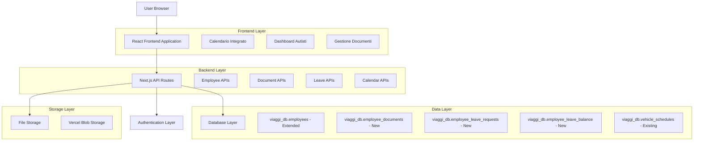
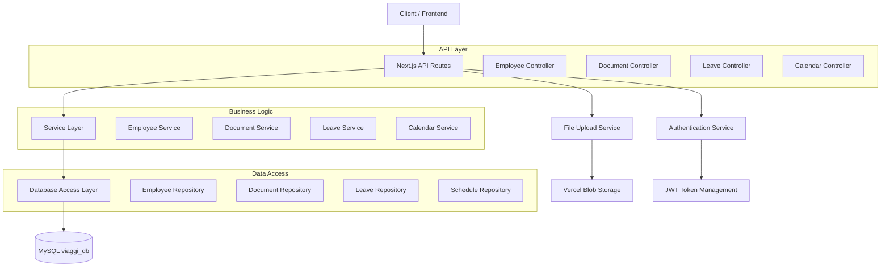
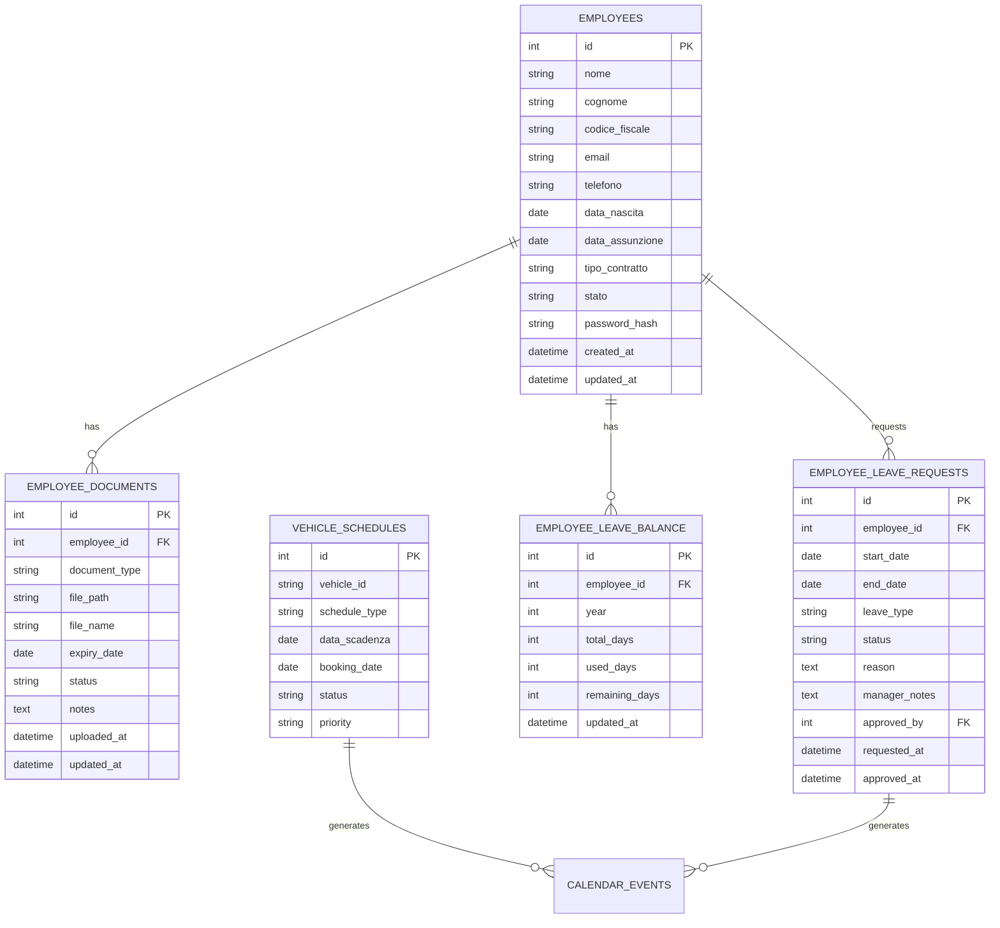

# Sistema Gestione Autisti - Architettura Tecnica

## 1. Architecture Design



## 2. Technology Description

- **Frontend**: React@18 + Bootstrap@5 + Next.js@14 + TypeScript
- **Backend**: Next.js API Routes + MySQL (XAMPP)
- **Database**: MySQL (viaggi_db) via ngrok tunnel
- **Storage**: Vercel Blob Storage per documenti
- **Calendar**: React Big Calendar (estensione esistente)
- **Authentication**: Sistema esistente esteso per autisti

## 3. Route Definitions

| Route | Purpose |
|-------|---------|
| /employees | Dashboard principale gestione autisti |
| /employees/list | Lista completa autisti con filtri |
| /employees/[id] | Dettaglio e modifica singolo autista |
| /employees/new | Creazione nuovo autista |
| /employees/documents | Gestione documenti autisti |
| /employees/documents/[id] | Dettaglio documento specifico |
| /employees/leave | Sistema ferie - dashboard |
| /employees/leave/request | Richiesta nuove ferie |
| /employees/leave/approve | Approvazione ferie (manager) |
| /employees/calendar | Calendario integrato autisti + veicoli |
| /employees/reports | Reportistica e export |
| /vehicles/schedules/calendar | Calendario esistente esteso |

## 4. API Definitions

### 4.1 Employee Management APIs

**Gestione anagrafica autisti**
```
GET /api/employees
```
Response:
| Param Name | Param Type | Description |
|------------|------------|-------------|
| employees | Employee[] | Lista autisti con dati completi |
| total | number | Totale autisti |
| active | number | Autisti attivi |

```
POST /api/employees
```
Request:
| Param Name | Param Type | Required | Description |
|------------|------------|----------|-------------|
| nome | string | true | Nome autista |
| cognome | string | true | Cognome autista |
| codice_fiscale | string | true | Codice fiscale |
| email | string | true | Email aziendale |
| telefono | string | false | Numero telefono |
| data_nascita | string | true | Data nascita (YYYY-MM-DD) |
| data_assunzione | string | true | Data assunzione |
| tipo_contratto | string | true | Tipo contratto (determinato/indeterminato) |
| stato | string | true | Stato (attivo/inattivo/sospeso) |

### 4.2 Document Management APIs

**Gestione documenti autisti**
```
GET /api/employees/[id]/documents
```
Response:
| Param Name | Param Type | Description |
|------------|------------|-------------|
| documents | Document[] | Lista documenti autista |
| expiring_soon | Document[] | Documenti in scadenza |

```
POST /api/employees/[id]/documents
```
Request:
| Param Name | Param Type | Required | Description |
|------------|------------|----------|-------------|
| document_type | string | true | Tipo documento (patente/carta_identita/codice_fiscale/attestato) |
| file | File | true | File documento |
| expiry_date | string | true | Data scadenza (YYYY-MM-DD) |
| notes | string | false | Note aggiuntive |

### 4.3 Leave Management APIs

**Sistema ferie e permessi**
```
GET /api/employees/leave/requests
```
Response:
| Param Name | Param Type | Description |
|------------|------------|-------------|
| requests | LeaveRequest[] | Richieste ferie |
| pending | number | Richieste in attesa |
| approved | number | Richieste approvate |

```
POST /api/employees/leave/request
```
Request:
| Param Name | Param Type | Required | Description |
|------------|------------|----------|-------------|
| employee_id | number | true | ID autista |
| start_date | string | true | Data inizio ferie |
| end_date | string | true | Data fine ferie |
| leave_type | string | true | Tipo (ferie/permesso/malattia) |
| reason | string | false | Motivazione |

### 4.4 Calendar Integration APIs

**Calendario integrato**
```
GET /api/calendar/events
```
Query Parameters:
| Param Name | Param Type | Required | Description |
|------------|------------|----------|-------------|
| start_date | string | true | Data inizio periodo |
| end_date | string | true | Data fine periodo |
| event_types | string[] | false | Tipi eventi (vehicle_schedules/employee_leave) |
| employee_ids | number[] | false | Filtro autisti specifici |

Response:
| Param Name | Param Type | Description |
|------------|------------|-------------|
| events | CalendarEvent[] | Eventi calendario unificati |
| vehicle_events | number | Numero eventi veicoli |
| employee_events | number | Numero eventi autisti |

## 5. Server Architecture Diagram



## 6. Data Model

### 6.1 Data Model Definition



### 6.2 Data Definition Language

**Estensione tabella employees esistente**
```sql
-- Aggiungere campi per autenticazione autisti
ALTER TABLE employees ADD COLUMN password_hash VARCHAR(255) NULL;
ALTER TABLE employees ADD COLUMN last_login DATETIME NULL;
ALTER TABLE employees ADD COLUMN is_driver BOOLEAN DEFAULT FALSE;
ALTER TABLE employees ADD COLUMN driver_license_number VARCHAR(50) NULL;
ALTER TABLE employees ADD COLUMN driver_license_expiry DATE NULL;

-- Indici per performance
CREATE INDEX idx_employees_is_driver ON employees(is_driver);
CREATE INDEX idx_employees_stato ON employees(stato);
```

**Nuova tabella employee_documents**
```sql
CREATE TABLE employee_documents (
    id INT PRIMARY KEY AUTO_INCREMENT,
    employee_id INT NOT NULL,
    document_type ENUM('patente', 'carta_identita', 'codice_fiscale', 'attestato_professionale', 'certificato_medico', 'altro') NOT NULL,
    file_path VARCHAR(500) NOT NULL,
    file_name VARCHAR(255) NOT NULL,
    file_size INT NOT NULL,
    expiry_date DATE NULL,
    status ENUM('valido', 'scaduto', 'in_scadenza') DEFAULT 'valido',
    notes TEXT NULL,
    uploaded_at DATETIME DEFAULT CURRENT_TIMESTAMP,
    updated_at DATETIME DEFAULT CURRENT_TIMESTAMP ON UPDATE CURRENT_TIMESTAMP,
    FOREIGN KEY (employee_id) REFERENCES employees(id) ON DELETE CASCADE
);

-- Indici
CREATE INDEX idx_employee_documents_employee_id ON employee_documents(employee_id);
CREATE INDEX idx_employee_documents_expiry_date ON employee_documents(expiry_date);
CREATE INDEX idx_employee_documents_status ON employee_documents(status);
```

**Nuova tabella employee_leave_requests**
```sql
CREATE TABLE employee_leave_requests (
    id INT PRIMARY KEY AUTO_INCREMENT,
    employee_id INT NOT NULL,
    start_date DATE NOT NULL,
    end_date DATE NOT NULL,
    leave_type ENUM('ferie', 'permesso', 'malattia', 'congedo') NOT NULL,
    status ENUM('pending', 'approved', 'rejected', 'cancelled') DEFAULT 'pending',
    days_requested INT NOT NULL,
    reason TEXT NULL,
    manager_notes TEXT NULL,
    approved_by INT NULL,
    requested_at DATETIME DEFAULT CURRENT_TIMESTAMP,
    approved_at DATETIME NULL,
    FOREIGN KEY (employee_id) REFERENCES employees(id) ON DELETE CASCADE,
    FOREIGN KEY (approved_by) REFERENCES employees(id) ON DELETE SET NULL
);

-- Indici
CREATE INDEX idx_leave_requests_employee_id ON employee_leave_requests(employee_id);
CREATE INDEX idx_leave_requests_status ON employee_leave_requests(status);
CREATE INDEX idx_leave_requests_dates ON employee_leave_requests(start_date, end_date);
```

**Nuova tabella employee_leave_balance**
```sql
CREATE TABLE employee_leave_balance (
    id INT PRIMARY KEY AUTO_INCREMENT,
    employee_id INT NOT NULL,
    year INT NOT NULL,
    total_days INT DEFAULT 22,
    used_days INT DEFAULT 0,
    remaining_days INT GENERATED ALWAYS AS (total_days - used_days) STORED,
    updated_at DATETIME DEFAULT CURRENT_TIMESTAMP ON UPDATE CURRENT_TIMESTAMP,
    FOREIGN KEY (employee_id) REFERENCES employees(id) ON DELETE CASCADE,
    UNIQUE KEY unique_employee_year (employee_id, year)
);

-- Indici
CREATE INDEX idx_leave_balance_employee_year ON employee_leave_balance(employee_id, year);
```

**Dati iniziali**
```sql
-- Aggiorna autisti esistenti
UPDATE employees SET is_driver = TRUE WHERE ruolo LIKE '%autista%' OR ruolo LIKE '%driver%';

-- Crea bilanci ferie per anno corrente per tutti gli autisti
INSERT INTO employee_leave_balance (employee_id, year, total_days)
SELECT id, YEAR(CURDATE()), 22
FROM employees 
WHERE is_driver = TRUE
ON DUPLICATE KEY UPDATE total_days = 22;
```