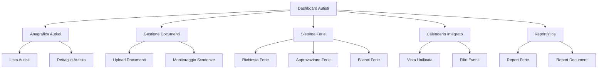

# Sistema Gestione Autisti Completo - PRD

## 1. Product Overview

Sistema completo per la gestione degli autisti che estende il progetto Gestione Partesa con funzionalità avanzate per anagrafica, documenti, ferie e integrazione con il calendario esistente delle scadenze veicoli.

- **Obiettivo principale**: Centralizzare la gestione completa degli autisti in un'unica piattaforma integrata
- **Target**: Aziende di trasporto che necessitano di monitorare autisti, documenti e pianificare ferie
- **Valore aggiunto**: Integrazione seamless con il sistema veicoli esistente per una vista operativa unificata

## 2. Core Features

### 2.1 User Roles

| Ruolo | Metodo Registrazione | Permessi Principali |
|-------|---------------------|---------------------|
| Admin | Accesso diretto sistema | Gestione completa autisti, approvazione ferie, visualizzazione documenti |
| Manager | Creazione da Admin | Gestione autisti del proprio team, approvazione ferie |
| Autista | Registrazione tramite codice dipendente | Visualizzazione propri dati, richiesta ferie, upload documenti |

### 2.2 Feature Module

Il sistema di gestione autisti si compone delle seguenti pagine principali:

1. **Dashboard Autisti**: panoramica generale, statistiche, alert scadenze documenti
2. **Anagrafica Autisti**: gestione dati personali, contrattuali e di contatto
3. **Gestione Documenti**: upload, monitoraggio scadenze, alert automatici
4. **Sistema Ferie**: richiesta, approvazione, calendario ferie
5. **Calendario Integrato**: vista unificata scadenze veicoli + ferie autisti
6. **Reportistica**: report ferie, scadenze documenti, statistiche operative

### 2.3 Page Details

| Page Name | Module Name | Feature Description |
|-----------|-------------|---------------------|
| Dashboard Autisti | Panoramica generale | Visualizza statistiche autisti attivi, documenti in scadenza, ferie pendenti, alert critici |
| Dashboard Autisti | Widget scadenze | Mostra documenti in scadenza nei prossimi 30 giorni con priorità colore |
| Dashboard Autisti | Widget ferie | Visualizza ferie approvate, in attesa, bilanci residui |
| Anagrafica Autisti | Lista autisti | Tabella completa autisti con filtri per stato, team, tipologia contratto |
| Anagrafica Autisti | Dettaglio autista | Form completo dati personali, contrattuali, contatti, note |
| Anagrafica Autisti | Gestione stato | Attivazione/disattivazione autisti, cambio stato contrattuale |
| Gestione Documenti | Upload documenti | Caricamento documenti con categorizzazione automatica e data scadenza |
| Gestione Documenti | Monitoraggio scadenze | Lista documenti per autista con alert scadenze e rinnovi |
| Gestione Documenti | Alert automatici | Sistema notifiche email/dashboard per scadenze imminenti |
| Sistema Ferie | Richiesta ferie | Form richiesta ferie con calendario disponibilità e validazione sovrapposizioni |
| Sistema Ferie | Approvazione ferie | Dashboard manager per approvare/rifiutare richieste con motivazioni |
| Sistema Ferie | Bilanci ferie | Visualizzazione giorni disponibili, utilizzati, pianificati per autista |
| Calendario Integrato | Vista unificata | Calendario con eventi veicoli (scadenze) + eventi autisti (ferie) |
| Calendario Integrato | Filtri avanzati | Filtri per tipo evento, autista, veicolo, periodo |
| Calendario Integrato | Gestione eventi | Drag&drop per spostare ferie, modal dettaglio per ogni evento |
| Reportistica | Report ferie | Export Excel ferie per periodo, autista, stato approvazione |
| Reportistica | Report documenti | Export scadenze documenti con alert e priorità |
| Reportistica | Statistiche operative | Dashboard KPI utilizzo ferie, copertura autisti, documenti validi |

## 3. Core Process

### 3.1 Flusso Gestione Autisti (Admin/Manager)

1. **Creazione Autista**: Admin accede ad anagrafica → Nuovo autista → Compila dati → Genera credenziali
2. **Gestione Documenti**: Admin/Manager → Documenti autista → Upload documento → Imposta scadenza → Sistema genera alert
3. **Monitoraggio**: Dashboard mostra alert scadenze → Click su alert → Dettaglio documento → Azioni rinnovo

### 3.2 Flusso Ferie (Autista)

1. **Richiesta Ferie**: Autista login → Ferie → Nuova richiesta → Seleziona date → Invia richiesta
2. **Approvazione**: Manager riceve notifica → Dashboard ferie → Approva/Rifiuta → Autista riceve notifica
3. **Visualizzazione**: Ferie approvate appaiono nel calendario integrato

### 3.3 Flusso Calendario Integrato

1. **Vista Unificata**: Utente accede al calendario → Vede scadenze veicoli + ferie autisti
2. **Filtri**: Seleziona filtri per tipo evento → Calendario si aggiorna dinamicamente
3. **Gestione**: Drag&drop per spostare ferie → Modal per dettagli → Salvataggio modifiche

## 4. User Interface Design

### 4.1 Design Style

- **Colori primari**: Mantenimento palette esistente Bootstrap con estensioni per autisti
  - Blu (#3174ad) per elementi autisti
  - Verde (#28a745) per ferie approvate
  - Giallo (#ffc107) per ferie in attesa
  - Rosso (#dc3545) per documenti scaduti
- **Stile pulsanti**: Bootstrap standard con icone Lucide React
- **Font**: Sistema font esistente del progetto
- **Layout**: Card-based con sidebar navigation, responsive Bootstrap
- **Icone**: Lucide React per consistenza con sistema esistente

### 4.2 Page Design Overview

| Page Name | Module Name | UI Elements |
|-----------|-------------|-------------|
| Dashboard Autisti | Widget panoramica | Cards Bootstrap con statistiche, icone colorate, progress bars per KPI |
| Dashboard Autisti | Alert scadenze | Alert Bootstrap rossi/gialli con icone warning, link diretti ai documenti |
| Anagrafica Autisti | Tabella autisti | DataTable responsive con filtri, sorting, paginazione, badge stato |
| Anagrafica Autisti | Form dettaglio | Form multi-tab Bootstrap con validazione, upload foto, campi required |
| Gestione Documenti | Upload area | Drag&drop zone, preview documenti, progress upload, categorizzazione |
| Sistema Ferie | Calendario richieste | Calendario interattivo con date disponibili/occupate, tooltip informativi |
| Sistema Ferie | Dashboard approvazioni | Lista richieste con badge stato, modal approvazione, timeline ferie |
| Calendario Integrato | Vista calendario | React Big Calendar esteso con nuovi colori eventi, legenda dinamica |
| Calendario Integrato | Filtri laterali | Sidebar con checkbox filtri, range date, selezione autisti/veicoli |

### 4.3 Responsiveness

- **Desktop-first** con adattamento mobile completo
- **Breakpoints Bootstrap**: sm, md, lg, xl per layout responsive
- **Touch optimization**: Elementi touch-friendly per mobile, swipe gestures su calendario
- **Mobile navigation**: Sidebar collapsible, menu hamburger per navigazione mobile