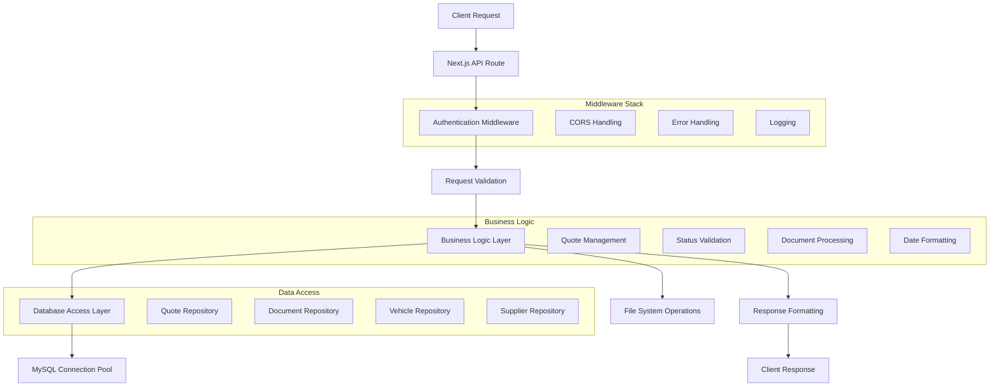
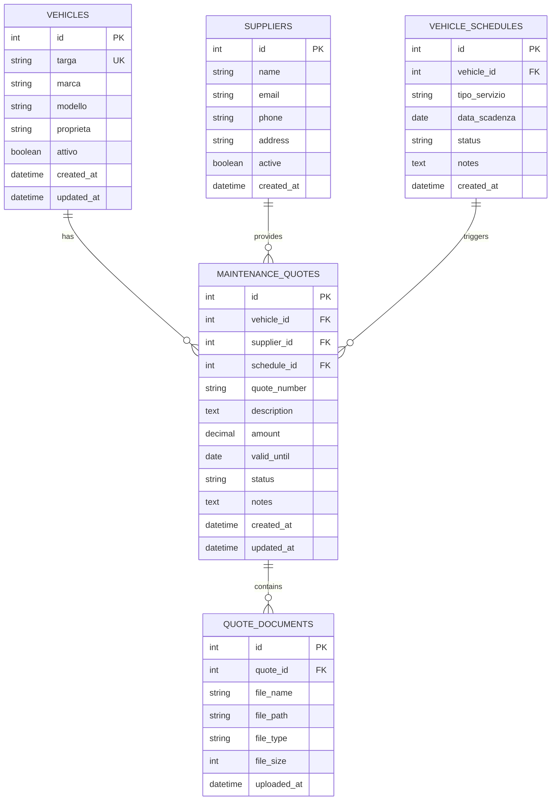

# Sistema Gestione Preventivi Veicoli - Architettura Tecnica

## 1. Architecture Design

```mermaid
graph TD
    A[User Browser] --> B[React Frontend - Vehicle Management]
    B --> C[Next.js API Routes]
    C --> D[MySQL Database]
    C --> E[File System Storage]
    C --> F[Authentication Middleware]
    
    subgraph "Frontend Layer"
        B
        G[Quote Components]
        H[Vehicle Components]
        I[Document Upload]
        J[Status Management]
    end
    
    subgraph "API Layer"
        C
        K[/api/vehicles/quotes]
        L[/api/vehicles/quotes/[id]]
        M[/api/vehicles/quotes/[id]/status]
        N[/api/vehicles/quotes/[id]/documents]
        O[/api/vehicles/[plate]]
    end
    
    subgraph "Data Layer"
        D
        P[maintenance_quotes]
        Q[quote_documents]
        R[vehicles]
        S[suppliers]
        T[vehicle_schedules]
    end
    
    subgraph "Storage Layer"
        E
        U[uploads/quotes/]
        V[PDF Documents]
        W[Image Files]
    end
```

## 2. Technology Description

- **Frontend**: React@18 + Next.js@15.5.3 + TypeScript@5 + Bootstrap@5.3.2
- **Backend**: Next.js API Routes + Node.js@24.4.1
- **Database**: MySQL@8.0+ (via XAMPP)
- **File Upload**: multer + react-dropzone per gestione documenti
- **Date Handling**: date-fns per formattazione italiana (dd/mm/yyyy)
- **State Management**: React useState/useEffect + Context API
- **UI Components**: Font Awesome icons + Bootstrap components
- **Validation**: Joi per server-side, HTML5 + custom per client-side
- **File Storage**: File system locale con path strutturato

## 3. Route Definitions

| Route | Purpose |
|-------|----------|
| /vehicles | Dashboard principale gestione veicoli con statistiche |
| /vehicles/list | Lista completa veicoli con filtri avanzati |
| /vehicles/quotes | Lista tutti i preventivi con filtri e azioni bulk |
| /vehicles/quotes/new | Form creazione nuovo preventivo |
| /vehicles/quotes/[id] | Dettaglio singolo preventivo con documenti |
| /vehicles/quotes/[id]/edit | Form modifica preventivo esistente |
| /vehicles/[plate] | Pagina dettaglio veicolo con preventivi associati |
| /vehicles/schedules | Gestione scadenze manutenzione veicoli |

## 4. API Definitions

### 4.1 Core Quote APIs

**Get All Quotes**
```
GET /api/vehicles/quotes
```

Query Parameters:
| Param Name | Param Type | isRequired | Description |
|------------|------------|------------|-------------|
| vehicleId | number | false | Filtra per ID veicolo |
| scheduleId | number | false | Filtra per ID scadenza |
| status | string | false | Filtra per stato (pending/approved/rejected) |
| supplierId | number | false | Filtra per fornitore |

Response:
| Param Name | Param Type | Description |
|------------|------------|-------------|
| success | boolean | Stato operazione |
| quotes | array | Lista preventivi con dati veicolo e fornitore |
| total | number | Totale preventivi |

**Create New Quote**
```
POST /api/vehicles/quotes
```

Request:
| Param Name | Param Type | isRequired | Description |
|------------|------------|------------|-------------|
| vehicle_id | number | true | ID veicolo |
| supplier_id | number | true | ID fornitore |
| description | string | true | Descrizione servizio |
| amount | number | true | Importo preventivo |
| valid_until | string | true | Data scadenza (YYYY-MM-DD) |
| schedule_id | number | false | ID scadenza associata |
| notes | string | false | Note aggiuntive |

Response:
| Param Name | Param Type | Description |
|------------|------------|-------------|
| success | boolean | Stato creazione |
| quoteId | number | ID preventivo creato |
| message | string | Messaggio di conferma |

**Update Quote Status**
```
PUT /api/vehicles/quotes
```

Request:
| Param Name | Param Type | isRequired | Description |
|------------|------------|------------|-------------|
| id | number | true | ID preventivo |
| status | string | true | Nuovo stato (approved/rejected) |
| notes | string | false | Note per la decisione |

Response:
| Param Name | Param Type | Description |
|------------|------------|-------------|
| success | boolean | Stato aggiornamento |
| message | string | Messaggio di conferma |

### 4.2 Quote Detail APIs

**Get Quote Details**
```
GET /api/vehicles/quotes/[id]
```

Response:
| Param Name | Param Type | Description |
|------------|------------|-------------|
| success | boolean | Stato operazione |
| quote | object | Dettagli completi preventivo |
| documents | array | Lista documenti allegati |

**Update Quote**
```
PUT /api/vehicles/quotes/[id]
```

Request:
| Param Name | Param Type | isRequired | Description |
|------------|------------|------------|-------------|
| supplier_id | number | true | ID fornitore |
| amount | number | true | Importo aggiornato |
| description | string | true | Descrizione servizio |
| valid_until | string | true | Data scadenza |
| status | string | false | Stato preventivo |
| notes | string | false | Note |

**Delete Quote**
```
DELETE /api/vehicles/quotes/[id]
```

Response:
| Param Name | Param Type | Description |
|------------|------------|-------------|
| success | boolean | Stato eliminazione |
| message | string | Messaggio di conferma |

### 4.3 Document Management APIs

**Upload Documents**
```
POST /api/vehicles/quotes/[id]/documents
```

Request: multipart/form-data
| Param Name | Param Type | isRequired | Description |
|------------|------------|------------|-------------|
| files | File[] | true | Array di file da caricare |

Response:
| Param Name | Param Type | Description |
|------------|------------|-------------|
| success | boolean | Stato upload |
| uploadedFiles | array | Lista file caricati con dettagli |
| errors | array | Eventuali errori per file specifici |

**Get Quote Documents**
```
GET /api/vehicles/quotes/[id]/documents
```

Response:
| Param Name | Param Type | Description |
|------------|------------|-------------|
| success | boolean | Stato operazione |
| documents | array | Lista documenti con metadata |

**Delete Document**
```
DELETE /api/vehicles/quotes/[id]/documents?documentId=[docId]
```

Response:
| Param Name | Param Type | Description |
|------------|------------|-------------|
| success | boolean | Stato eliminazione |
| message | string | Messaggio di conferma |

### 4.4 Vehicle Integration APIs

**Get Vehicle with Quotes**
```
GET /api/vehicles/[plate]
```

Response:
| Param Name | Param Type | Description |
|------------|------------|-------------|
| success | boolean | Stato operazione |
| vehicle | object | Dati veicolo completi |
| schedules | array | Scadenze manutenzione |
| quotes | array | Preventivi associati con documenti |

## 5. Server Architecture



## 6. Data Model

### 6.1 Data Model Definition



### 6.2 Data Definition Language

**Maintenance Quotes Table**
```sql
CREATE TABLE maintenance_quotes (
    id INT AUTO_INCREMENT PRIMARY KEY,
    vehicle_id INT NOT NULL,
    supplier_id INT NOT NULL,
    schedule_id INT NULL,
    quote_number VARCHAR(50) UNIQUE,
    description TEXT NOT NULL,
    amount DECIMAL(10,2) NOT NULL,
    valid_until DATE NOT NULL,
    status ENUM('pending', 'approved', 'rejected', 'expired', 'converted') DEFAULT 'pending',
    notes TEXT NULL,
    created_at TIMESTAMP DEFAULT CURRENT_TIMESTAMP,
    updated_at TIMESTAMP DEFAULT CURRENT_TIMESTAMP ON UPDATE CURRENT_TIMESTAMP,
    
    FOREIGN KEY (vehicle_id) REFERENCES vehicles(id) ON DELETE CASCADE,
    FOREIGN KEY (supplier_id) REFERENCES suppliers(id) ON DELETE RESTRICT,
    FOREIGN KEY (schedule_id) REFERENCES vehicle_schedules(id) ON DELETE SET NULL
);

-- Indexes
CREATE INDEX idx_maintenance_quotes_vehicle_id ON maintenance_quotes(vehicle_id);
CREATE INDEX idx_maintenance_quotes_supplier_id ON maintenance_quotes(supplier_id);
CREATE INDEX idx_maintenance_quotes_status ON maintenance_quotes(status);
CREATE INDEX idx_maintenance_quotes_valid_until ON maintenance_quotes(valid_until);
CREATE INDEX idx_maintenance_quotes_created_at ON maintenance_quotes(created_at DESC);
```

**Quote Documents Table**
```sql
CREATE TABLE quote_documents (
    id INT AUTO_INCREMENT PRIMARY KEY,
    quote_id INT NOT NULL,
    file_name VARCHAR(255) NOT NULL,
    file_path VARCHAR(500) NOT NULL,
    file_type VARCHAR(50) NOT NULL,
    file_size INT NOT NULL,
    uploaded_at TIMESTAMP DEFAULT CURRENT_TIMESTAMP,
    
    FOREIGN KEY (quote_id) REFERENCES maintenance_quotes(id) ON DELETE CASCADE
);

-- Indexes
CREATE INDEX idx_quote_documents_quote_id ON quote_documents(quote_id);
CREATE INDEX idx_quote_documents_uploaded_at ON quote_documents(uploaded_at DESC);
```

**Suppliers Table (if not exists)**
```sql
CREATE TABLE suppliers (
    id INT AUTO_INCREMENT PRIMARY KEY,
    name VARCHAR(255) NOT NULL,
    email VARCHAR(255) NULL,
    phone VARCHAR(50) NULL,
    address TEXT NULL,
    active BOOLEAN DEFAULT TRUE,
    created_at TIMESTAMP DEFAULT CURRENT_TIMESTAMP,
    updated_at TIMESTAMP DEFAULT CURRENT_TIMESTAMP ON UPDATE CURRENT_TIMESTAMP
);

-- Initial data
INSERT INTO suppliers (name, email, phone, active) VALUES
('Officina Centrale', 'info@officinacentrale.it', '0123456789', TRUE),
('AutoService Plus', 'servizi@autoserviceplus.it', '0987654321', TRUE),
('Manutenzione Express', 'preventivi@manutenzioneexpress.it', '0555123456', TRUE);
```

## 7. File Storage Structure

### 7.1 Directory Organization
```
uploads/
├── quotes/
│   ├── 2025/
│   │   ├── 01/
│   │   │   ├── quote_1_document_1.pdf
│   │   │   ├── quote_1_document_2.jpg
│   │   │   └── quote_2_document_1.pdf
│   │   └── 02/
│   └── 2024/
└── temp/
    └── uploads/
```

### 7.2 File Naming Convention
- **Pattern**: `quote_{quote_id}_{timestamp}_{original_name}`
- **Example**: `quote_123_20250115143022_preventivo_officina.pdf`
- **Max Size**: 10MB per file
- **Allowed Types**: PDF, JPG, JPEG, PNG

## 8. Security Considerations

### 8.1 Authentication & Authorization
- **JWT Token**: Validazione su tutte le API routes
- **Role-based Access**: Admin/Manager per approvazioni
- **Session Management**: Timeout automatico sessioni

### 8.2 File Upload Security
- **Type Validation**: Whitelist estensioni consentite
- **Size Limits**: Max 10MB per file, 50MB totali per preventivo
- **Virus Scanning**: Validazione contenuto file
- **Path Traversal**: Sanitizzazione nomi file

### 8.3 Data Validation
- **Input Sanitization**: Escape SQL injection
- **XSS Prevention**: Sanitizzazione output HTML
- **CSRF Protection**: Token validation
- **Rate Limiting**: Throttling API calls

## 9. Performance Optimization

### 9.1 Database Optimization
- **Indexes**: Su campi frequentemente filtrati
- **Connection Pooling**: Riuso connessioni MySQL
- **Query Optimization**: JOIN efficienti, LIMIT su liste

### 9.2 Frontend Optimization
- **Lazy Loading**: Caricamento componenti on-demand
- **Image Optimization**: Resize automatico allegati
- **Caching**: Browser cache per risorse statiche
- **Pagination**: Liste grandi con paginazione

### 9.3 File System Optimization
- **Directory Structure**: Organizzazione per anno/mese
- **Cleanup Jobs**: Rimozione file orfani
- **Backup Integration**: Inclusione nei backup automatici

---

**Documento creato**: Gennaio 2025  
**Versione**: 1.0  
**Stato**: Implementato e funzionante