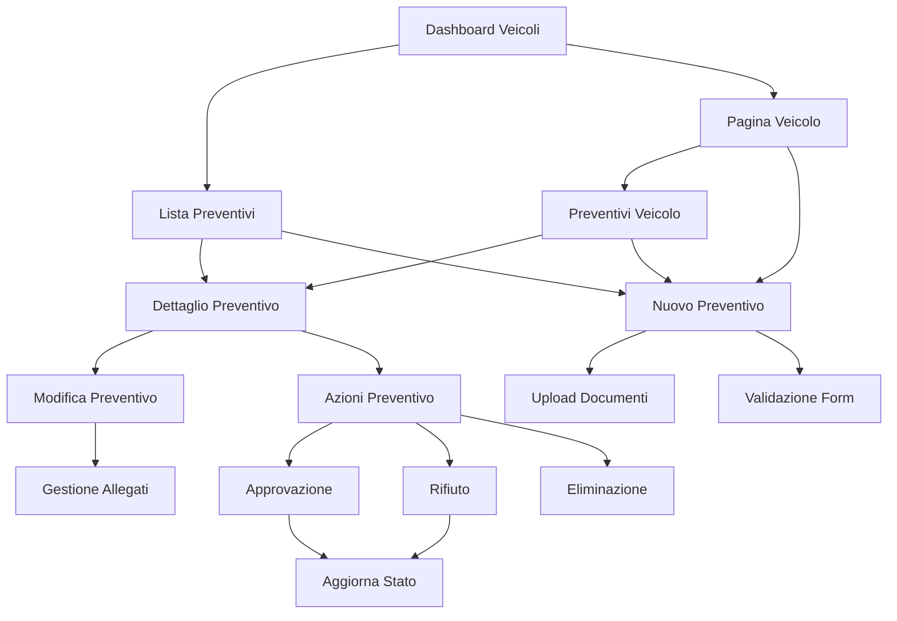

# Sistema Gestione Preventivi Veicoli - Documento dei Requisiti di Prodotto

## 1. Product Overview

Il Sistema Gestione Preventivi Veicoli è un modulo completo integrato nella piattaforma Gestione Partesa per la gestione end-to-end dei preventivi di manutenzione dei veicoli aziendali. Il sistema automatizza il processo di richiesta, valutazione, approvazione e gestione dei preventivi, fornendo tracciabilità completa e controllo dei costi di manutenzione.

Il modulo risolve la complessità della gestione manuale dei preventivi di manutenzione, centralizzando fornitori, documenti e processi di approvazione per ottimizzare i costi operativi e garantire la manutenzione preventiva dei veicoli.

## 2. Core Features

### 2.1 User Roles

| Role | Registration Method | Core Permissions |
|------|---------------------|------------------|
| Admin | Sistema esistente | Gestione completa preventivi, approvazione/rifiuto, configurazione fornitori |
| Manager | Sistema esistente | Visualizzazione, creazione, modifica preventivi, approvazione limitata |
| User | Sistema esistente | Visualizzazione e creazione preventivi, caricamento documenti |

### 2.2 Feature Module

Il sistema di gestione preventivi è composto dalle seguenti pagine principali:

1. **Dashboard Veicoli**: panoramica generale veicoli, statistiche preventivi, navigazione rapida
2. **Lista Preventivi**: visualizzazione completa tutti i preventivi, filtri avanzati, statistiche
3. **Dettaglio Preventivo**: visualizzazione completa singolo preventivo, documenti allegati
4. **Creazione Preventivo**: form guidato per nuovo preventivo, selezione fornitore e servizio
5. **Modifica Preventivo**: editing completo preventivo esistente, gestione allegati
6. **Pagina Veicolo**: dettaglio singolo veicolo con preventivi associati, azioni rapide

### 2.3 Page Details

| Page Name | Module Name | Feature description |
|-----------|-------------|---------------------|
| Dashboard Veicoli | Panoramica Generale | Visualizza statistiche veicoli attivi, preventivi in corso, scadenze imminenti |
| Dashboard Veicoli | Cards Statistiche | Mostra totale veicoli, preventivi pending/approved/rejected, costi mensili |
| Dashboard Veicoli | Navigazione Rapida | Links diretti a lista veicoli, preventivi, scadenze, fornitori |
| Lista Preventivi | Tabella Preventivi | Visualizza tutti i preventivi con filtri per stato, veicolo, fornitore, periodo |
| Lista Preventivi | Filtri Avanzati | Filtra per stato (pending/approved/rejected/expired), veicolo, fornitore, date |
| Lista Preventivi | Azioni Bulk | Approvazione/rifiuto multiplo, export Excel, stampa report |
| Lista Preventivi | Statistiche Real-time | Contatori dinamici per stato, importi totali, scadenze |
| Dettaglio Preventivo | Informazioni Complete | Mostra tutti i dettagli preventivo, veicolo, fornitore, servizio |
| Dettaglio Preventivo | Gestione Documenti | Visualizza, scarica, elimina allegati PDF/immagini |
| Dettaglio Preventivo | Azioni Preventivo | Approva, rifiuta, modifica, elimina, stampa preventivo |
| Dettaglio Preventivo | Cronologia Stati | Timeline delle modifiche stato con timestamp e utente |
| Creazione Preventivo | Form Guidato | Selezione veicolo, fornitore, servizio, importo, scadenza |
| Creazione Preventivo | Upload Documenti | Caricamento multiplo allegati con drag&drop, validazione formato |
| Creazione Preventivo | Validazione Dati | Controlli real-time su campi obbligatori, formati, importi |
| Modifica Preventivo | Editing Completo | Modifica tutti i campi preventivo con validazione |
| Modifica Preventivo | Gestione Allegati | Aggiunta, rimozione, sostituzione documenti esistenti |
| Modifica Preventivo | Cambio Stato | Transizioni stato con validazione business rules |
| Pagina Veicolo | Preventivi Associati | Lista preventivi del veicolo con azioni rapide |
| Pagina Veicolo | Azioni Rapide | Creazione nuovo preventivo, approvazione/rifiuto diretta |
| Pagina Veicolo | Storico Manutenzioni | Cronologia preventivi approvati e lavori completati |

## 3. Core Process

### Flusso Gestione Preventivo Standard
1. L'utente accede alla pagina del veicolo o alla lista preventivi
2. Crea un nuovo preventivo selezionando veicolo, fornitore e servizio
3. Compila i dettagli (descrizione, importo, scadenza) e carica documenti
4. Il preventivo viene salvato con stato "pending"
5. Manager/Admin visualizza e valuta il preventivo
6. Approva o rifiuta il preventivo con eventuale nota
7. Il sistema aggiorna lo stato e notifica gli interessati
8. Se approvato, il preventivo può essere convertito in ordine di lavoro

### Flusso Approvazione Preventivi
1. Preventivo creato con stato "pending"
2. Notifica automatica a Manager/Admin
3. Revisione dettagli e documenti allegati
4. Decisione: Approva/Rifiuta/Richiedi modifiche
5. Aggiornamento stato e cronologia
6. Notifica al richiedente dell'esito

## 4. User Interface Design

### 4.1 Design Style
- **Colori Primari**: Blu (#3B82F6) per azioni principali, Verde (#10B981) per approvazioni
- **Colori Secondari**: Rosso (#EF4444) per rifiuti/eliminazioni, Giallo (#F59E0B) per pending, Grigio (#6B7280) per neutro
- **Stile Pulsanti**: Rounded corners, effetti hover, colori semantici per stati
- **Font**: System fonts, 14px per testo, 16px per form, 24px+ per titoli
- **Layout**: Card-based design, tabelle responsive, sidebar navigation
- **Icone**: Font Awesome e Lucide React, dimensioni 16px-20px
- **Badge Stati**: Colori distintivi per pending (giallo), approved (verde), rejected (rosso), expired (grigio)

### 4.2 Page Design Overview

| Page Name | Module Name | UI Elements |
|-----------|-------------|-------------|
| Dashboard Veicoli | Header | Titolo "Gestione Veicoli", breadcrumb navigation, azioni rapide |
| Dashboard Veicoli | Cards Statistiche | Grid 2x2, numeri grandi, icone colorate, trend indicators |
| Dashboard Veicoli | Tabella Riassuntiva | Top 5 veicoli per preventivi, link diretti, stati colorati |
| Lista Preventivi | Filtri | Collapsible panel, dropdown multipli, date picker, reset button |
| Lista Preventivi | Tabella | Sortable headers, pagination, row actions, status badges |
| Lista Preventivi | Azioni Bulk | Checkbox selection, bulk actions toolbar, confirmation modals |
| Dettaglio Preventivo | Info Card | Layout a 2 colonne, campi readonly, formatting automatico |
| Dettaglio Preventivo | Documenti | Gallery view, download buttons, delete confirmations |
| Dettaglio Preventivo | Azioni | Button group, colori semantici, confirmation dialogs |
| Form Preventivo | Layout | Form a 2 colonne, validazione real-time, progress indicator |
| Form Preventivo | Upload Zone | Drag & drop area, progress bars, file type validation |
| Form Preventivo | Date Fields | Date picker italiano (dd/mm/yyyy), validazione range |

### 4.3 Responsiveness
L'applicazione è desktop-first con adattamento mobile completo. Utilizza Bootstrap 5.3.2 per responsive design, con tabelle scrollabili orizzontalmente su mobile e navigation collapsible. Ottimizzazione touch per azioni rapide su dispositivi mobili.

## 5. Stati e Workflow

### 5.1 Stati Preventivo
- **pending**: Preventivo creato, in attesa di approvazione
- **approved**: Preventivo approvato, può procedere con i lavori
- **rejected**: Preventivo rifiutato, richiede revisione o nuovo preventivo
- **expired**: Preventivo scaduto (data validità superata)
- **converted**: Preventivo convertito in ordine di lavoro

### 5.2 Transizioni di Stato
- **pending → approved**: Solo Manager/Admin
- **pending → rejected**: Solo Manager/Admin
- **pending → expired**: Automatico (sistema)
- **approved → converted**: Manager/Admin dopo completamento lavori
- **rejected → pending**: Dopo modifica e ri-sottomissione

### 5.3 Business Rules
- Solo preventivi "pending" possono essere approvati/rifiutati
- Preventivi scaduti (valid_until < oggi) mostrano stato "expired"
- Eliminazione preventivi solo se stato "pending" o "rejected"
- Upload documenti: max 10MB per file, formati PDF/JPG/PNG
- Importo preventivo: validazione range 0-999999.99€

## 6. Integrazione Sistema

### 6.1 Database Integration
- **Tabella principale**: `maintenance_quotes` per dati preventivo
- **Documenti**: `quote_documents` per allegati
- **Relazioni**: JOIN con `vehicles`, `suppliers`, `vehicle_schedules`
- **Audit**: Tracking modifiche con timestamp e user_id

### 6.2 API Integration
- **REST API**: Endpoints CRUD completi per preventivi
- **File Upload**: Gestione multipart/form-data per documenti
- **Validation**: Server-side validation con response strutturate
- **Error Handling**: Codici HTTP semantici e messaggi localizzati

### 6.3 External Services
- **Email Notifications**: Integrazione per notifiche approvazione/rifiuto
- **PDF Generation**: Export preventivi in formato PDF
- **Backup System**: Inclusione dati preventivi nei backup automatici

---

**Documento creato**: Gennaio 2025  
**Versione**: 1.0  
**Stato**: Implementato e funzionante