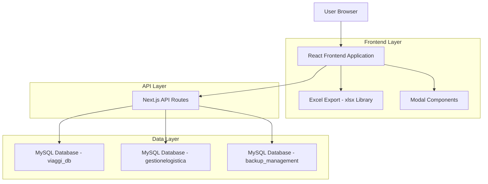
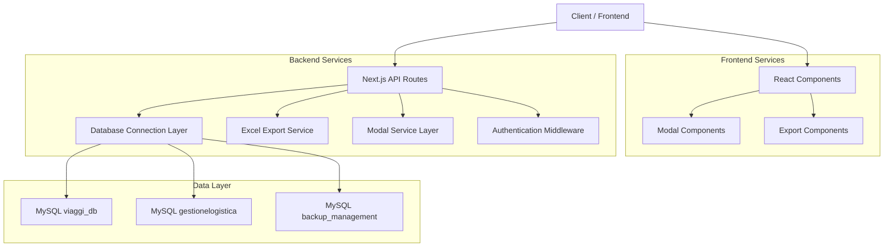
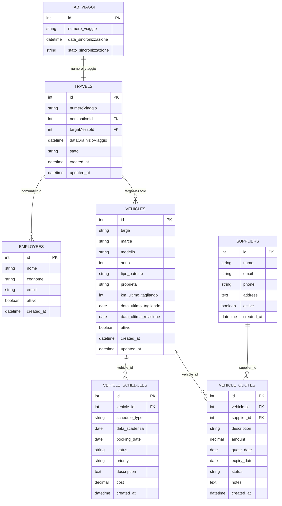

# 🏗️ Gestione Partesa - Architettura Tecnica v2.27.0

## 1. Architecture Design



## 2. Technology Description

- **Frontend**: React@18 + Next.js@15 + TypeScript + Bootstrap@5 + TailwindCSS
- **Backend**: Next.js API Routes + Node.js
- **Database**: MySQL (3 databases: viaggi_db, gestionelogistica, backup_management)
- **Export**: xlsx@0.18.5 (Excel native format)
- **UI Components**: React Modal Pattern + Bootstrap Components
- **State Management**: React Hooks (useState, useEffect, useCallback)

## 3. Route Definitions

| Route | Purpose |
|-------|----------|
| `/dashboard` | Dashboard principale con modal integrati |
| `/vehicles/list` | Gestione veicoli con export Excel |
| `/dashboard/travels-not-in-tab` | Pagina completa sincronizzazione viaggi |
| `/vehicles/schedules` | Calendario scadenze veicoli |
| `/vehicles/quotes` | Sistema preventivi veicoli |
| `/analytics` | Dashboard analytics avanzato |
| `/backup` | Sistema backup e recovery |

## 4. API Definitions

### 4.1 Core API

**Travels Synchronization API**
```
GET /api/dashboard/travels-not-in-tab
```

Request Parameters:
| Param Name | Param Type | isRequired | Description |
|------------|------------|------------|-------------|
| page | number | false | Numero pagina per paginazione (default: 1) |
| limit | number | false | Elementi per pagina (default: 10) |

Response:
| Param Name | Param Type | Description |
|------------|------------|-------------|
| travels | Travel[] | Array viaggi non sincronizzati |
| stats | Stats | Statistiche sincronizzazione |
| pagination | Pagination | Informazioni paginazione |

Example Response:
```json
{
  "travels": [
    {
      "numero_viaggio": "V2024001",
      "nominativo": "Mario Rossi",
      "targa": "AB123CD",
      "data_inizio": "2024-01-15T08:30:00Z",
      "status": "non_sincronizzato"
    }
  ],
  "stats": {
    "synchronized": 150,
    "unsynchronized": 25
  },
  "pagination": {
    "currentPage": 1,
    "totalPages": 3,
    "totalItems": 25
  }
}
```

**Vehicles Management API**
```
GET /api/vehicles
```

Request Parameters:
| Param Name | Param Type | isRequired | Description |
|------------|------------|------------|-------------|
| search | string | false | Ricerca per targa o modello |
| marca | string | false | Filtro per marca |
| attivo | boolean | false | Filtro per stato attivo |
| page | number | false | Numero pagina |
| limit | number | false | Elementi per pagina |

Response:
| Param Name | Param Type | Description |
|------------|------------|-------------|
| vehicles | Vehicle[] | Array veicoli |
| stats | VehicleStats | Statistiche veicoli |
| pagination | Pagination | Informazioni paginazione |

**Dashboard Statistics API**
```
GET /api/dashboard/stats
```

Response:
| Param Name | Param Type | Description |
|------------|------------|-------------|
| totalVehicles | number | Totale veicoli attivi |
| activeSchedules | number | Scadenze attive |
| overdueSchedules | number | Scadenze scadute |
| pendingQuotes | number | Preventivi in attesa |
| recentTravels | number | Viaggi recenti |

## 5. Server Architecture Diagram



## 6. Data Model

### 6.1 Data Model Definition



### 6.2 Data Definition Language

**Travels Table (travels)**
```sql
-- Tabella principale viaggi
CREATE TABLE travels (
    id INT PRIMARY KEY AUTO_INCREMENT,
    numeroViaggio VARCHAR(50) UNIQUE NOT NULL,
    nominativoId INT,
    targaMezzoId INT,
    dataOraInizioViaggio DATETIME,
    stato VARCHAR(20) DEFAULT 'attivo',
    created_at TIMESTAMP DEFAULT CURRENT_TIMESTAMP,
    updated_at TIMESTAMP DEFAULT CURRENT_TIMESTAMP ON UPDATE CURRENT_TIMESTAMP,
    
    INDEX idx_numero_viaggio (numeroViaggio),
    INDEX idx_nominativo (nominativoId),
    INDEX idx_targa (targaMezzoId),
    INDEX idx_data_inizio (dataOraInizioViaggio)
);
```

**Employees Table (employees)**
```sql
-- Tabella dipendenti/nominativi
CREATE TABLE employees (
    id INT PRIMARY KEY AUTO_INCREMENT,
    nome VARCHAR(100) NOT NULL,
    cognome VARCHAR(100) NOT NULL,
    email VARCHAR(255) UNIQUE,
    attivo BOOLEAN DEFAULT TRUE,
    created_at TIMESTAMP DEFAULT CURRENT_TIMESTAMP,
    
    INDEX idx_nome_cognome (nome, cognome),
    INDEX idx_attivo (attivo)
);
```

**Vehicles Table (vehicles)**
```sql
-- Tabella veicoli estesa
CREATE TABLE vehicles (
    id INT PRIMARY KEY AUTO_INCREMENT,
    targa VARCHAR(20) UNIQUE NOT NULL,
    marca VARCHAR(50) NOT NULL,
    modello VARCHAR(100) NOT NULL,
    anno INT,
    tipo_patente VARCHAR(10),
    proprieta VARCHAR(50),
    km_ultimo_tagliando INT,
    data_ultimo_tagliando DATE,
    data_ultima_revisione DATE,
    attivo BOOLEAN DEFAULT TRUE,
    created_at TIMESTAMP DEFAULT CURRENT_TIMESTAMP,
    updated_at TIMESTAMP DEFAULT CURRENT_TIMESTAMP ON UPDATE CURRENT_TIMESTAMP,
    
    INDEX idx_targa (targa),
    INDEX idx_marca_modello (marca, modello),
    INDEX idx_attivo (attivo),
    INDEX idx_tipo_patente (tipo_patente)
);
```

**Vehicle Schedules Table (vehicle_schedules)**
```sql
-- Tabella scadenze veicoli
CREATE TABLE vehicle_schedules (
    id INT PRIMARY KEY AUTO_INCREMENT,
    vehicle_id INT NOT NULL,
    schedule_type ENUM('tagliando', 'revisione', 'assicurazione', 'bollo', 'manutenzione') NOT NULL,
    data_scadenza DATE NOT NULL,
    booking_date DATE,
    status ENUM('pending', 'completed', 'cancelled') DEFAULT 'pending',
    priority ENUM('low', 'medium', 'high') DEFAULT 'medium',
    description TEXT,
    cost DECIMAL(10,2),
    created_at TIMESTAMP DEFAULT CURRENT_TIMESTAMP,
    
    FOREIGN KEY (vehicle_id) REFERENCES vehicles(id) ON DELETE CASCADE,
    INDEX idx_vehicle_schedule (vehicle_id, schedule_type),
    INDEX idx_data_scadenza (data_scadenza),
    INDEX idx_booking_date (booking_date),
    INDEX idx_status (status)
);
```

**Tab Viaggi Synchronization (tab_viaggi)**
```sql
-- Tabella sincronizzazione viaggi
CREATE TABLE tab_viaggi (
    id INT PRIMARY KEY AUTO_INCREMENT,
    numero_viaggio VARCHAR(50) UNIQUE NOT NULL,
    data_sincronizzazione TIMESTAMP DEFAULT CURRENT_TIMESTAMP,
    stato_sincronizzazione VARCHAR(20) DEFAULT 'sincronizzato',
    
    INDEX idx_numero_viaggio (numero_viaggio),
    INDEX idx_data_sync (data_sincronizzazione)
);
```

**Initial Data**
```sql
-- Dati iniziali per testing
INSERT INTO employees (nome, cognome, email) VALUES
('Mario', 'Rossi', 'mario.rossi@partesa.it'),
('Luigi', 'Verdi', 'luigi.verdi@partesa.it'),
('Anna', 'Bianchi', 'anna.bianchi@partesa.it');

INSERT INTO vehicles (targa, marca, modello, anno, tipo_patente, proprieta, attivo) VALUES
('AB123CD', 'Iveco', 'Daily', 2020, 'C', 'Proprietà', TRUE),
('EF456GH', 'Mercedes', 'Sprinter', 2019, 'B', 'Leasing', TRUE),
('IJ789KL', 'Fiat', 'Ducato', 2021, 'B', 'Proprietà', TRUE);
```

## 7. Component Architecture

### 7.1 Modal Components Pattern

```typescript
// Base Modal Interface
interface BaseModalProps {
  isOpen: boolean;
  onClose: () => void;
  title?: string;
  size?: 'sm' | 'md' | 'lg' | 'xl';
}

// Specific Modal Implementation
interface TravelsNotInTabModalProps extends BaseModalProps {
  // Specific props
}

// Modal Component Structure
const TravelsNotInTabModal: React.FC<TravelsNotInTabModalProps> = ({
  isOpen,
  onClose,
  title = "Viaggi Non Sincronizzati"
}) => {
  // State management
  const [data, setData] = useState<Travel[]>([]);
  const [loading, setLoading] = useState(false);
  const [error, setError] = useState<string | null>(null);
  
  // Data fetching
  const fetchData = useCallback(async () => {
    // API call implementation
  }, []);
  
  // Effects
  useEffect(() => {
    if (isOpen) {
      fetchData();
    }
  }, [isOpen, fetchData]);
  
  // Render
  return (
    <div className={`modal fade ${isOpen ? 'show' : ''}`}>
      {/* Modal implementation */}
    </div>
  );
};
```

### 7.2 Export Service Pattern

```typescript
// Export Service Interface
interface ExportService {
  exportToExcel<T>(data: T[], filename: string, sheetName?: string): void;
  exportToCSV<T>(data: T[], filename: string): void;
}

// Excel Export Implementation
class ExcelExportService implements ExportService {
  exportToExcel<T>(data: T[], filename: string, sheetName = 'Sheet1'): void {
    const worksheet = XLSX.utils.json_to_sheet(data);
    const workbook = XLSX.utils.book_new();
    XLSX.utils.book_append_sheet(workbook, worksheet, sheetName);
    
    const timestamp = new Date().toISOString().replace(/[:.]/g, '').slice(0, 15);
    XLSX.writeFile(workbook, `${filename}_${timestamp}.xlsx`);
  }
}

// Usage in Components
const exportService = new ExcelExportService();

const handleExport = () => {
  const exportData = vehicles.map(vehicle => ({
    'ID': vehicle.id,
    'Targa': vehicle.targa,
    'Marca': vehicle.marca,
    // ... other fields
  }));
  
  exportService.exportToExcel(exportData, 'veicoli');
};
```

## 8. Security and Performance

### 8.1 Security Measures

- **SQL Injection Prevention**: Prepared statements e parametrized queries
- **Authentication**: JWT tokens per sessioni utente
- **Authorization**: Role-based access control
- **Input Validation**: Sanitizzazione dati client-side e server-side
- **CORS Configuration**: Configurazione corretta per API access

### 8.2 Performance Optimizations

- **Database Indexing**: Indici su colonne frequentemente utilizzate
- **Pagination**: Limitazione risultati per performance
- **Lazy Loading**: Caricamento componenti on-demand
- **Caching**: Cache browser per risorse statiche
- **Query Optimization**: Query SQL ottimizzate per performance

### 8.3 Monitoring and Logging

```typescript
// Error Logging Service
class LoggingService {
  static logError(error: Error, context: string): void {
    console.error(`[${context}] ${error.message}`, error.stack);
    // Send to monitoring service in production
  }
  
  static logInfo(message: string, data?: any): void {
    console.log(`[INFO] ${message}`, data);
  }
}

// Usage in API Routes
try {
  const result = await database.query(sql, params);
  return NextResponse.json(result);
} catch (error) {
  LoggingService.logError(error as Error, 'API_TRAVELS_NOT_IN_TAB');
  return NextResponse.json(
    { error: 'Internal server error' },
    { status: 500 }
  );
}
```

## 9. Deployment Configuration

### 9.1 Environment Variables

```bash
# Database Configuration
MYSQL_HOST_VIAGGI=10.tcp.eu.ngrok.io
MYSQL_PORT_VIAGGI=24345
MYSQL_USER_VIAGGI=root
MYSQL_PASSWORD_VIAGGI=password
MYSQL_DATABASE_VIAGGI=viaggi_db

MYSQL_HOST_GESTIONE=10.tcp.eu.ngrok.io
MYSQL_PORT_GESTIONE=24345
MYSQL_USER_GESTIONE=root
MYSQL_PASSWORD_GESTIONE=password
MYSQL_DATABASE_GESTIONE=gestionelogistica

MYSQL_HOST_BACKUP=10.tcp.eu.ngrok.io
MYSQL_PORT_BACKUP=24345
MYSQL_USER_BACKUP=root
MYSQL_PASSWORD_BACKUP=password
MYSQL_DATABASE_BACKUP=backup_management

# Application Configuration
NEXT_PUBLIC_APP_URL=http://localhost:3001
JWT_SECRET=your_jwt_secret_key
NODE_ENV=production
```

### 9.2 Build Configuration

```json
{
  "scripts": {
    "dev": "next dev -p 3001",
    "build": "next build",
    "start": "next start -p 3001",
    "lint": "next lint",
    "type-check": "tsc --noEmit"
  },
  "dependencies": {
    "next": "^15.0.0",
    "react": "^18.0.0",
    "typescript": "^5.0.0",
    "mysql2": "^3.6.0",
    "xlsx": "^0.18.5",
    "bootstrap": "^5.3.0"
  }
}
```

## 10. Future Roadmap

### 10.1 Short Term (v2.28.0)
- **Multi-sheet Excel Export**: Export con fogli multipli
- **Advanced Filters**: Filtri avanzati nei modal
- **Real-time Updates**: WebSocket per aggiornamenti live

### 10.2 Medium Term (v2.30.0)
- **Mobile App**: Applicazione mobile React Native
- **API Gateway**: Centralizzazione API con rate limiting
- **Microservices**: Separazione servizi per scalabilità

### 10.3 Long Term (v3.0.0)
- **Cloud Migration**: Migrazione a cloud provider
- **AI Integration**: Intelligenza artificiale per predizioni
- **Advanced Analytics**: Dashboard predittivi e ML