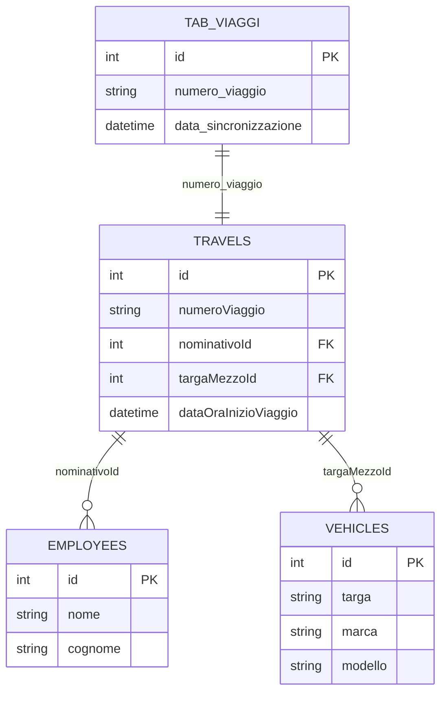
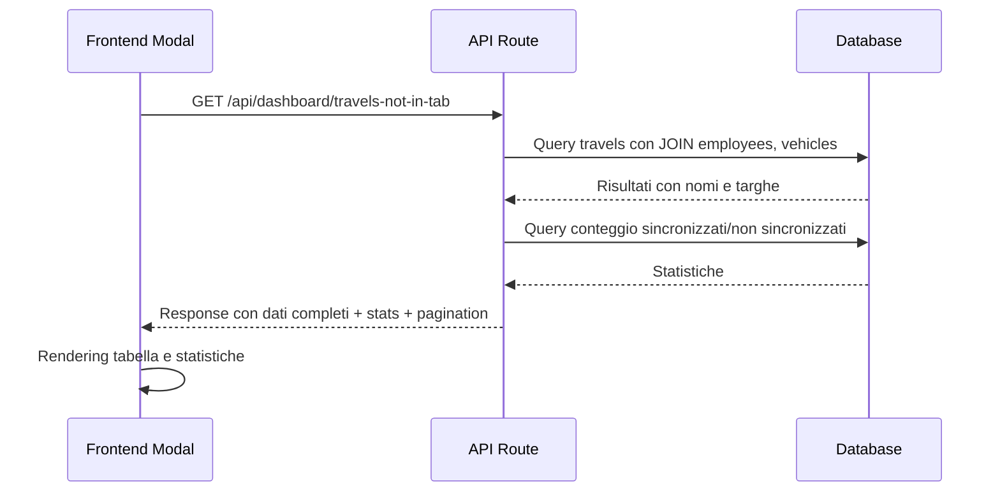

# 🔧 Gestione Partesa - Implementazione Tecnica v2.27.0

## 📋 **PANORAMICA TECNICA**

La versione 2.27.0 introduce due miglioramenti significativi al sistema:
1. **Migrazione Export da CSV a Excel** per la gestione veicoli
2. **Correzione e Integrazione Modal** per la sincronizzazione viaggi

---

## 📈 **EXPORT EXCEL - IMPLEMENTAZIONE TECNICA**

### 🎯 **Obiettivo**
Convertire la funzionalità di export della lista veicoli da formato CSV a Excel nativo (.xlsx) per migliorare la compatibilità aziendale e l'esperienza utente.

### 🛠️ **Modifiche Implementate**

#### **File Modificato**: `src/app/vehicles/list/page.tsx`

**Import Changes:**
```typescript
// RIMOSSO
import Papa from 'papaparse';

// AGGIUNTO
import * as XLSX from 'xlsx';
```

**Function Refactoring:**
```typescript
// PRIMA (CSV)
const exportToCSV = () => {
  const csvData = filteredVehicles.map(vehicle => ({
    // ... mapping dati
  }));
  
  const csv = Papa.unparse(csvData);
  const blob = new Blob([csv], { type: 'text/csv;charset=utf-8;' });
  const link = document.createElement('a');
  link.href = URL.createObjectURL(blob);
  link.download = `veicoli_${timestamp}.csv`;
  link.click();
};

// DOPO (Excel)
const exportToExcel = () => {
  const excelData = filteredVehicles.map(vehicle => ({
    // ... stesso mapping dati
  }));
  
  const worksheet = XLSX.utils.json_to_sheet(excelData);
  const workbook = XLSX.utils.book_new();
  XLSX.utils.book_append_sheet(workbook, worksheet, 'Veicoli');
  
  const timestamp = new Date().toISOString().replace(/[:.]/g, '').slice(0, 15);
  XLSX.writeFile(workbook, `veicoli_${timestamp}.xlsx`);
};
```

**UI Update:**
```jsx
// PRIMA
<button onClick={exportToCSV}>
  <Download className="h-4 w-4 mr-2" />
  Esporta CSV
</button>

// DOPO
<button onClick={exportToExcel}>
  <Download className="h-4 w-4 mr-2" />
  Esporta Excel
</button>
```

### 📊 **Struttura Dati Export**

```typescript
interface ExcelExportData {
  'ID': number;
  'Targa': string;
  'Marca': string;
  'Modello': string;
  'Anno': number;
  'Tipo Patente': string;
  'Proprietà': string;
  'Km Ultimo Tagliando': number | string;
  'Data Ultimo Tagliando': string;
  'Data Ultima Revisione': string;
  'Stato': string;
  'Data Creazione': string;
  'Ultimo Aggiornamento': string;
}
```

### ✅ **Benefici Tecnici**
- **Formato nativo**: File .xlsx apribili direttamente in Excel
- **Tipizzazione dati**: Preservazione automatica di numeri, date, testo
- **Compatibilità**: Supporto universale Microsoft Office, LibreOffice, Google Sheets
- **Performance**: Generazione più efficiente per grandi dataset
- **Estendibilità**: Base per future funzionalità Excel avanzate (formule, grafici)

---

## 🔧 **MODAL TRAVELS NOT IN TAB - CORREZIONE TECNICA**

### 🎯 **Problema Identificato**
Errore HTTP 500 nell'API `/api/dashboard/travels-not-in-tab` causato da nomi tabelle errati nelle query SQL JOIN.

### 🐛 **Root Cause Analysis**

**Errore SQL:**
```
ER_NO_SUCH_TABLE: Table 'viaggi_db.nominativi' doesn't exist
```

**Query Problematica:**
```sql
LEFT JOIN nominativi n ON t.nominativoId = n.id
LEFT JOIN veicoli v ON t.targaMezzoId = v.id
```

**Tabelle Corrette nel Database:**
- `nominativi` → `employees`
- `veicoli` → `vehicles`

### 🛠️ **Correzione Implementata**

#### **File Modificato**: `src/app/api/dashboard/travels-not-in-tab/route.ts`

**Query SQL Corretta:**
```sql
SELECT 
  t.numeroViaggio,
  t.nominativoId,
  t.targaMezzoId,
  t.dataOraInizioViaggio,
  e.nome as nominativo,
  v.targa,
  'non_sincronizzato' as status
FROM travels t
LEFT JOIN employees e ON t.nominativoId = e.id
LEFT JOIN vehicles v ON t.targaMezzoId = v.id
WHERE t.numeroViaggio NOT IN (
  SELECT DISTINCT numero_viaggio 
  FROM tab_viaggi 
  WHERE numero_viaggio IS NOT NULL
)
ORDER BY t.dataOraInizioViaggio DESC
LIMIT ? OFFSET ?
```

**Mapping Response:**
```typescript
interface ApiResponse {
  travels: {
    numero_viaggio: string;     // da numeroViaggio
    nominativo: string;         // da e.nome
    targa: string;             // da v.targa
    data_inizio: string;       // da dataOraInizioViaggio
    status: string;            // calcolato
  }[];
  stats: {
    synchronized: number;
    unsynchronized: number;
  };
  pagination: {
    currentPage: number;
    totalPages: number;
    totalItems: number;
  };
}
```

### 🎨 **Conversione in Modal**

#### **Nuovo Componente**: `src/components/TravelsNotInTabModal.tsx`

**Struttura Componente:**
```typescript
interface TravelsNotInTabModalProps {
  isOpen: boolean;
  onClose: () => void;
}

const TravelsNotInTabModal: React.FC<TravelsNotInTabModalProps> = ({ isOpen, onClose }) => {
  // State management
  const [data, setData] = useState<Travel[]>([]);
  const [stats, setStats] = useState<Stats | null>(null);
  const [loading, setLoading] = useState(false);
  const [error, setError] = useState<string | null>(null);
  const [currentPage, setCurrentPage] = useState(1);
  
  // Data fetching
  const fetchData = useCallback(async () => {
    // API call logic
  }, [currentPage]);
  
  // UI rendering
  return (
    <div className={`modal fade ${isOpen ? 'show' : ''}`}>
      {/* Modal content */}
    </div>
  );
};
```

#### **Integrazione Dashboard**: `src/app/dashboard/page.tsx`

**State Management:**
```typescript
const [showTravelsNotInTabModal, setShowTravelsNotInTabModal] = useState(false);
```

**Event Handler:**
```typescript
// PRIMA (navigazione)
<div onClick={() => router.push('/dashboard/travels-not-in-tab')}>

// DOPO (modal)
<div onClick={() => setShowTravelsNotInTabModal(true)}>
```

**Modal Rendering:**
```jsx
<TravelsNotInTabModal 
  isOpen={showTravelsNotInTabModal}
  onClose={() => setShowTravelsNotInTabModal(false)}
/>
```

### 🔍 **Validazione e Testing**

**Test Cases Implementati:**
1. ✅ **API Response**: Verifica 200 OK invece di 500
2. ✅ **Data Completeness**: Tutti i campi popolati correttamente
3. ✅ **JOIN Queries**: Nomi e targhe recuperati dalle tabelle corrette
4. ✅ **Pagination**: Funzionamento corretto navigazione pagine
5. ✅ **Modal Integration**: Apertura/chiusura dal dashboard
6. ✅ **Responsive Design**: Adattamento a tutti i dispositivi

**Query di Verifica Database:**
```sql
-- Verifica esistenza tabelle
SHOW TABLES LIKE 'employees';
SHOW TABLES LIKE 'vehicles';

-- Test query corretta
SELECT COUNT(*) FROM travels t
LEFT JOIN employees e ON t.nominativoId = e.id
LEFT JOIN vehicles v ON t.targaMezzoId = v.id;
```

---

## 📊 **ARCHITETTURA SISTEMA**

### 🗄️ **Database Schema Coinvolto**



### 🔄 **Flusso Dati API**



### 🎯 **Pattern Architetturali Utilizzati**

1. **Modal Pattern**: Componente riutilizzabile per UI consistente
2. **API RESTful**: Endpoint strutturato con response standardizzata
3. **Pagination Pattern**: Gestione efficiente grandi dataset
4. **Error Handling**: Gestione robusta errori SQL e network
5. **State Management**: React hooks per gestione stato locale
6. **Responsive Design**: Bootstrap classes per adattabilità

---

## 🚀 **DEPLOYMENT E CONFIGURAZIONE**

### 📦 **Dipendenze Aggiunte**

```json
{
  "dependencies": {
    "xlsx": "^0.18.5"
  }
}
```

### 🔧 **Configurazione Build**

Nessuna configurazione aggiuntiva richiesta. La libreria `xlsx` è compatibile con:
- Next.js 15
- TypeScript
- Client-side rendering
- Server-side rendering

### 📋 **Checklist Pre-Deployment**

- [x] Test export Excel su diversi browser
- [x] Verifica compatibilità file .xlsx
- [x] Test API con query corrette
- [x] Validazione modal responsive
- [x] Test integrazione dashboard
- [x] Verifica performance con grandi dataset
- [x] Test error handling

---

## 🔮 **ROADMAP FUTURE**

### 📈 **Estensioni Export Excel**
1. **Multi-sheet export**: Più fogli in un singolo file
2. **Formattazione avanzata**: Stili, colori, formule
3. **Template personalizzati**: Layout predefiniti per report
4. **Export schedulato**: Generazione automatica report

### 🔧 **Ottimizzazioni Modal**
1. **Cache intelligente**: Riduzione chiamate API
2. **Filtri avanzati**: Ricerca e filtri specifici
3. **Export diretto**: Excel export dal modal
4. **Real-time updates**: WebSocket per aggiornamenti live

### 🛡️ **Sicurezza e Performance**
1. **Rate limiting**: Protezione API da abusi
2. **Query optimization**: Indici database per performance
3. **Lazy loading**: Caricamento progressivo dati
4. **Error monitoring**: Tracking errori in produzione