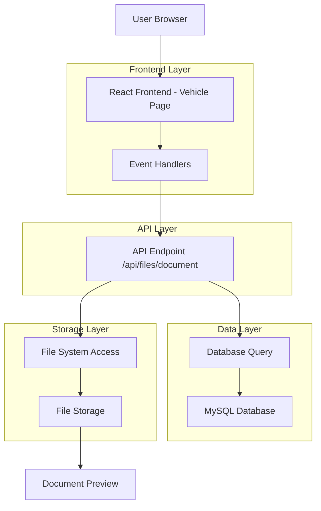
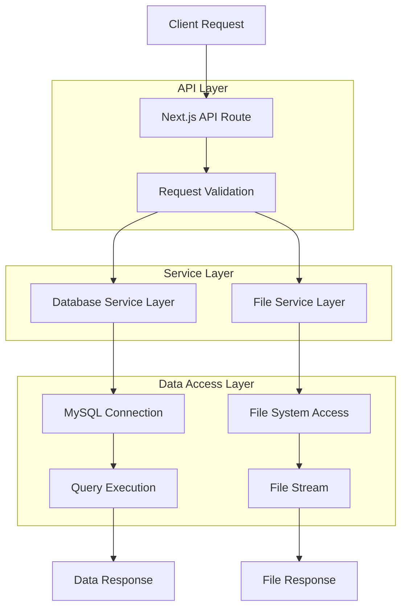
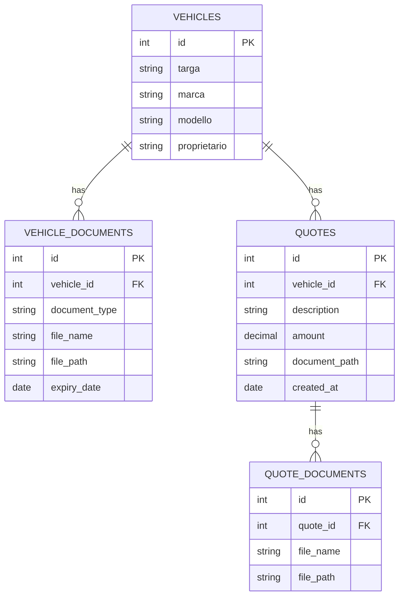

# Architettura Tecnica - Preview Diretta Documenti e Preventivi

## 1. Architecture Design



## 2. Technology Description

- Frontend: React@18 + Next.js@15 + TypeScript + Tailwind CSS
- Backend: Next.js API Routes + Node.js
- Database: MySQL@8.0
- File Storage: Local file system + Vercel Blob Storage
- Authentication: JWT + Session management

## 3. Route Definitions

| Route | Purpose |
|-------|----------|
| /vehicles/[plate] | Pagina principale veicolo con preview diretta documenti e preventivi |
| /vehicles/[plate]/documents | Gestione completa documenti (fallback) |
| /vehicles/quotes/[id] | Dettaglio preventivo (fallback per preventivi senza allegati) |

## 4. API Definitions

### 4.1 Core API

#### Endpoint Preview Documenti
```
GET /api/files/document
```

Request Parameters:
| Param Name | Param Type | isRequired | Description |
|------------|------------|------------|-------------|
| type | string | true | Tipo documento: 'document' o 'quote' |
| id | string | true | ID del documento o preventivo |

Response:
- **Success**: Stream del file (PDF, immagine, documento)
- **Error 404**: File non trovato
- **Error 500**: Errore server o database

Example Request:
```
GET /api/files/document?type=document&id=123
GET /api/files/document?type=quote&id=456
```

#### Endpoint Documenti Veicolo
```
GET /api/vehicles/[plate]/documents
```

Response:
| Param Name | Param Type | Description |
|------------|------------|-------------|
| documents | array | Lista documenti del veicolo |
| id | number | ID documento |
| document_type | string | Tipo documento |
| file_name | string | Nome file |
| expiry_date | string | Data scadenza (ISO format) |

#### Endpoint Preventivi Veicolo
```
GET /api/vehicles/[plate]/quotes
```

Response:
| Param Name | Param Type | Description |
|------------|------------|-------------|
| quotes | array | Lista preventivi del veicolo |
| id | number | ID preventivo |
| description | string | Descrizione preventivo |
| amount | number | Importo preventivo |
| document_path | string | Path documento allegato (nullable) |

## 5. Server Architecture Diagram



## 6. Data Model

### 6.1 Data Model Definition



### 6.2 Data Definition Language

#### Tabella Vehicle Documents
```sql
-- Struttura tabella documenti veicoli
CREATE TABLE vehicle_documents (
    id INT PRIMARY KEY AUTO_INCREMENT,
    vehicle_id INT NOT NULL,
    document_type VARCHAR(100) NOT NULL,
    file_name VARCHAR(255) NOT NULL,
    file_path VARCHAR(500) NOT NULL,
    expiry_date DATE,
    created_at TIMESTAMP DEFAULT CURRENT_TIMESTAMP,
    updated_at TIMESTAMP DEFAULT CURRENT_TIMESTAMP ON UPDATE CURRENT_TIMESTAMP,
    FOREIGN KEY (vehicle_id) REFERENCES vehicles(id)
);

-- Indici per performance
CREATE INDEX idx_vehicle_documents_vehicle_id ON vehicle_documents(vehicle_id);
CREATE INDEX idx_vehicle_documents_expiry ON vehicle_documents(expiry_date);
```

#### Tabella Quote Documents
```sql
-- Struttura tabella documenti preventivi
CREATE TABLE quote_documents (
    id INT PRIMARY KEY AUTO_INCREMENT,
    quote_id INT NOT NULL,
    file_name VARCHAR(255) NOT NULL,
    file_path VARCHAR(500) NOT NULL,
    created_at TIMESTAMP DEFAULT CURRENT_TIMESTAMP,
    FOREIGN KEY (quote_id) REFERENCES quotes(id)
);

-- Indici per performance
CREATE INDEX idx_quote_documents_quote_id ON quote_documents(quote_id);
```

#### Tabella Quotes
```sql
-- Struttura tabella preventivi
CREATE TABLE quotes (
    id INT PRIMARY KEY AUTO_INCREMENT,
    vehicle_id INT NOT NULL,
    description TEXT,
    amount DECIMAL(10,2),
    document_path VARCHAR(500),
    status VARCHAR(50) DEFAULT 'pending',
    created_at TIMESTAMP DEFAULT CURRENT_TIMESTAMP,
    updated_at TIMESTAMP DEFAULT CURRENT_TIMESTAMP ON UPDATE CURRENT_TIMESTAMP,
    FOREIGN KEY (vehicle_id) REFERENCES vehicles(id)
);

-- Indici per performance
CREATE INDEX idx_quotes_vehicle_id ON quotes(vehicle_id);
CREATE INDEX idx_quotes_status ON quotes(status);
```

## 7. Frontend Implementation

### 7.1 Component Structure

```typescript
// Struttura componente principale
interface VehiclePageProps {
  params: { plate: string };
}

interface Document {
  id: number;
  document_type: string;
  file_name: string;
  expiry_date: string;
}

interface Quote {
  id: number;
  description: string;
  amount: number;
  document_path: string | null;
}
```

### 7.2 Event Handlers

```typescript
// Handler per click documenti
const handleDocumentClick = (doc: Document) => {
  const url = `/api/files/document?type=document&id=${doc.id}`;
  window.open(url, '_blank');
};

// Handler per click preventivi
const handleQuoteClick = (quote: Quote) => {
  if (quote.document_path) {
    const url = `/api/files/document?type=quote&id=${quote.id}`;
    window.open(url, '_blank');
  } else {
    router.push(`/vehicles/quotes/${quote.id}`);
  }
};
```

### 7.3 API Integration

```typescript
// Fetch documenti veicolo
const fetchDocuments = async () => {
  try {
    const response = await fetch(`/api/vehicles/${plate}/documents`);
    const data = await response.json();
    setDocuments(data.documents || []);
  } catch (error) {
    console.error('Errore caricamento documenti:', error);
  }
};

// Fetch preventivi veicolo
const fetchQuotes = async () => {
  try {
    const response = await fetch(`/api/vehicles/${plate}/quotes`);
    const data = await response.json();
    setQuotes(data.quotes || []);
  } catch (error) {
    console.error('Errore caricamento preventivi:', error);
  }
};
```

## 8. Security Considerations

### 8.1 File Access Control
- **Validazione parametri**: Controllo tipo e ID documento
- **Autenticazione**: Verifica sessione utente valida
- **Autorizzazione**: Controllo accesso al veicolo specifico
- **Path traversal protection**: Validazione percorsi file

### 8.2 Input Validation
```typescript
// Validazione parametri API
const validateParams = (type: string, id: string) => {
  if (!['document', 'quote'].includes(type)) {
    throw new Error('Tipo documento non valido');
  }
  if (!id || isNaN(parseInt(id))) {
    throw new Error('ID documento non valido');
  }
};
```

### 8.3 Error Handling
```typescript
// Gestione errori sicura
try {
  const file = await getDocumentFile(type, id);
  return new Response(file.stream, {
    headers: {
      'Content-Type': file.mimeType,
      'Content-Disposition': `inline; filename="${file.name}"`
    }
  });
} catch (error) {
  return new Response('File non trovato', { status: 404 });
}
```

## 9. Performance Optimizations

### 9.1 Caching Strategy
- **Browser cache**: Headers appropriati per cache file statici
- **Database connection pooling**: Riutilizzo connessioni database
- **Lazy loading**: Caricamento documenti solo quando necessario

### 9.2 File Streaming
```typescript
// Streaming efficiente file
const streamFile = (filePath: string) => {
  const stream = fs.createReadStream(filePath);
  return new Response(stream as any, {
    headers: {
      'Content-Type': 'application/pdf',
      'Cache-Control': 'public, max-age=3600'
    }
  });
};
```

## 10. Monitoring and Logging

### 10.1 Error Tracking
```typescript
// Logging errori
const logError = (error: Error, context: string) => {
  console.error(`[${context}] ${error.message}`, {
    stack: error.stack,
    timestamp: new Date().toISOString()
  });
};
```

### 10.2 Performance Metrics
- **Response time**: Tempo risposta API
- **File size**: Dimensioni file serviti
- **Error rate**: Percentuale errori
- **Cache hit rate**: Efficacia cache

## 11. Deployment Considerations

### 11.1 Environment Variables
```bash
# Configurazione file storage
FILE_STORAGE_PATH=/app/uploads
MAX_FILE_SIZE=10485760

# Database configuration
MYSQL_HOST=localhost
MYSQL_PORT=3306
MYSQL_DATABASE=gestione_partesa
```

### 11.2 File System Permissions
- **Read access**: Accesso lettura directory documenti
- **Write access**: Accesso scrittura per upload
- **Security**: Restrizioni accesso directory sistema

## 12. Future Enhancements

### 12.1 Planned Features
- **Thumbnail generation**: Generazione anteprime automatiche
- **Document versioning**: Gestione versioni multiple
- **Inline preview**: Visualizzazione senza aprire nuove finestre
- **Annotation support**: Supporto annotazioni documenti

### 12.2 Scalability Improvements
- **CDN integration**: Distribuzione file tramite CDN
- **Microservices**: Separazione servizio gestione file
- **Load balancing**: Distribuzione carico per file grandi
- **Async processing**: Elaborazione asincrona documenti